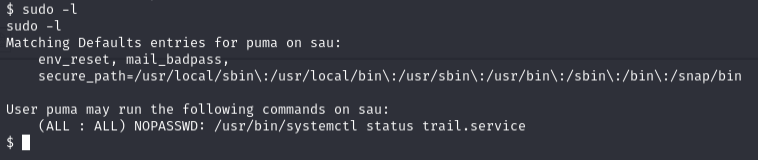
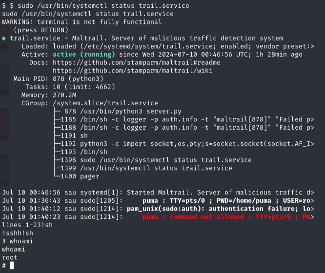

# Sau -- HackTheBox (write-up)

**Difficulty:** Easy
**Box:** Sau (HackTheBox)
**Author:** dkrxhn
**Date:** 2025-10-25

---

## TL;DR

### SSRF to internal service. Privesc by escaping systemctl pager with `!sh` while running as root.
---

## Target info

- Host: Sau (HackTheBox)

---

## Enumeration & foothold



---

## Privilege escalation

```bash
sudo /usr/bin/systemctl status trail.service
```



Command hangs at the pager. Since it runs in root context, typing `!sh` spawns a root shell.

---

## Lessons & takeaways

- `systemctl status` uses a pager (less) -- if running as root, `!sh` gives a root shell
- Always check what commands you can run with `sudo -l`
---
