# Silver Platter -- TryHackMe (write-up)

**Difficulty:** Easy
**Box:** Silver Platter (TryHackMe)
**Author:** dkrxhn
**Date:** 2025-08-20

---

## TL;DR

### Generated password list with cewl, logged into Silverpeas. IDOR on notification IDs leaked SSH creds. Pivoted to tyler via log grep (adm group). Tyler had sudo root.
---

## Target info

- Host: `10.10.21.22`
- Services discovered: `22/tcp (ssh)`, `80/tcp (http)`, `8080/tcp (http-proxy)`

---

## Enumeration

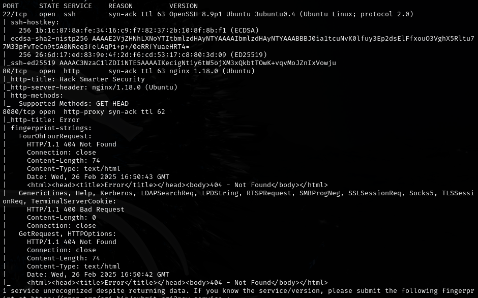

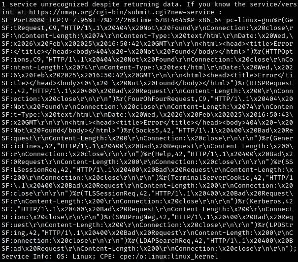

Quick scan:

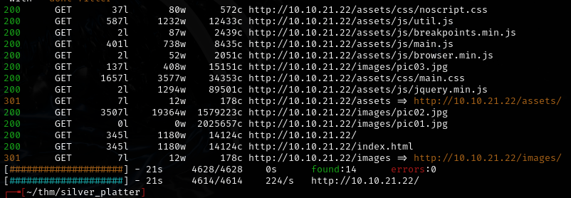

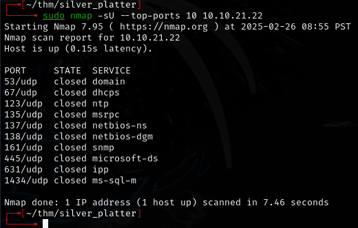

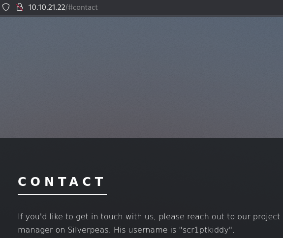

Fuzzed port 8080:

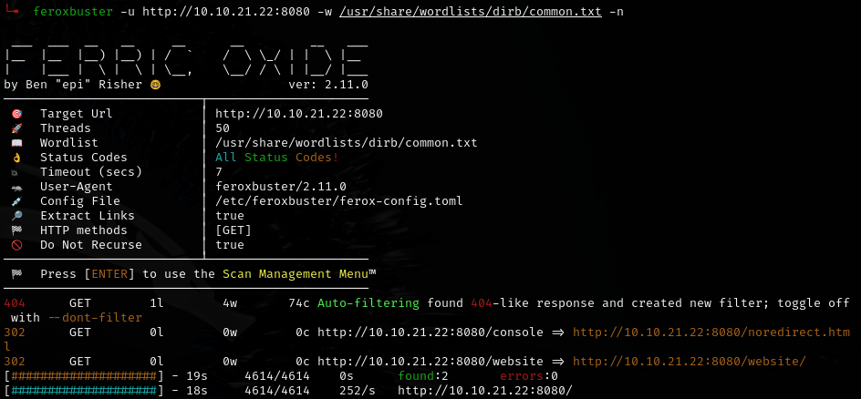

Guessed `/silverpeas`:

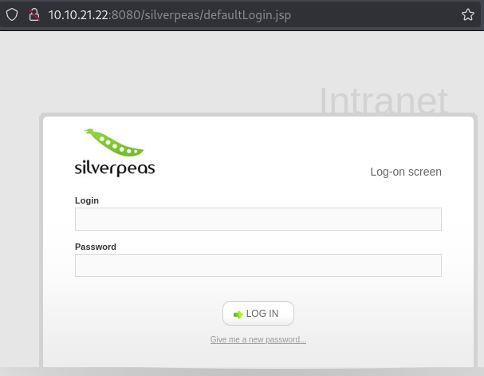

Generated password list from the website with cewl (rockyou didn't work):

```bash
cewl 10.10.21.22 > passwords.txt
```

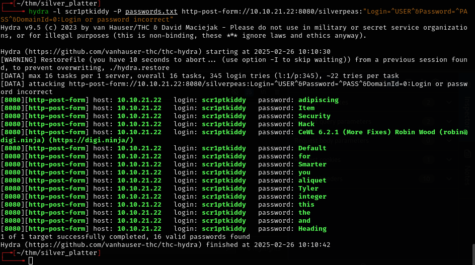

Top password worked:

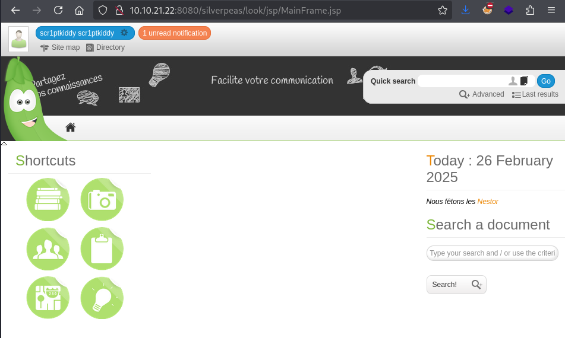

## Exploitation

Found an IDOR -- changed notification ID=5 to ID=6:

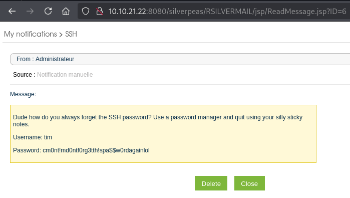

- `tim:cm0nt!md0ntf0rg3tth!spa$$w0rdagainlol`

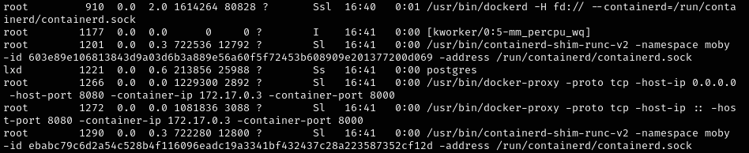

## Lateral movement

Ran LinEnum:

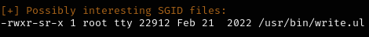

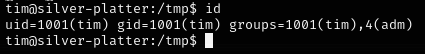

- `adm` group means can read logs in `/var/log`

Searched logs for tyler:

```bash
cd /var/log && grep -iR tyler
```

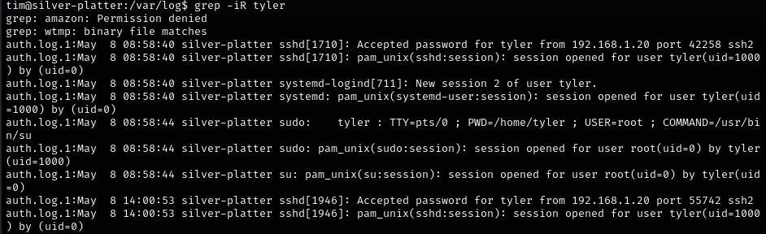

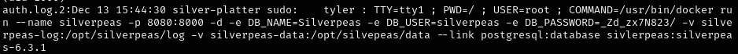

- Password: `_Zd_zx7N823/`

## Privilege escalation

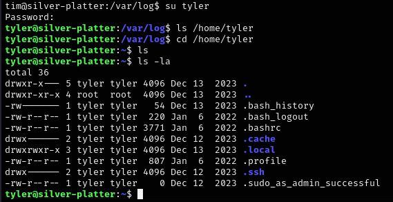

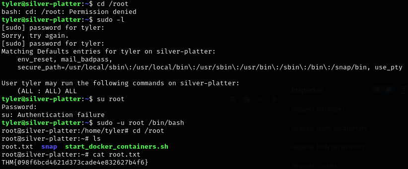

---

## Lessons & takeaways

- Use cewl to generate passwords from the target website when rockyou fails
- Watch for IDORs when reading messages/notifications -- increment the ID
- `adm` group (`id` command) allows reading `/var/log` -- grep for usernames to find creds
- Fuzz non-standard ports (8080) for hidden directories
---
