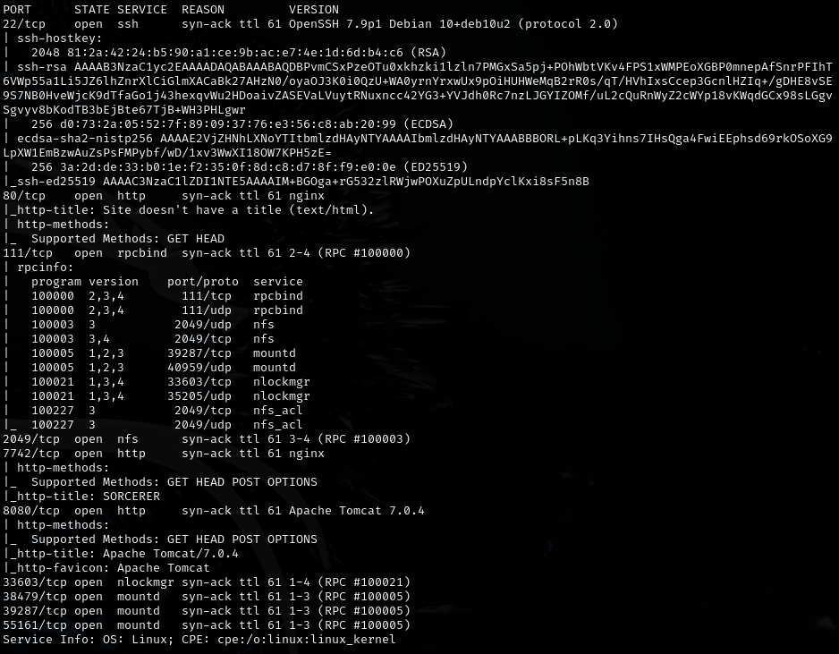
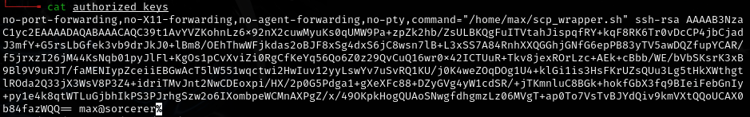
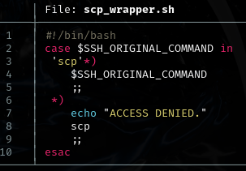
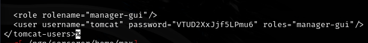
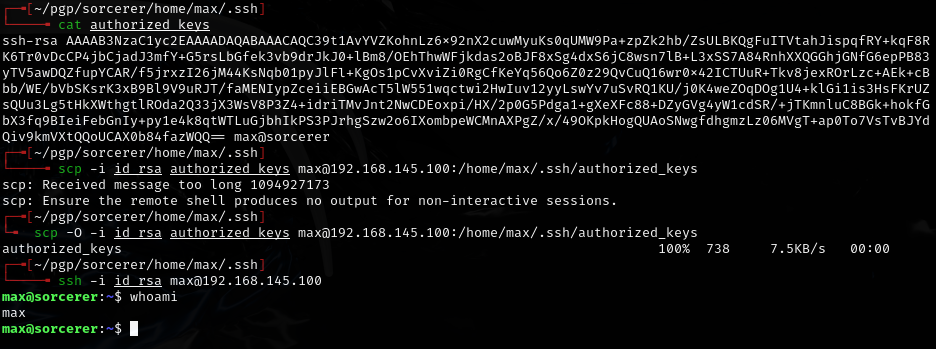
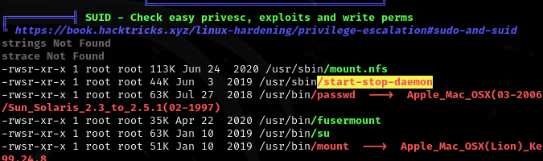
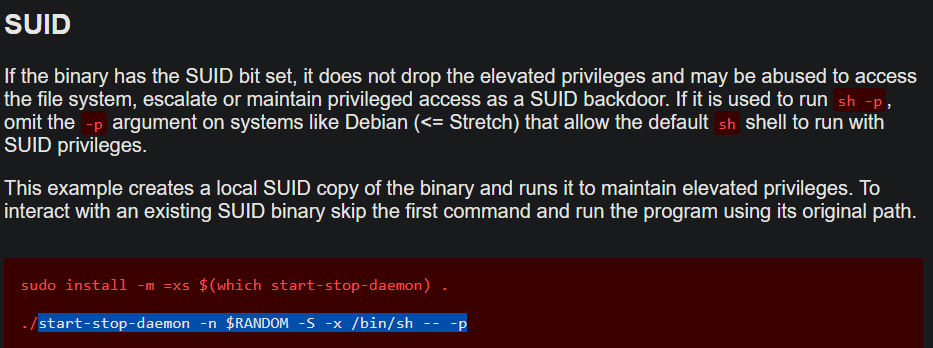
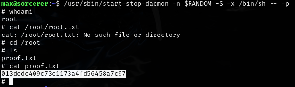

# Sorcerer -- Proving Grounds (write-up)

**Difficulty:** Intermediate
**Box:** Sorcerer (Proving Grounds)
**Author:** dsec
**Date:** 2025-07-13

---

## TL;DR

### Found SSH keys and Tomcat creds in a zip file from a web directory. Overwrote authorized_keys via SCP to gain access. Privesc via SUID binary found by linpeas.
---

## Target info

- Host: see nmap results
- Services discovered: `7742/tcp (http)`

---

## Enumeration

Found max's zip file on port 7742 `/zipfiles` directory containing:

- `.ssh` keys (didn't work directly)
  - 
  - `id_rsa` md5sum does not match authorized_keys
- `scp_wrapper.sh`
  - 
- `tomcat-users.xml.bak`
  - 
  - `tomcat:VTUD2XxJjf5LPmu6`

## Exploitation

Removed the preamble from authorized_keys up to `ssh-rsa` and used SCP to overwrite the target's authorized_keys:

Required the `-O` flag for legacy SCP protocol:

## Privilege escalation

Ran linpeas:

---

## Lessons & takeaways

- Always check zip files on web servers for SSH keys and config backups
- When SSH keys don't work directly, try overwriting authorized_keys via SCP
- The `-O` flag enables legacy SCP protocol which may be required on some targets
---
