# Stapler -- Proving Grounds (write-up)

**Difficulty:** Intermediate
**Box:** Stapler (Proving Grounds)
**Author:** dsec
**Date:** 2025-12-14

---

## TL;DR

### FTP anonymous access leaked passwd file. Extracted usernames for brute force. WordPress exploitation for shell. Kernel exploit (39772) for root.
---

## Target info

- Host: Stapler (Proving Grounds)

---

## Enumeration

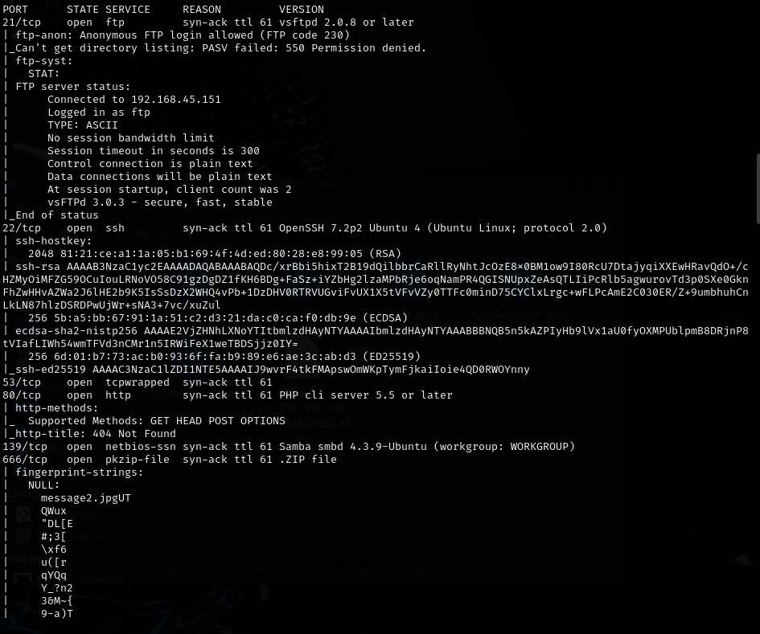

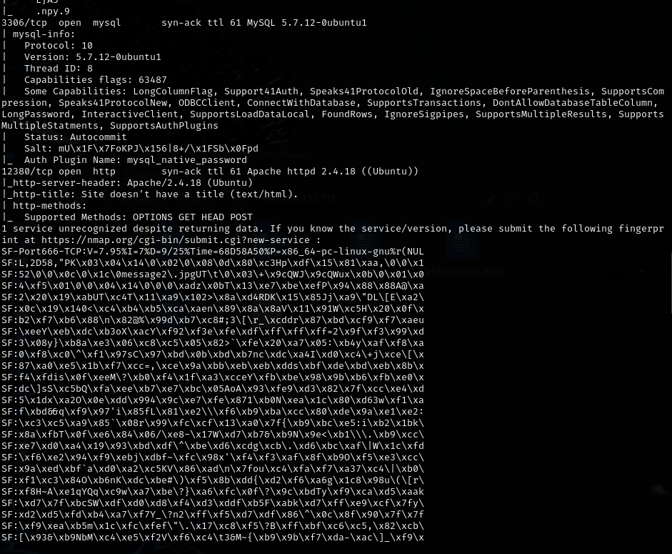

FTP anonymous login:

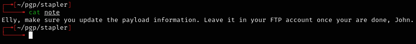

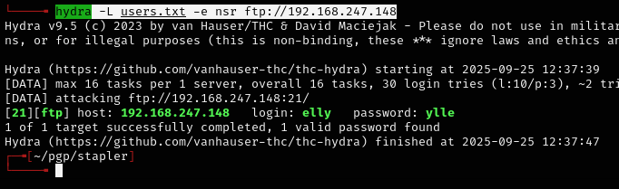

Got the passwd file and extracted usernames:

```bash
cat passwd | awk -F: '{print $1}' > usernames.txt
```

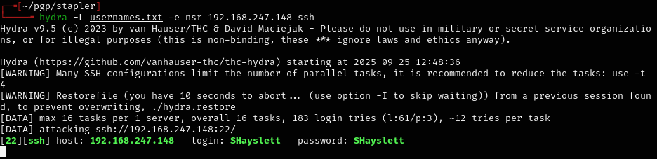

---

## Foothold

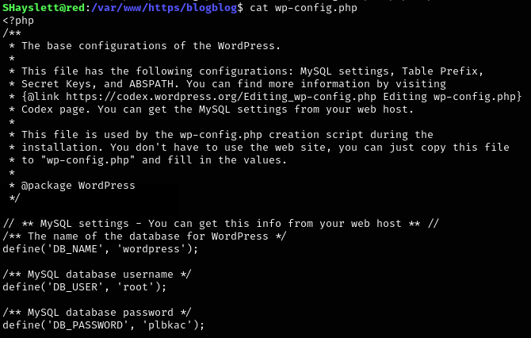

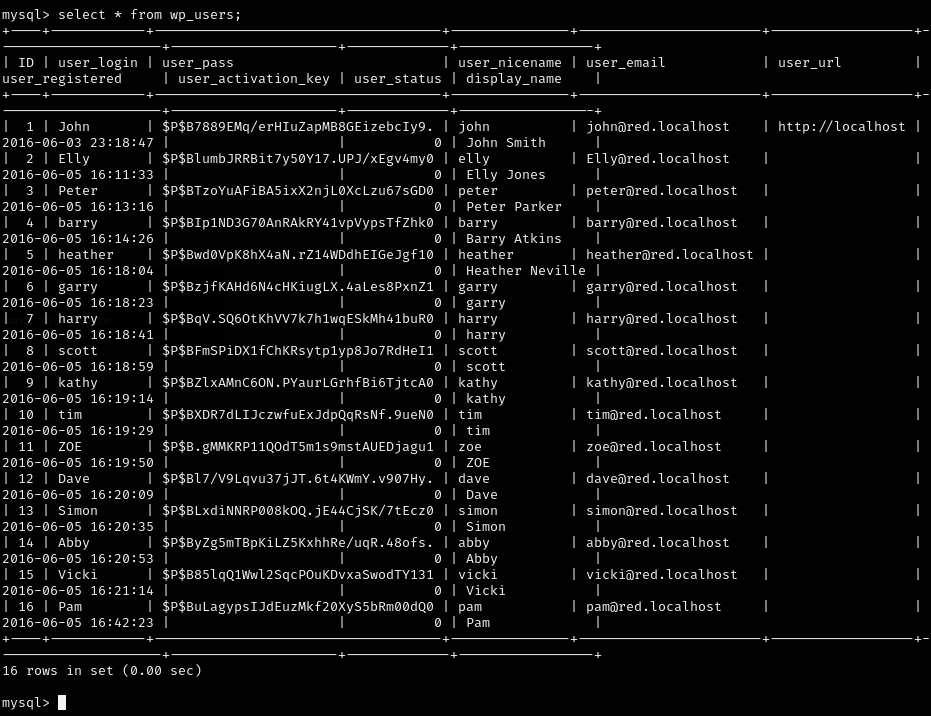

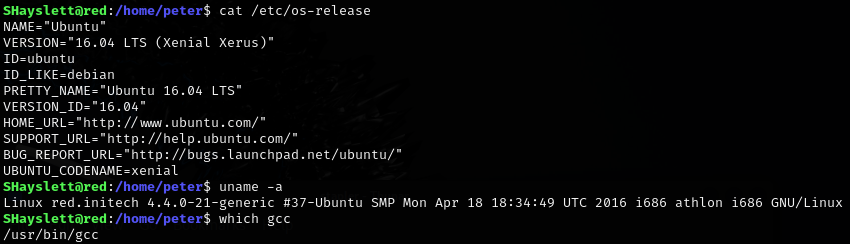

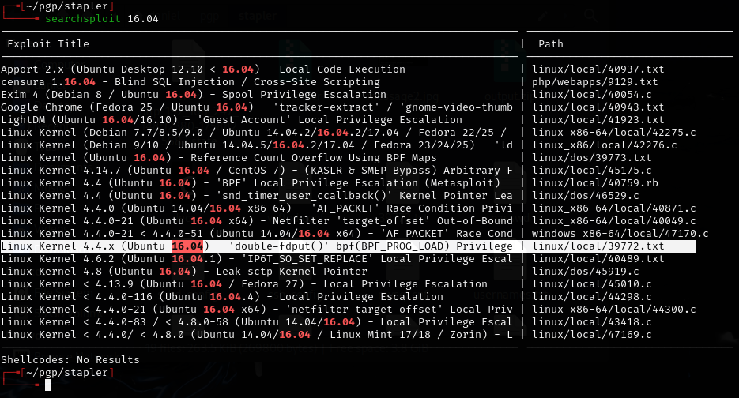

---

## Privilege escalation

Found kernel exploit 39772:

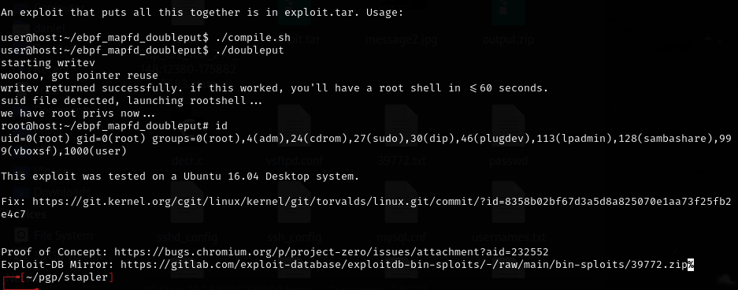

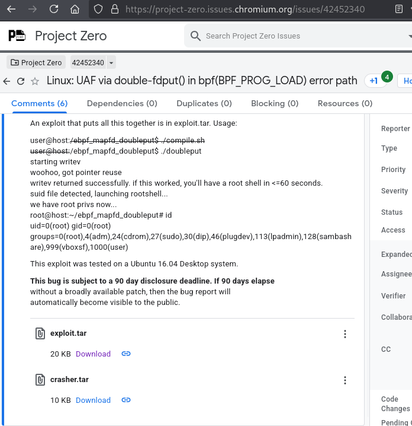

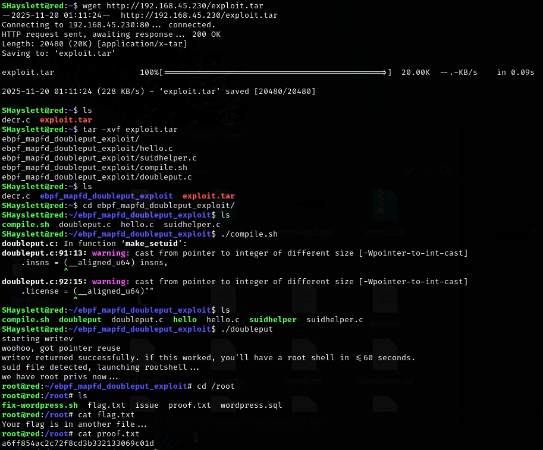

---

## Lessons & takeaways

- Anonymous FTP access can leak critical files like `/etc/passwd`
- Extract usernames from passwd files for targeted brute force
- Linux kernel exploits (39772) are reliable for older kernels
---
