# Sunday -- HackTheBox (write-up)

**Difficulty:** Easy
**Box:** Sunday (HackTheBox)
**Author:** dkrxhn
**Date:** 2025-10-27

---

## TL;DR

### Finger enumeration found users. SSH brute force on non-standard port. Cracked shadow hash. Sudo ALL for root.
---

## Target info

- Host: Sunday (HackTheBox)
- Services discovered: `79/tcp (finger)`, `6787/tcp (ssh)`

---

## Enumeration

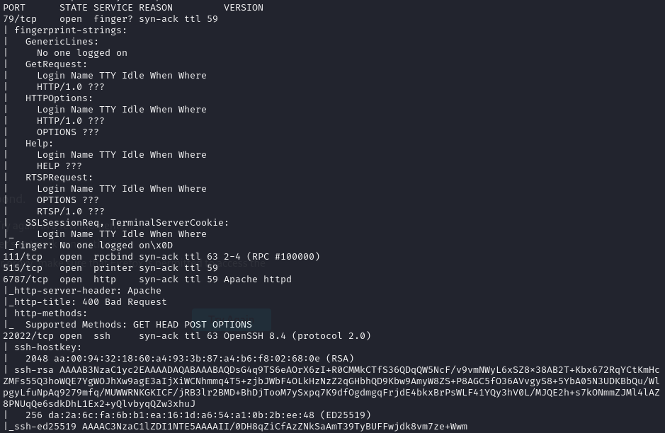

Port 79 -- finger:

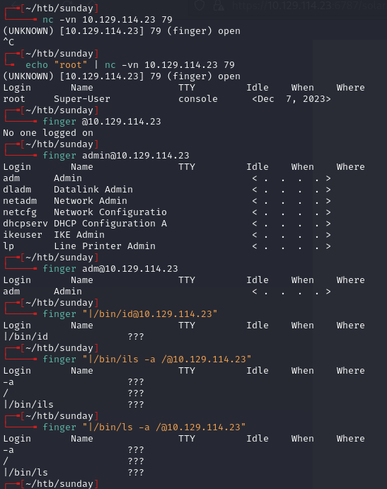

Port 6787:

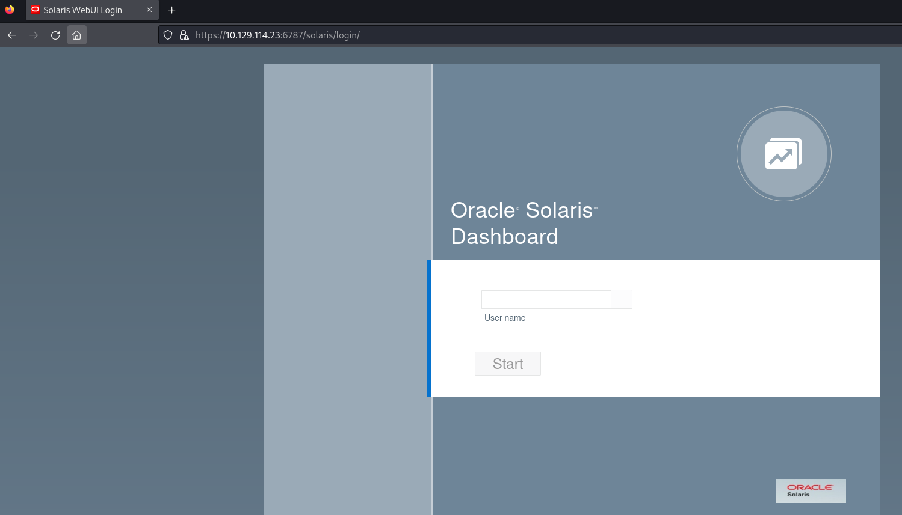

Found users: `sammy` & `sunny`

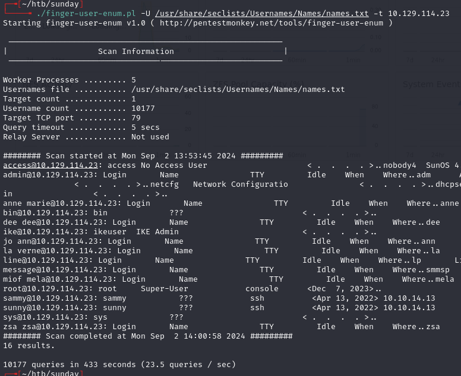

---

## Foothold

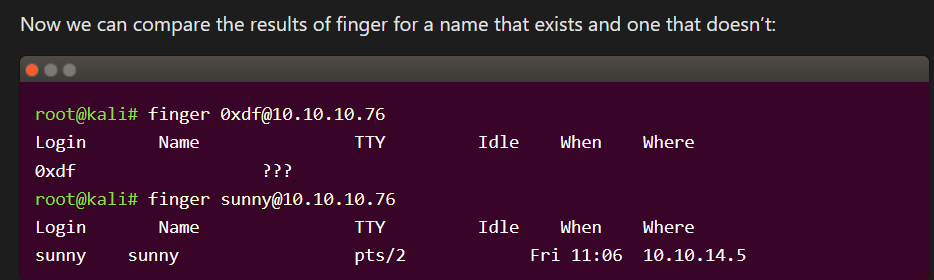

`sunny:Sunday` worked on port 6787 SSH login.

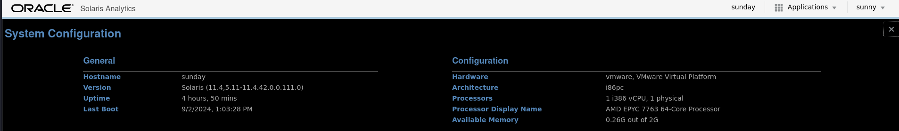

Found shadow file backup:

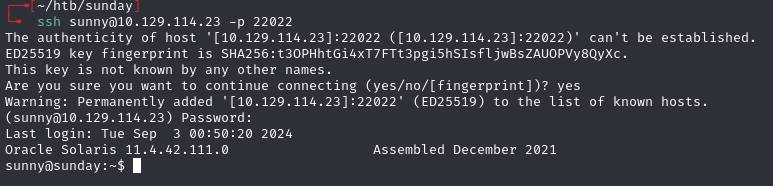

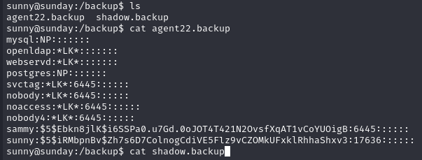

```
sammy:$5$Ebkn8jlK$i6SSPa0.u7Gd.0oJOT4T421N2OvsfXqAT1vCoYUOigB:6445::::::
sunny:$5$iRMbpnBv$Zh7s6D7ColnogCdiVE5Flz9vCZOMkUFxklRhhaShxv3:17636::::::
```

Cracked sammy's hash:

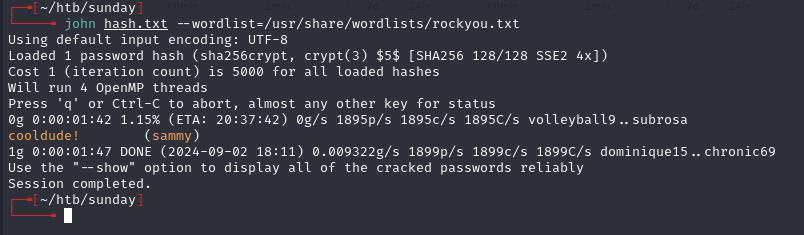

- `sammy:cooldude!`

---

## Privilege escalation

```bash
sudo -l
```

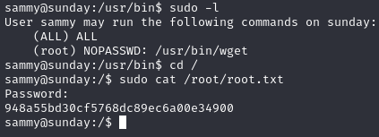

`(ALL) ALL` -- full sudo access as sammy.

Alternate route with wget:

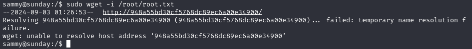

- `-I` (input-file) flag -- error leaks file data (in this case the flag)
- Could also use wget to overwrite troll script with a shell, but the script resets every 5 seconds

---

## Lessons & takeaways

- Finger (port 79) is a goldmine for user enumeration
- Always check non-standard SSH ports
- Shadow file backups are a common find for hash cracking
- `sudo (ALL) ALL` is instant root
---
