# Sweep -- Vulnlab (write-up)

**Difficulty:** Medium
**Box:** Sweep (Vulnlab)
**Author:** dsec
**Date:** 2025-08-28

---

## TL;DR

### Lansweeper on port 81 with default creds. Abused scanning credentials feature with fakessh to capture SSH creds for a high-value service account. Privesc through Lansweeper admin.
---
## Target info

- Domain: Vulnlab chain
---
## Enumeration

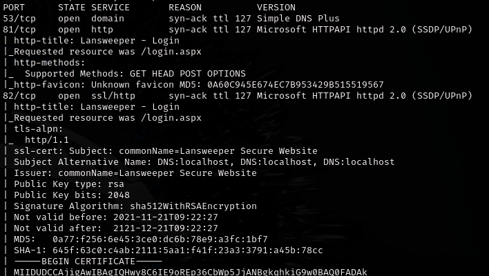

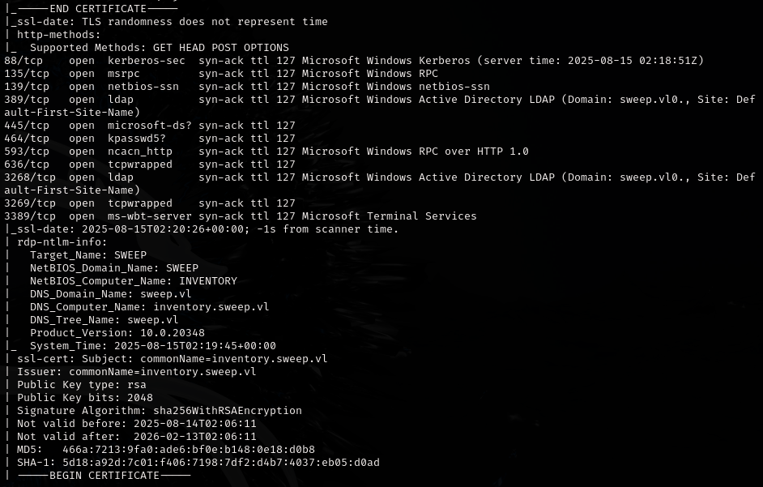

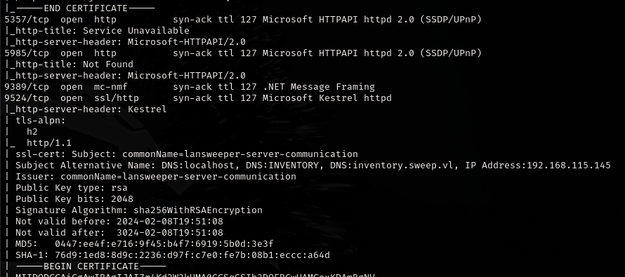

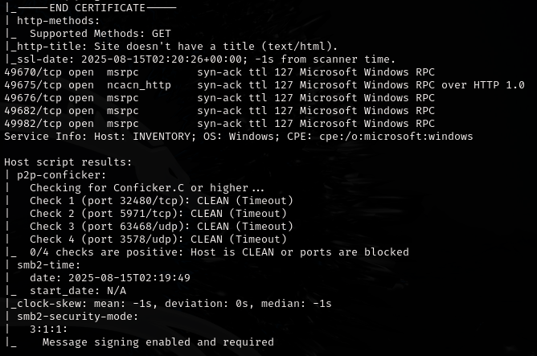

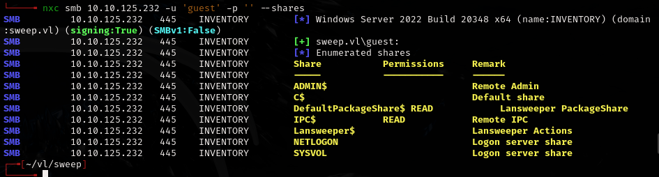

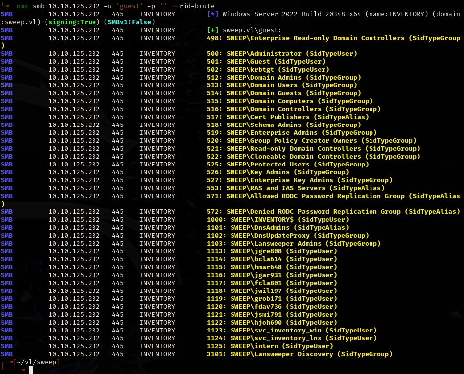

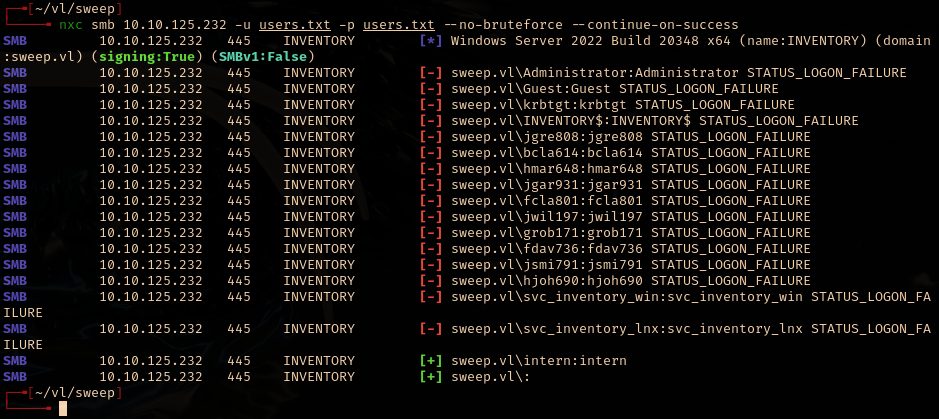

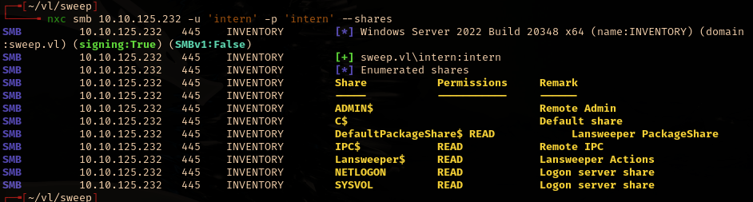

---
## Initial access

Logged into Lansweeper on port 81 with `intern:intern`:

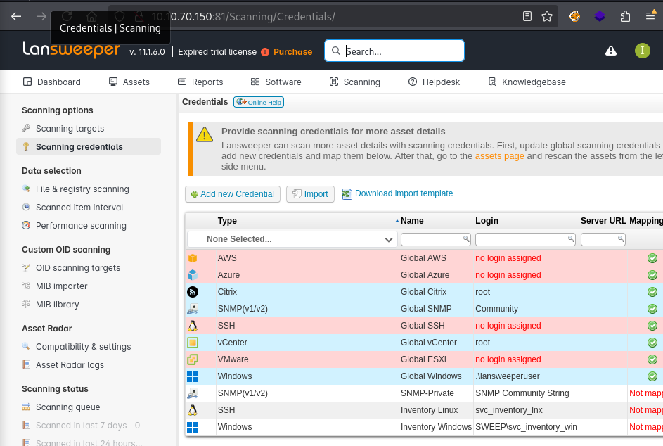

The scanning credentials section showed `svc_inventory_lnx` creds are used via SSH.

Used [fakessh](https://github.com/fffaraz/fakessh) to capture credentials. Added my box as a scanning target, mapped the SSH credential to that IP range, then ran a quick scan.

BloodHound showed the service account is a high-value target:

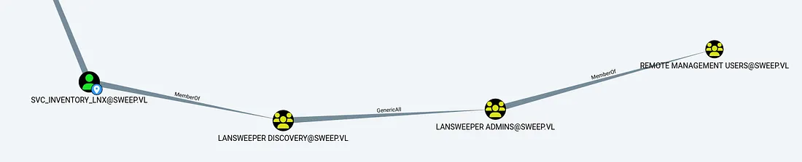

Added IP to scanning targets, mapped credential to IP range, triggered quick scan:

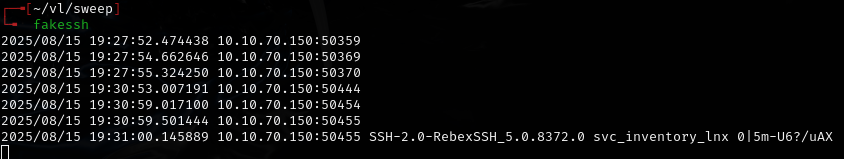

Captured: `svc_inventory_lnx:'0|5m-U6?/uAX'`

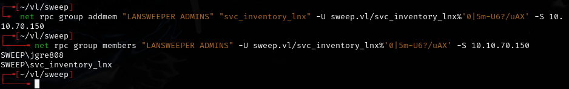

---
## Privilege escalation

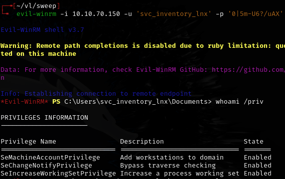

**SeMachineAccountPriv didn't work.**

Privesc was through Lansweeper admin after logging in with the new creds.

---
## Lessons & takeaways

- Lansweeper stores scanning credentials that can be intercepted with a fake service (fakessh)
- Default/weak creds on management interfaces open the door to credential harvesting
- BloodHound helps identify which service accounts are worth targeting
---
