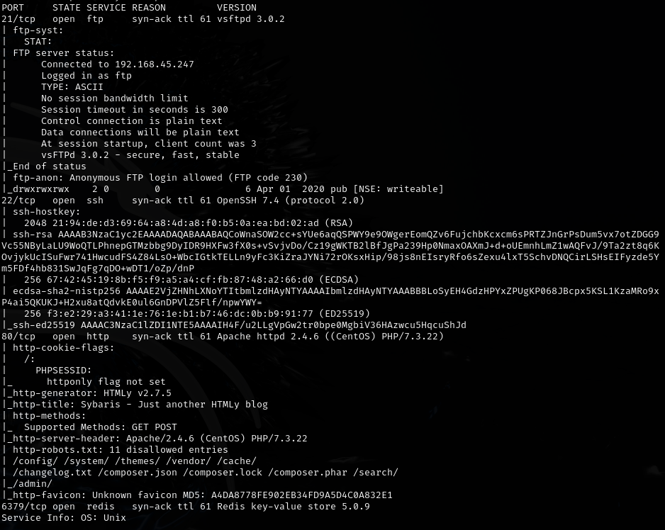
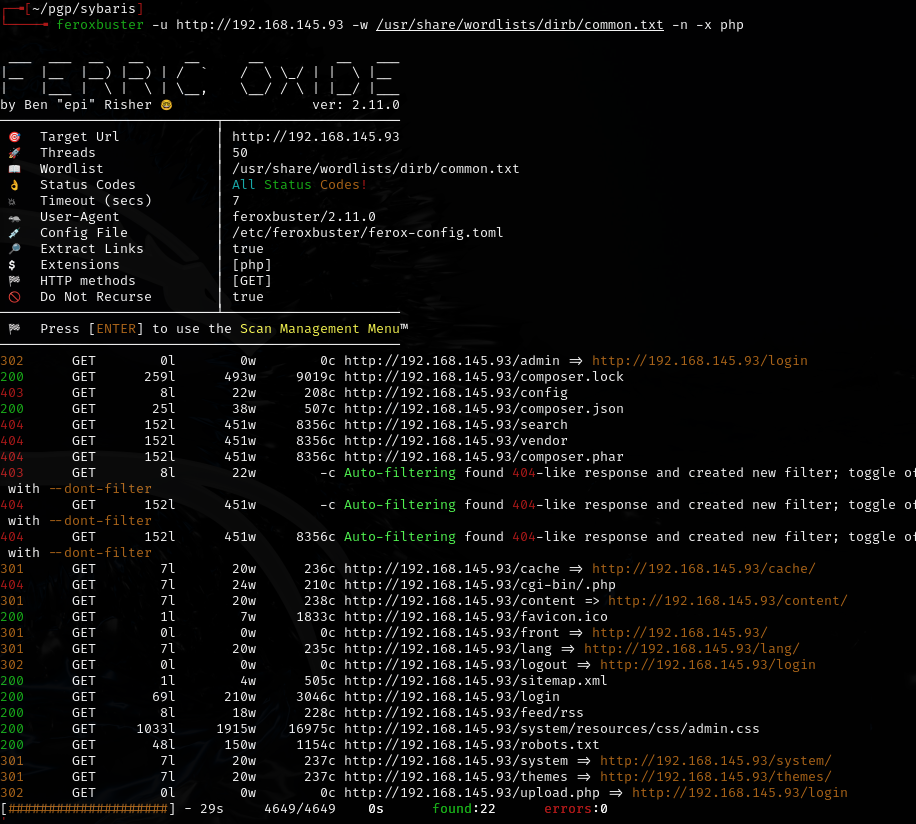
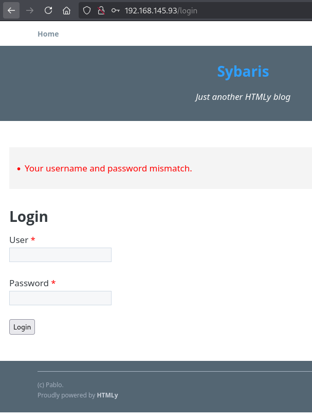
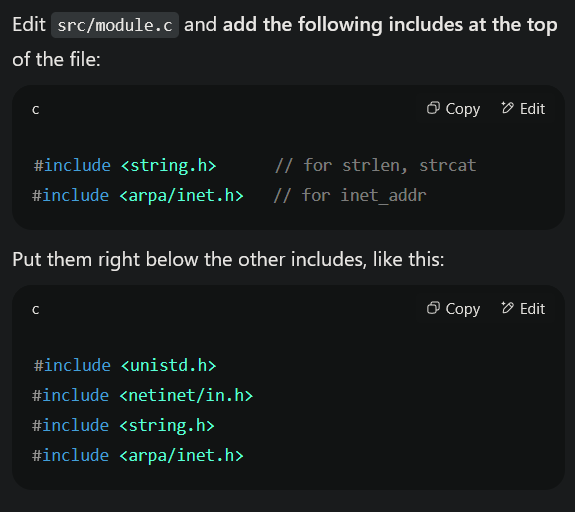
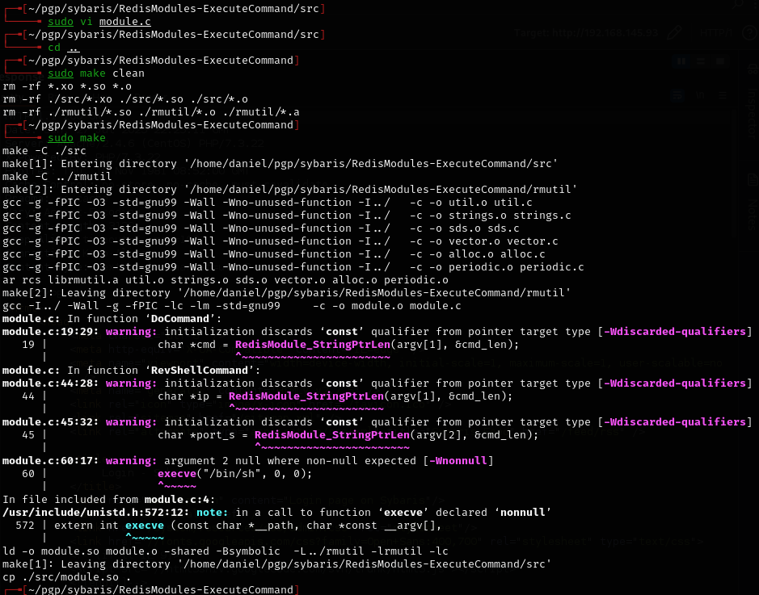
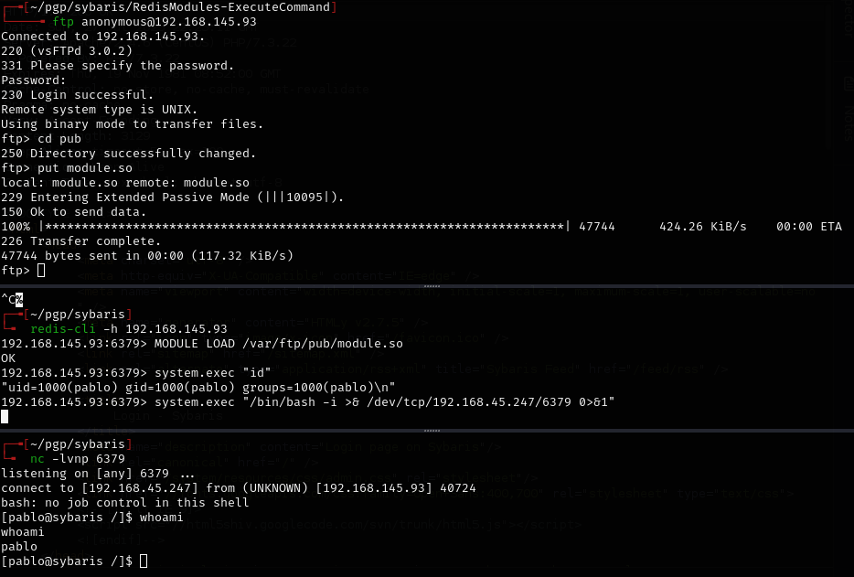
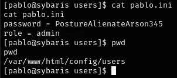
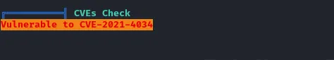
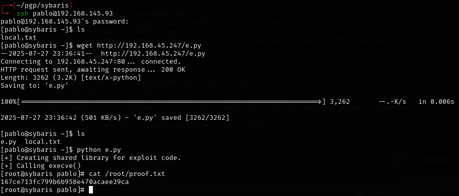

# Sybaris -- Proving Grounds (write-up)

**Difficulty:** Intermediate
**Box:** Sybaris (Proving Grounds)
**Author:** dsec
**Date:** 2025-11-04

---

## TL;DR

### Web app user enumeration led to hydra brute force. Redis module RCE for shell. Privesc via CVE-2021-4034 (PwnKit).
---

## Target info

- Host: `192.168.145.93`

---

## Enumeration







User enumeration on the login form:

- `admin:admin` gives "user is not in database"
- `pablo:test` gives a different response -- user exists (saw `pablo` in the copyright)

Brute forced with hydra:

```bash
hydra 192.168.145.93 -l pablo -P /usr/share/seclists/Passwords/twitter-banned.txt http-post-form "/login:user=pablo&password=^PASS^&csrf_token=d64839f9dfeba1dbef43b57f296c20170d1dbe6a&submit=Login:Your username and password mismatch."
```

---

## Foothold

Compiled a Redis module for RCE from `https://github.com/n0b0dyCN/RedisModules-ExecuteCommand.git`. Had compilation errors so had to add fixes:









Found password `PostureAlienateArson345` -- useless.

---

## Privilege escalation

**Dirty Cow seemed to work initially but then deleted the user.**

Linpeas pointed to CVE-2021-4034 (PwnKit):



- `https://github.com/joeammond/CVE-2021-4034.git`



---

## Lessons & takeaways

- Different error messages on login forms reveal valid usernames
- Redis with module loading enabled is an easy RCE vector
- Dirty Cow can be unreliable -- PwnKit (CVE-2021-4034) is more stable
---
