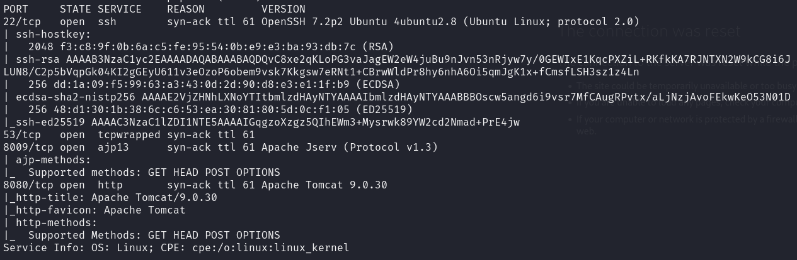
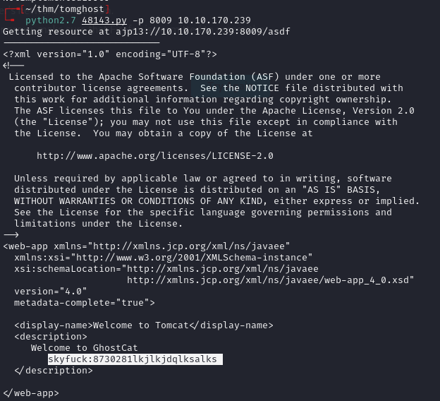
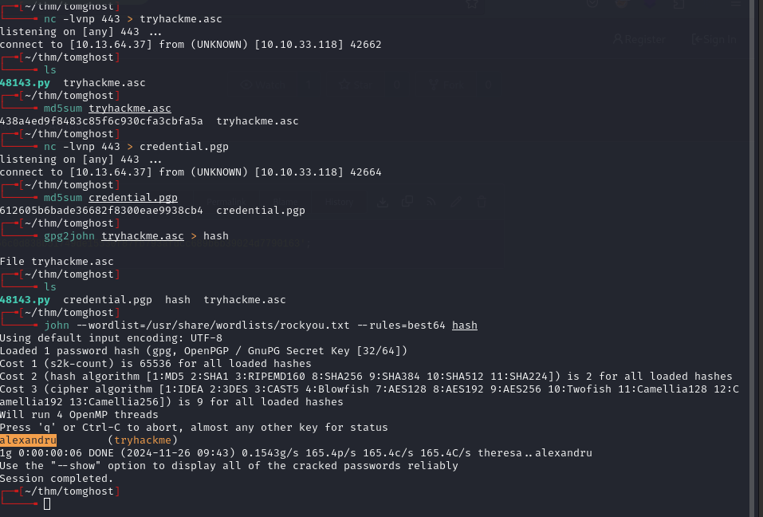
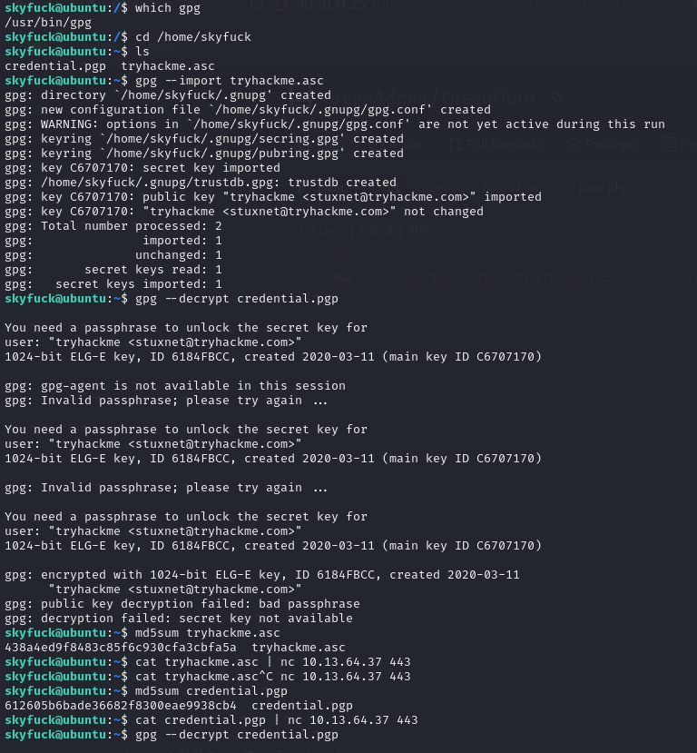
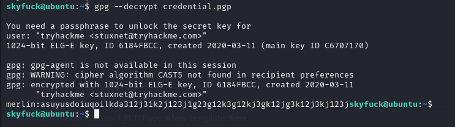
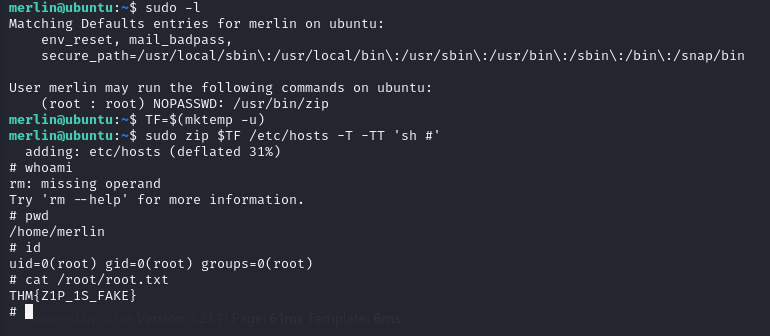

# Tomghost -- TryHackMe (write-up)

**Difficulty:** Easy
**Box:** Tomghost (TryHackMe)
**Author:** dsec
**Date:** 2025-02-23

---

## TL;DR

### Ghostcat vulnerability (CVE-2020-1938) on AJP port leaked credentials. SSH access, then GPG-encrypted creds for lateral move. Privesc via sudo zip GTFOBins.

---

## Target info

- Host: `10.10.170.239`
- Services discovered: `22/tcp (ssh)`, `8009/tcp (ajp)`, `8080/tcp (http)`

---

## Enumeration



---

## Foothold

Exploited Ghostcat (AJP on port 8009):



Leaked credentials: `skyfuck:8730281lkjlkjdqlksalks`

```bash
ssh skyfuck@10.10.170.239
```

---

## Lateral movement

Found GPG-encrypted files in home directory:





Decrypted to get credentials for `merlin`:



`merlin:asuyusdoiuqoilkda312j31k2j123j1g23g12k3g12kj3gk12jg3k12j3kj123j`

---

## Privilege escalation



Used sudo privileges to escalate to root.

---

## Lessons & takeaways

- AJP port 8009 (Ghostcat / CVE-2020-1938) can leak sensitive files from Tomcat
- GPG-encrypted files on disk may contain credentials -- always try to crack the key
---
