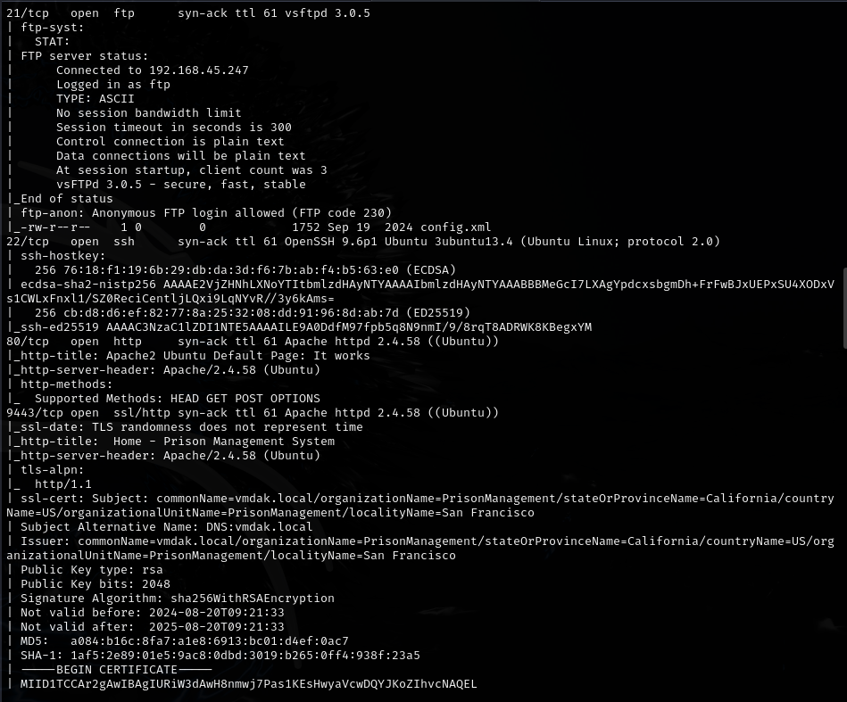
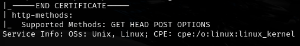
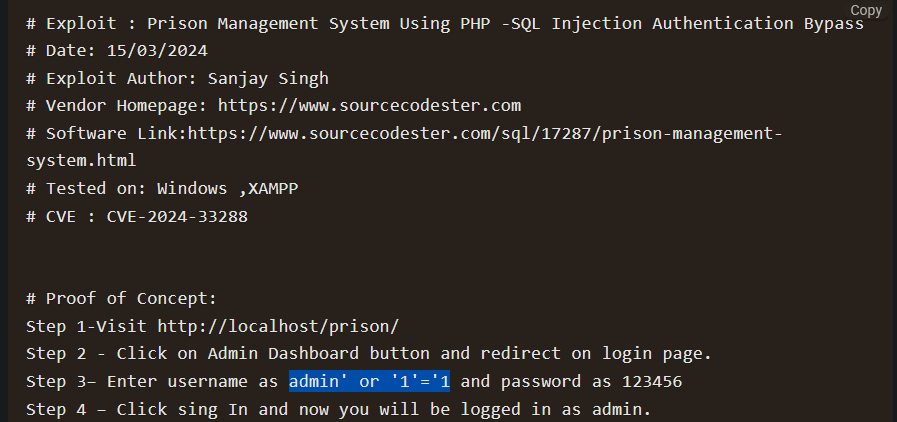
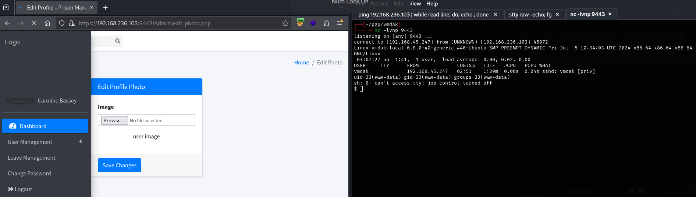
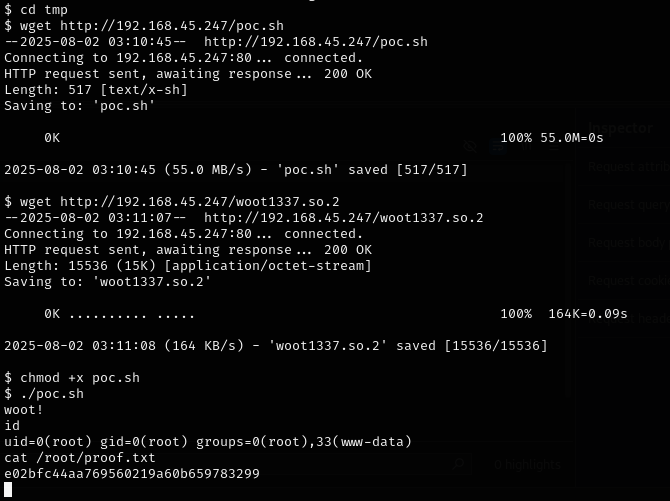
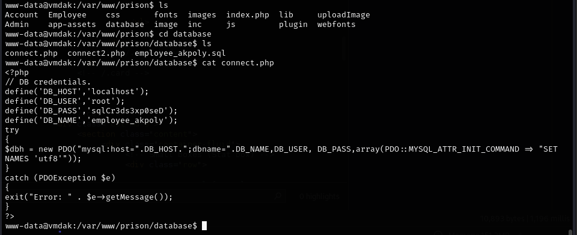
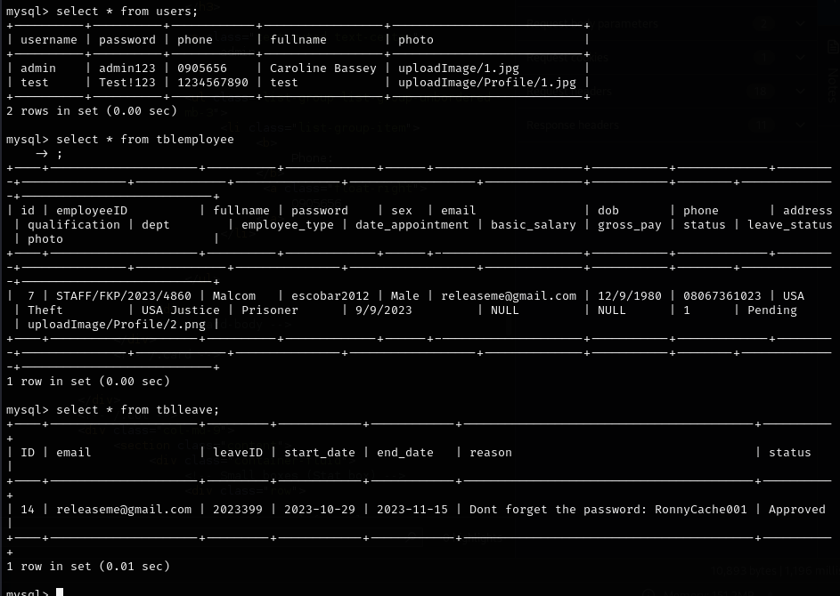
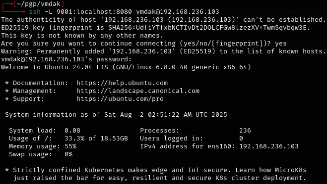
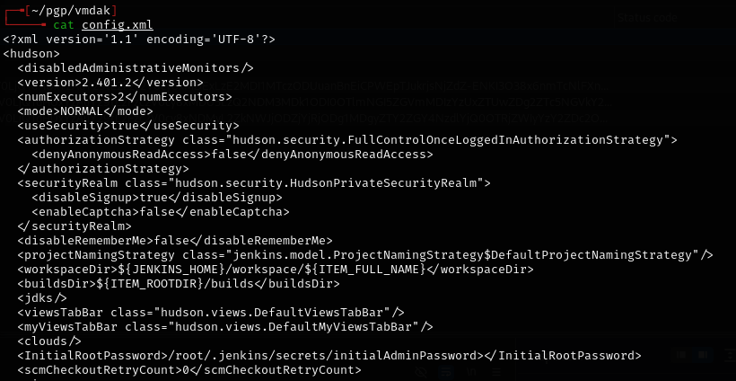

# Vmdak -- Proving Grounds (write-up)

**Difficulty:** Hard
**Box:** Vmdak (Proving Grounds)
**Author:** dkrxhn
**Date:** 2025-11-25

---

## TL;DR

### Photo upload bypass for initial shell. Sudo CVE-2025-32463 for root. Alternate path: SQL creds, user pivot, Jenkins arbitrary file read via port forwarding.
---

## Target info

- Host: `192.168.236.103`
- Services discovered: `9443/tcp (https)`, `8080/tcp`

---

## Enumeration





Found exploit: `https://www.exploit-db.com/exploits/52017`



---

## Foothold

Created `1.jpg` with PHP shell. Uploaded to `/admin/edit-photo.php`. Intercepted with Burp, changed extension to `1.php`, forwarded requests:

- `https://github.com/Aa1b/mycve/blob/main/Readme.md`



---

## Privilege escalation

Linpeas showed sudo 1.9.15p5. Exploited CVE-2025-32463:

- `https://github.com/zinzloun/CVE-2025-32463`



---

## Alternate path (from walkthrough)

Found SQL credentials:



- `sqlCr3ds3xp0seD`



- `escobar2012`
- `RonnyCache001`

```bash
su vmdak
```

Password: `RonnyCache001`

Port 8080 was open -- set up port forwarding:



`127.0.0.1:9001` shows Jenkins login page.

Jenkins arbitrary file read (CVE-2024-23897):

- `https://github.com/godylockz/CVE-2024-23897/blob/main/jenkins_fileread.py`

Read `/root/.jenkins/secrets/initialAdminPassword` (found path from FTP `config.xml`):



Password: `140ef31373034d19a77baa9c6b84a200`

Created shell with busybox for root.

---

## Lessons & takeaways

- File upload endpoints that accept images are always worth testing with Burp extension changes
- Check sudo version for recent CVEs
- Jenkins arbitrary file read (CVE-2024-23897) can leak admin passwords
- Multiple paths to root exist -- always look for the fastest one
---
