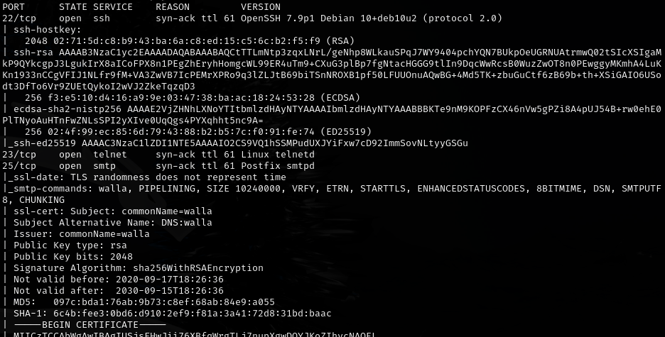
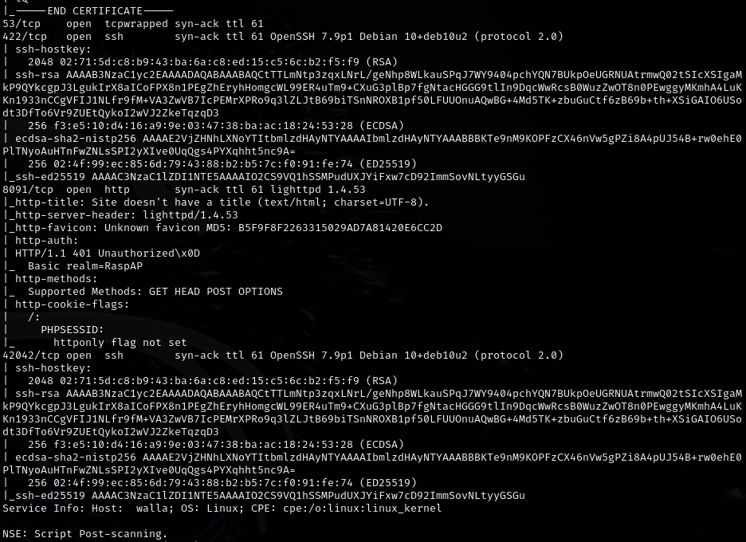
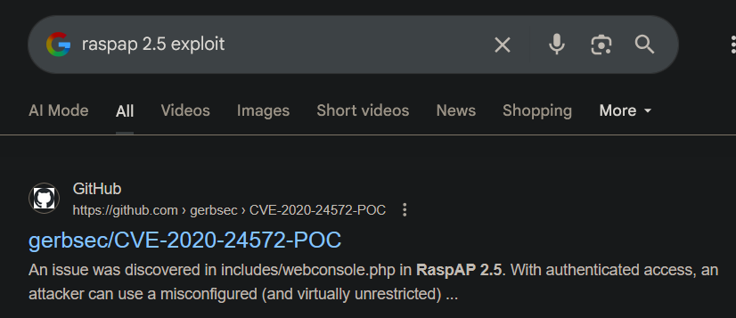
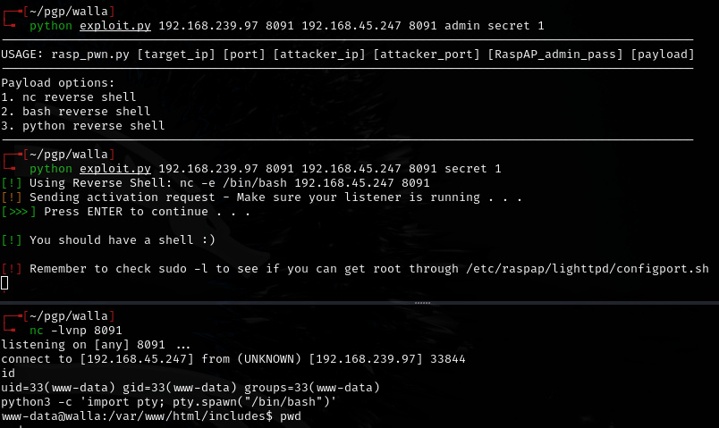
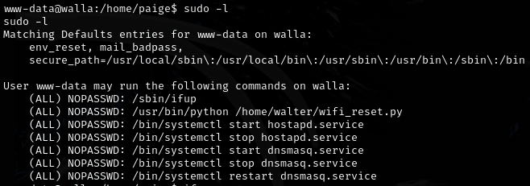
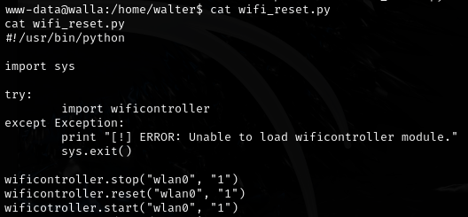
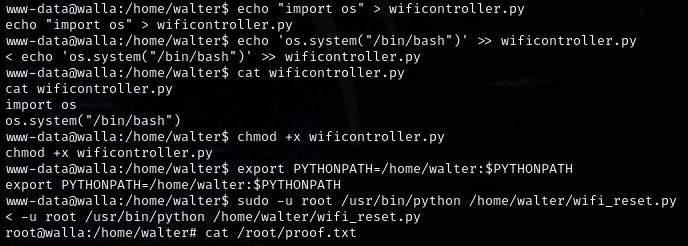

# Walla -- Proving Grounds (write-up)

**Difficulty:** Intermediate
**Box:** Walla (Proving Grounds)
**Author:** dkrxhn
**Date:** 2025-11-11

---

## TL;DR

### RaspAP on port 8091 with default credentials. CVE-2020-24572 RCE for shell. Privesc via wifi controller module exploit.
---

## Target info

- Host: Walla (Proving Grounds)
- Services discovered: `8091/tcp (RaspAP)`

---

## Enumeration

Port 8091 -- RaspAP with default credentials:

- `admin:secret`

---

## Foothold

CVE-2020-24572 RCE exploit:

- `https://github.com/gerbsec/CVE-2020-24572-POC`

---

## Privilege escalation

Exploited the wifi controller module:

---

## Lessons & takeaways

- Always check for default credentials on IoT/network management interfaces
- RaspAP has known RCE vulnerabilities
- Wifi controller modules running with elevated privileges can be abused for privesc
---
