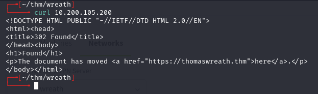
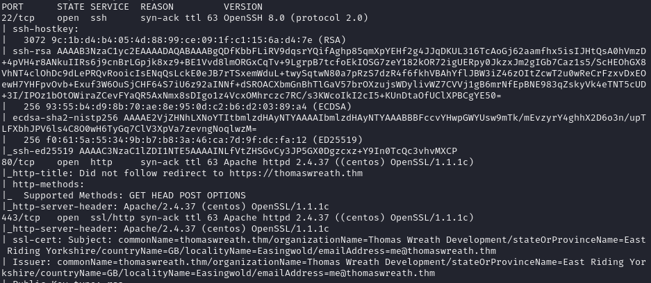
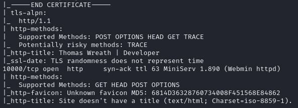
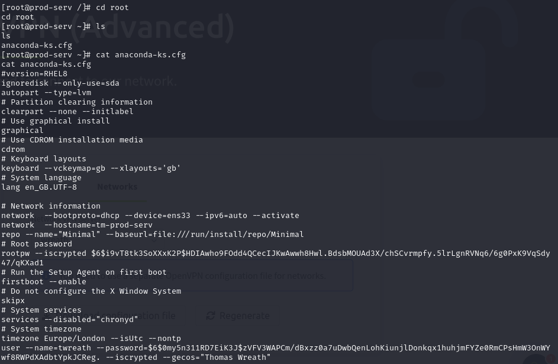
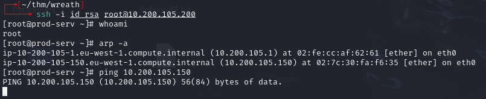

# Wreath -- TryHackMe (write-up)

**Difficulty:** Medium
**Box:** Wreath (TryHackMe) -- Network
**Author:** dkrxhn
**Date:** 2025-11-01

---

## TL;DR

### Multi-host network. Cracked hashes from shadow file, grabbed SSH key for root on first host. Pivoted and discovered internal hosts via ARP and nmap sweep.
---
## Target info

- Host: `10.200.105.200` (initial target)
- Internal hosts discovered: `10.200.105.100`, `10.200.105.150`
---
## Enumeration



Added target to `/etc/hosts`.





---
## Initial foothold



Found hashes in `/etc/shadow`:

```
root: $6$i9vT8tk3SoXXxK2P$HDIAwho9FOdd4QCecIJKwAwwh8Hwl.BdsbMOUAd3X/chSCvrmpfy.5lrLgnRVNq6/6g0PxK9VqSdy47/qKXad1
twreath: $6$0my5n311RD7EiK3J$zVFV3WAPCm/dBxzz0a7uDwbQenLohKiunjlDonkqx1huhjmFYZe0RmCPsHmW3OnWYwf8RWPdXAdbtYpkJCReg.
```

Copied `/root/.ssh/id_rsa` to my machine:

```bash
sudo chown daniel:daniel id_rsa
chmod 600 id_rsa
ssh -i id_rsa root@10.200.105.200
```

---
## Pivoting

Ran `arp -a` on the compromised host:



Found `10.200.105.150` -- can't ping it.

Ran a static nmap sweep to discover live hosts:

```bash
./nmap-static -sn 10.200.105.1-255 -oN scan-USERNAME
```

Ignore `.1` (gateway), `.250` (OpenVPN server), and `.200` (first machine). Found `.100` and `.150`.

---
## Useful notes

LOTL ping sweep from bash:

```bash
for i in {1..255}; do (ping -c 1 192.168.1.${i} | grep "bytes from" &); done
```

If ICMP is suspected to be blocked (common with Windows):

```bash
for i in {1..65535}; do (echo > /dev/tcp/192.168.1.1/$i) >/dev/null 2>&1 && echo $i is open; done
```

Windows equivalent of `/etc/hosts`: `C:\Windows\System32\drivers\etc\hosts`

Local DNS servers on Linux: `/etc/resolv.conf` or `nmcli dev show`

Windows DNS: `ipconfig /all`

---
## Lessons & takeaways

- On multi-host networks, always check ARP tables and do internal sweeps after the first compromise
- Upload a static nmap binary when the target lacks tools
- LOTL bash one-liners are useful when you can't transfer tools
---
