# ZenPhoto -- Proving Grounds (write-up)

**Difficulty:** Easy
**Box:** ZenPhoto (Proving Grounds)
**Author:** dsec
**Date:** 2024-07-17

---

## TL;DR

### Exploited ZenPhoto with a known RCE exploit to get a shell, ran linpeas, and escalated to root via Dirty COW.

---

## Enumeration

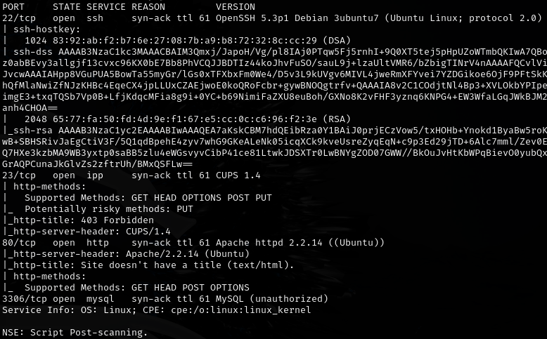

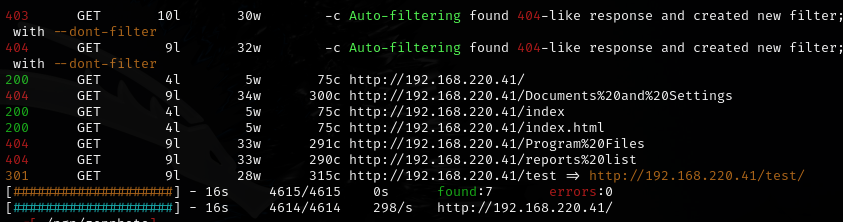

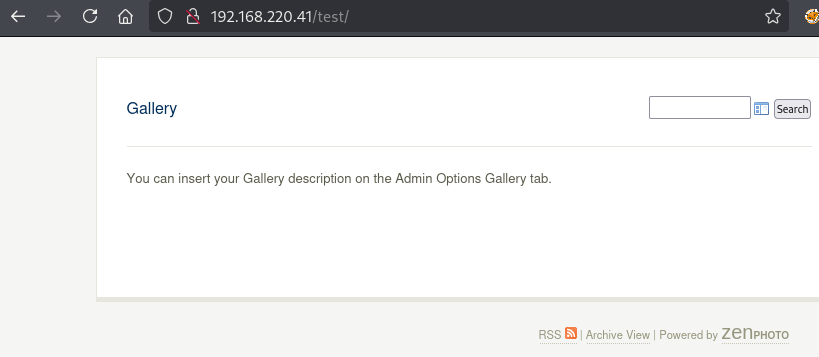

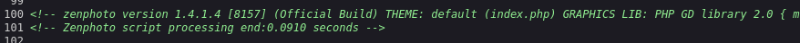

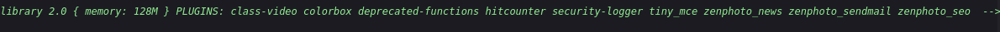

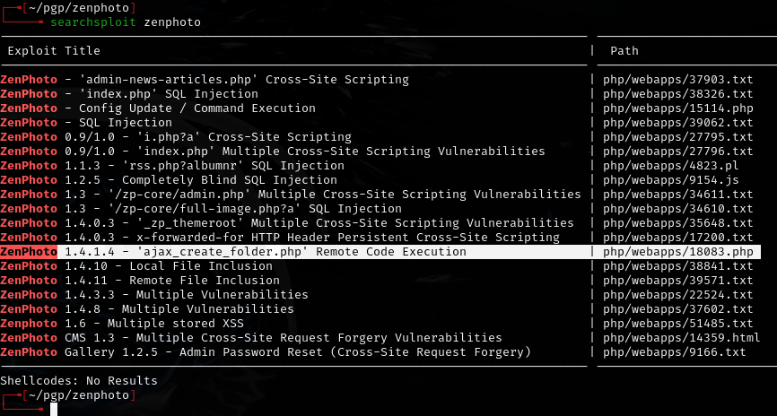

---

## Exploitation

```bash
php 18083.php 192.168.220.41 /test/
```

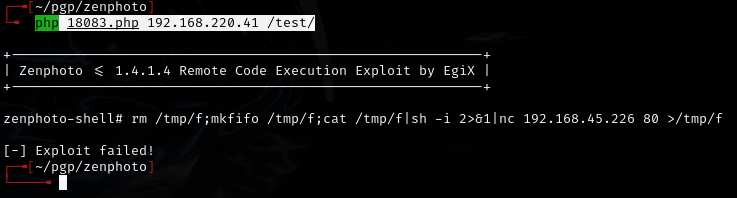

Pivoted to a better shell.

---

## Privilege escalation

Uploaded and ran `linpeas.sh`:

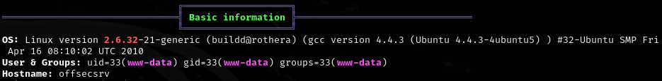

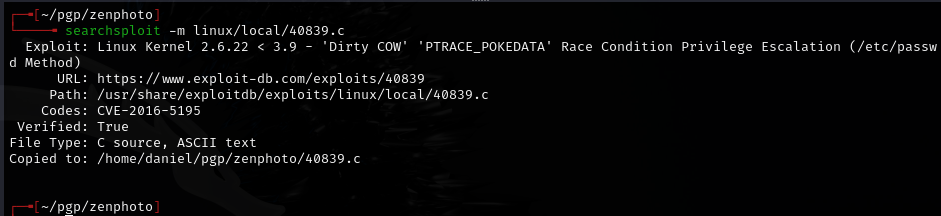

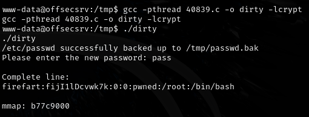

- Ran Dirty COW.
- Shell died and SSH **did not** work, but was able to connect back in and switch to the `firefart` user.

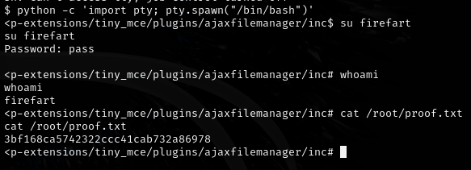

---

## Lessons & takeaways

- Dirty COW can crash your shell -- have a backup connection method ready
- Old applications like ZenPhoto often have public RCE exploits that work out of the box
- When a kernel exploit kills your shell, reconnect through the original exploit path
